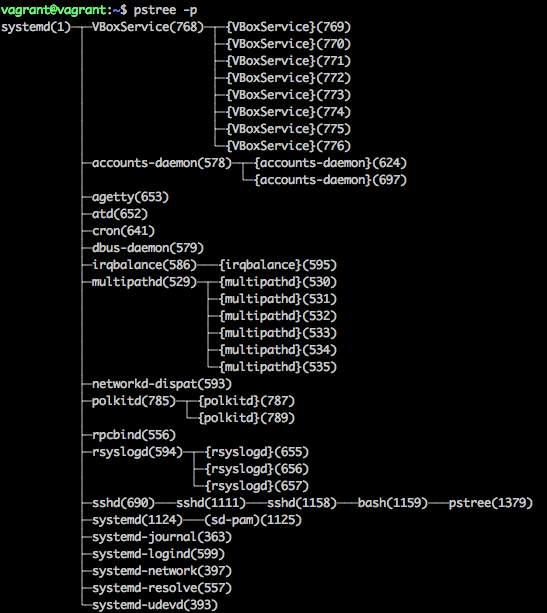
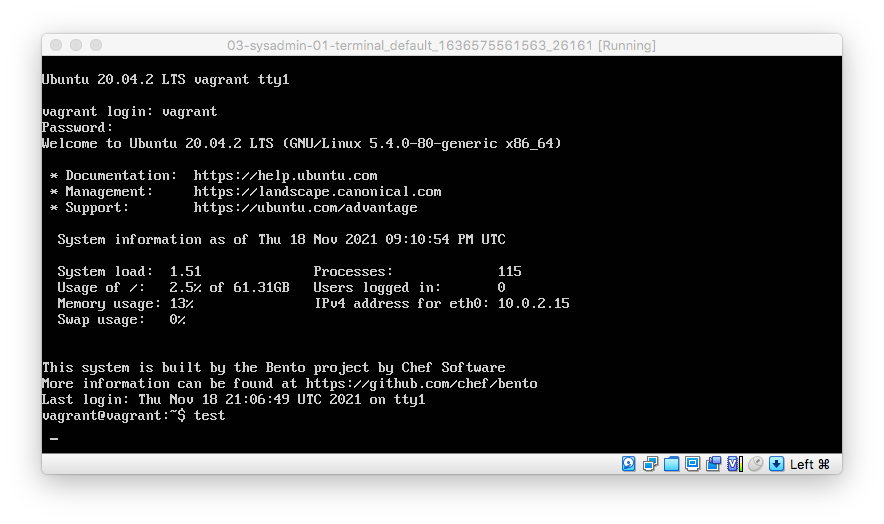
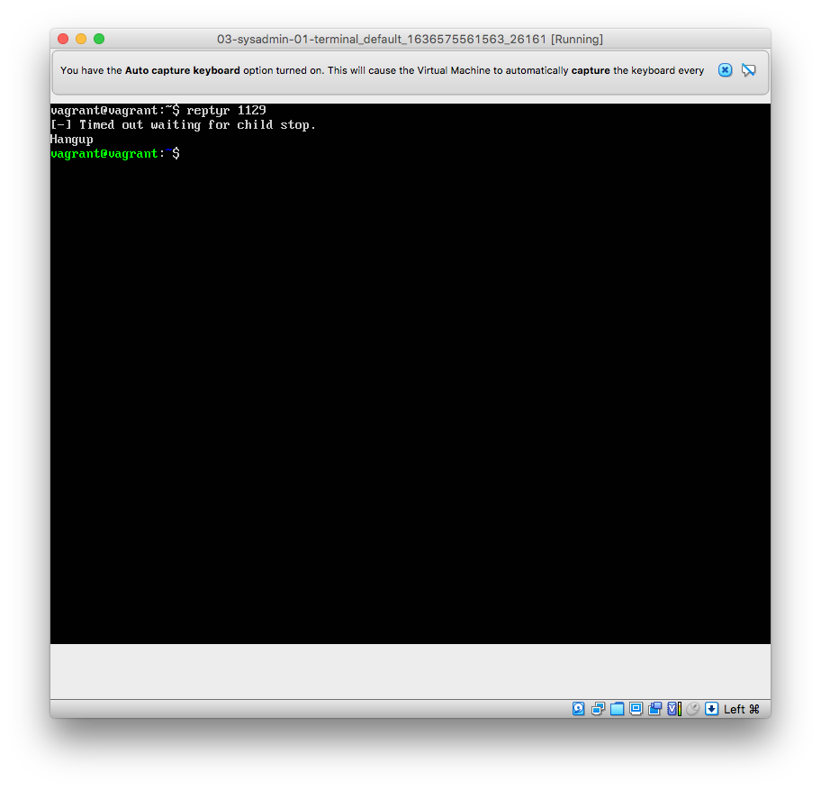

#### 1. Какого типа команда `cd`? Попробуйте объяснить, почему она именно такого типа; опишите ход своих мыслей, если считаете что она могла бы быть другого типа.

`type -a cd` говорит нам, что `cd is a shell builtin`.  
При этом в стандарте POSIX в [списке Special Built-In Utilities](https://pubs.opengroup.org/onlinepubs/9699919799.2016edition/utilities/V3_chap02.html#tag_18_14) упоминания `cd` нет. При этом в описании самой утилиты, [стандарт](https://pubs.opengroup.org/onlinepubs/9699919799/utilities/cd.html) говорит следующее:
> Since _cd_ affects the current shell execution environment, it is always provided as a shell regular built-in.

Вряд ли бы она могла быть внешней, потому что стандарт дальше описывает требования так:
> If it is called in a subshell or separate utility execution environment, such as one of the following:
>````bash
>(cd /tmp)
> nohup cd
> find . -exec cd {} \;
>````
>**it does not affect the working directory of the caller's environment**.

То есть будучи внешней утилитой, `cd` не смогла бы изменить текущую директорию, что от нее идейно и требуется.

#### 2. Какая альтернатива без pipe команде `grep <some_string> <some_file> | wc -l`?

`grep -c <some_string> <some_file>`

#### 3. Какой процесс с PID `1` является родителем для всех процессов в вашей виртуальной машине Ubuntu 20.04?

Поскольку у меня чистая виртуальная машина, в которой не может быть огромного количества процессов, чтобы все это стало нечитабельно, я пошел простым путем: `pstree -p`. Получил вот такое не самое сложное дерево:


Соответственно, это процесс `systemd`.

#### 4. Как будет выглядеть команда, которая перенаправит вывод stderr `ls` на другую сессию терминала?

`ls -l new.txt fff 2>/dev/pts/1`

#### 5. Получится ли одновременно передать команде файл на stdin и вывести ее stdout в другой файл? Приведите работающий пример.

Да, получится.
```bash
vagrant@vagrant:~$ echo > stdin_file
vagrant@vagrant:~$ echo > stdout_file
vagrant@vagrant:~$ cat stdin_file
bla 1 bla
vagrant@vagrant:~$ cat < stdin_file > stdout_file
vagrant@vagrant:~$ cat stdout_file
bla 1 bla
```

#### 6. Получится ли находясь в графическом режиме, вывести данные из PTY в какой-либо из эмуляторов TTY? Сможете ли вы наблюдать выводимые данные?

Да, получится: `echo 'test'>/dev/tty1`.

Да, смогу:


#### 7. Выполните команду `bash 5>&1`. К чему она приведет? Что будет, если вы выполните `echo netology > /proc/$$/fd/5`? Почему так происходит?

Команда создает файловый дескриптор 5 и перенаправляет его в стандартный поток вывода.

Команда `echo netology > /proc/$$/fd/5` просто выведет в терминал netology, потому что она перенаправляет вывод `echo netology` в файл с файловым дескриптором 5, а он перенаправлен в стандартный поток вывода.

#### 8. Получится ли в качестве входного потока для pipe использовать только stderr команды, не потеряв при этом отображение stdout на pty?

Если выполнить команду `ls -l stdin_file fff`, мы получим две ошибки:
```bash
ls: cannot access 'fff': No such file or directory
-rw-rw-r-- 1 vagrant vagrant 10 Nov 18 21:02 stdin_file
```

Чтобы не потерять вывод, нам нужно сделать так: `ls -l stdin_file fff 15>&2 2>&1 1>&15 | grep such -c`

И получим тот же вывод:
```bash
vagrant@vagrant:~$ ls -l stdin_file fff 15>&2 2>&1 1>&15 | grep such -c
-rw-rw-r-- 1 vagrant vagrant 10 Nov 18 21:02 stdin_file
1
```

Но не буду врать, логически я это понимаю не до конца.

#### 9. Что выведет команда `cat /proc/$$/environ`? Как еще можно получить аналогичный по содержанию вывод?

Команда выводит переменные среды (окружения) и их содержание: что является shell по умолчанию, какой язык используется, где домашняя директория, какой терминал используется и т. д.

В таком же порядке, но с разделением по строкам их можно получить через комнанду `env`, но можно и через просто `export`, но порядок будет другим.

#### 10. Используя man, опишите что доступно по адресам `/proc/<PID>/cmdline`, `/proc/<PID>/exe`.

Для `/proc/<PID>/cmdline`:
> This read-only file holds the complete command line for the process, unless the process is a zombie.  In the latter case, there is nothing in this file: that is, a read on this file will return 0 characters. The command-line arguments appear in this file as a set of strings separated by null bytes ('\0'), with a further null byte after the last string.

То есть там содержится полный путь до исполняемого файла конкретного процесса по PID'у. Например, для `accounts-daemon` с PID 624 из скриншота в задании 3 это будет `/usr/lib/accountsservice/accounts-daemon`, а для `systemd-journal` с PID 363 — `/lib/systemd/systemd-journald`.

#### 11. Узнайте, какую наиболее старшую версию набора инструкций SSE поддерживает ваш процессор с помощью `/proc/cpuinfo`.

````bash
vagrant@vagrant:~$ cat /proc/cpuinfo
<...>
flags		: fpu vme de pse tsc msr pae mce cx8 apic sep mtrr pge mca cmov pat pse36 clflush mmx fxsr sse sse2 ht syscall nx rdtscp lm constant_tsc rep_good nopl xtopology nonstop_tsc cpuid tsc_known_freq pni pclmulqdq ssse3 cx16 sse4_1 sse4_2 x2apic popcnt aes xsave avx hypervisor lahf_lm pti md_clear flush_l1d
````

Если я правильно интерпретирую фраги, то самая старшая версия – это SSE 4.2.

#### 12. При открытии нового окна терминала и `vagrant ssh` создается новая сессия и выделяется pty. Это можно подтвердить командой `tty`, которая упоминалась в лекции 3.2. Однако: <...>. Почитайте, почему так происходит, и как изменить поведение.

По умолчанию, когда на удаленном компьютере выполняется команда `ssh`, для удаленного взаимодействия не выделяется/не создается TTY. Это позволяет, как я прочитал в сети, передавать двоичные данные на удаленный компьютер без необходимости разбираться с особенностями TTY.

Однако, когда `ssh` выполняется не на удаленном, а на локальном компьютере, новый TTY выделяется/создается, поскольку скорее всего на локальной машине будет запущена оболочка (shell).

Ключ `-t` для `ssh` позволяет принудительно (force) запустить оболочку на удаленном компьютере:

>-t Force pseudo-terminal allocation.  This can be used to execute arbitrary screen-based programs on a remote machine, which can be very
>useful, e.g. when implementing menu services.  Multiple -t options force tty allocation, even if ssh has no local tty.

````bash
vagrant@vagrant:~$ ssh -t localhost 'tty'
vagrant@localhost's password:
/dev/pts/2
Connection to localhost closed.
````

#### 13. Бывает, что есть необходимость переместить запущенный процесс из одной сессии в другую. Попробуйте сделать это, воспользовавшись `reptyr`. Например, так можно перенести в `screen` процесс, который вы запустили по ошибке в обычной SSH-сессии.

Сначала я получал такой вывод:
````bash
vagrant@vagrant:~$ reptyr 1129
Unable to attach to pid 1129: Operation not permitted
The kernel denied permission while attaching. If your uid matches
the target's, check the value of /proc/sys/kernel/yama/ptrace_scope.
For more information, see /etc/sysctl.d/10-ptrace.conf
````

Пришлось временно разрешить подключение:
````bash
vagrant@vagrant:~$ sudo su
root@vagrant:/home/vagrant# echo 0 > /proc/sys/kernel/yama/ptrace_scope
root@vagrant:/home/vagrant# exit
````

Тогда начало работать:


#### 14. `sudo echo string > /root/new_file` не даст выполнить перенаправление под обычным пользователем, так как перенаправлением занимается процесс shell'а, который запущен без `sudo` под вашим пользователем. Для решения данной проблемы можно использовать конструкцию `echo string | sudo tee /root/new_file`. Узнайте что делает команда `tee` и почему в отличие от `sudo echo` команда с `sudo tee` будет работать.

>tee - read from standard input and write to standard output and files  
> <...>  
> Copy standard input to each FILE, and also to standard output.

Команда `tee` считывает стандартный ввод и записывает его одновременно в стандартный вывод и указанные файлы. При использовании `tee`, например, все, записанное в файлы, все еще можно будет увидеть в консоли в `stdout`.

В случае с `echo string | sudo tee /root/new_file` команда слева от пайпа выполняется не под `sudo`, а под обычным пользователем, у нас нет перенаправления потока как такового, которым бы занимался процесс shell'а, запускаемый без `sudo`, а уже сама `tee`, принявшая на вход результат работы `echo`, выполняется под `sudo` и с правами суперпользователя перезаписывает файл, для доступа к которому нужны повышенные права.

````bash
vagrant@vagrant:~$ echo string | sudo tee /root/new_file
string
````