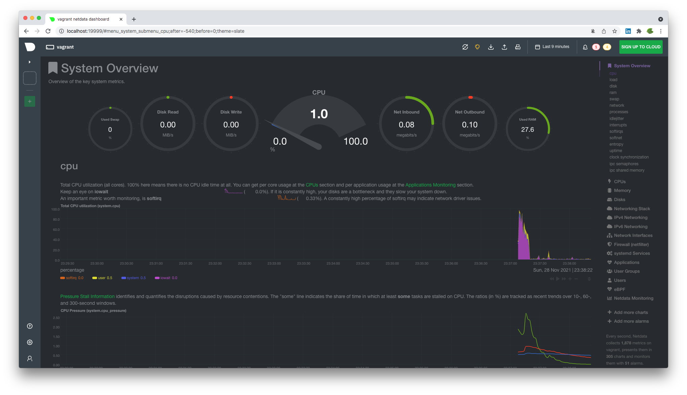
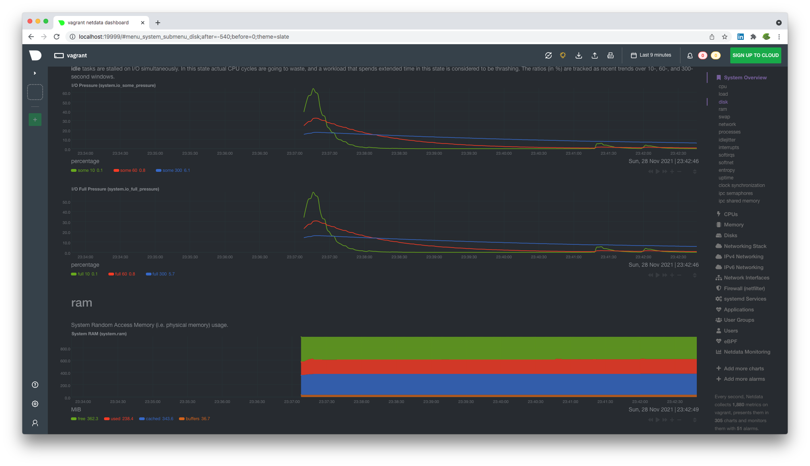

#### 1. Используя знания из лекции по systemd, создайте самостоятельно простой unit-файл для node_exporter:<br />* поместите его в автозагрузку,<br />* предусмотрите возможность добавления опций к запускаемому процессу через внешний файл (посмотрите, например, на `systemctl cat cron`),<br />* удостоверьтесь, что с помощью systemctl процесс корректно стартует, завершается, а после перезагрузки автоматически поднимается.

`vagrant@vagrant:~$ sudo nano /lib/systemd/system/node_exporter.service`

Содержание файла:
````bash
[Unit]
Description=Prometheus Node Exporter
Wants=network-online.target
After=network-online.target

[Service]
Type=simple
ExecStart=/home/vagrant/node_exporter-1.3.0.linux-amd64/node_exporter

[Install]
WantedBy=multi-user.target
````

Добавляем его в автозагрузку:  
````bash
vagrant@vagrant:~$ sudo systemctl enable node_exporter
Created symlink /etc/systemd/system/multi-user.target.wants/node_exporter.service → /lib/systemd/system/node_exporter.service.
````

Предусмотрим возможность добавления опций через внешний файл, добавив строчку:
`EnvironmentFile=/etc/default/node_exporter`

Файл `node_exporter.service` будет теперь выглядеть вот так:
````commandline
vagrant@vagrant:~$ systemctl cat node_exporter
# /lib/systemd/system/node_exporter.service
[Unit]
Description=Prometheus Node Exporter
Wants=network-online.target
After=network-online.target

[Service]
EnvironmentFile=/etc/default/node_exporter
Type=simple
ExecStart=/home/vagrant/node_exporter-1.3.0.linux-amd64/node_exporter $MYOPTIONS

[Install]
WantedBy=multi-user.target
````

Проверим, что процесс корректно стартует:
````bash
vagrant@vagrant:~$ systemctl status node_exporter
● node_exporter.service - Prometheus Node Exporter
     Loaded: loaded (/lib/systemd/system/node_exporter.service; enabled; vendor preset: enabled)
     Active: inactive (dead)

<...>

vagrant@vagrant:~$ systemctl start node_exporter
==== AUTHENTICATING FOR org.freedesktop.systemd1.manage-units ===
Authentication is required to start 'node_exporter.service'.
Authenticating as: vagrant,,, (vagrant)
Password:
==== AUTHENTICATION COMPLETE ===
vagrant@vagrant:~$ systemctl status node_exporter.service
● node_exporter.service - Prometheus Node Exporter
     Loaded: loaded (/lib/systemd/system/node_exporter.service; enabled; vendor preset: enabled)
     Active: active (running) since Sun 2021-11-28 00:05:06 UTC; 15s ago
   Main PID: 56285 (node_exporter)
      Tasks: 4 (limit: 1071)
     Memory: 2.4M
     CGroup: /system.slice/node_exporter.service
             └─56285 /home/vagrant/node_exporter-1.3.0.linux-amd64/node_exporter
````

Проверим, что действительно есть такой процесс:
````bash
vagrant@vagrant:~$ ps -aux | grep node_exporter
root       56285  0.0  1.0 715964 11044 ?        Ssl  00:05   0:00 /home/vagrant/node_exporter-1.3.0.linux-amd64/node_exporter
vagrant    56303  0.0  0.0  10760   736 pts/0    S+   00:06   0:00 grep --color=auto node_exporter
````

Проверим, что процесс корректно завершается:
````bash
vagrant@vagrant:~$ systemctl stop node_exporter
==== AUTHENTICATING FOR org.freedesktop.systemd1.manage-units ===
Authentication is required to stop 'node_exporter.service'.
Authenticating as: vagrant,,, (vagrant)
Password:
==== AUTHENTICATION COMPLETE ===
vagrant@vagrant:~$ systemctl status node_exporter.service
● node_exporter.service - Prometheus Node Exporter
     Loaded: loaded (/lib/systemd/system/node_exporter.service; enabled; vendor preset: enabled)
     Active: inactive (dead) since Sun 2021-11-28 00:07:13 UTC; 4s ago
    Process: 56285 ExecStart=/home/vagrant/node_exporter-1.3.0.linux-amd64/node_exporter (code=killed, signal=TERM)
   Main PID: 56285 (code=killed, signal=TERM)
   
<...>

vagrant@vagrant:~$ ps -aux | grep node_exporter
vagrant    56328  0.0  0.0  10760   676 pts/0    S+   00:07   0:00 grep --color=auto node_exporter
````

Процесс успешно стартует и завершается через `systemctl`.

Перезагрузим систему и проверим, что процесс автоматически стартует:
````bash
vagrant@vagrant:~$ sudo reboot
Connection to 127.0.0.1 closed by remote host.
Connection to 127.0.0.1 closed.
Opalennyi-iMac-2:03-sysadmin-01-terminal opalennyi$ vagrant ssh
<...>
Last login: Sat Nov 27 22:19:51 2021 from 10.0.2.2
vagrant@vagrant:~$ systemctl status node_exporter.service
● node_exporter.service - Prometheus Node Exporter
     Loaded: loaded (/lib/systemd/system/node_exporter.service; enabled; vendor preset: enabled)
     Active: active (running) since Sun 2021-11-28 00:10:36 UTC; 1min 6s ago
   Main PID: 758 (node_exporter)
      Tasks: 5 (limit: 1112)
     Memory: 14.6M
     CGroup: /system.slice/node_exporter.service
             └─758 /home/vagrant/node_exporter-1.3.0.linux-amd64/node_exporter
<...>
vagrant@vagrant:~$ ps -aux | grep node_exporter
root         758  0.0  1.2 715964 12968 ?        Ssl  00:10   0:00 /home/vagrant/node_exporter-1.3.0.linux-amd64/node_exporter
vagrant     1076  0.0  0.2  10760  2468 pts/0    S+   00:12   0:00 grep --color=auto node_exporter
````

Все успешно стартует после перезагрузки.

#### 2. Ознакомьтесь с опциями node_exporter и выводом `/metrics` по-умолчанию. Приведите несколько опций, которые вы бы выбрали для базового мониторинга хоста по CPU, памяти, диску и сети.

**CPU:**
* `node_cpu_seconds_total{cpu="0",mode="system"}` — время выполнения процессов, которые выполняются в режиме ядра.
* `node_cpu_seconds_total{cpu="0",mode="user"}` — время выполнения обычных процессов, которые выполняются в режиме пользователя.
* `node_cpu_seconds_total{cpu="0",mode="idle"}` — время простоя системы, когда CPU ничем не занят.

**Memory:**
* `node_memory_MemTotal_bytes` — общий объем памяти на машине.
* `node_memory_MemFree_bytes` — объем свободной памяти, оставшийся в системе, не включая кэш и буферы, которые могут быть очищены/освобождены.
* `node_memory_MemAvailable_bytes` — объем доступной памяти, включая кэш и буферы.

**Disk:**
* `node_disk_read_time_seconds_total` — количество секунд, затраченных на чтение.
* `node_disk_read_bytes_total` — количество прочитанных байт.
* `node_disk_write_time_seconds_total` — количество секунд, затраченных на запись.
 * `node_disk_write_bytes_total` — количество прочитанных байт.
* `node_disk_io_now` — количество операций ввода-вывода (I/O), выполняемых в настоящий момент.

**Network:**
* `node_network_receive_bytes_total` — объем полученных данных (в байтах).
* `node_network_receive_errs_total` — количество возникших ошибок при получении.
* `node_network_transmit_bytes_total` — объем переданных данных (в байтах).
* `node_network_transmit_errs_total` — количество возникших ошибок при передаче.

#### 3.  Установите в свою виртуальную машину [Netdata](https://github.com/netdata/netdata). После успешной установки:<br />    * в конфигурационном файле `/etc/netdata/netdata.conf` в секции [web] замените значение с localhost на `bind to = 0.0.0.0`,<br />* добавьте в Vagrantfile проброс порта Netdata на свой локальный компьютер и сделайте `vagrant reload`:<br />```bash    config.vm.network "forwarded_port", guest: 19999, host: 19999```<br />После успешной перезагрузки в браузере *на своем ПК* (не в виртуальной машине) вы должны суметь зайти на `localhost:19999`. Ознакомьтесь с метриками, которые по умолчанию собираются Netdata и с комментариями, которые даны к этим метрикам.





#### 4. Можно ли по выводу `dmesg` понять, осознает ли ОС, что загружена не на настоящем оборудовании, а на системе виртуализации?

Судя по всему, можно:
````bash
vagrant@vagrant:~$ dmesg | grep virtual
[    0.003907] CPU MTRRs all blank - virtualized system.
[    0.249692] Booting paravirtualized kernel on KVM
[    7.355906] systemd[1]: Detected virtualization oracle.
````

На моей обычной системе (не виртуализированной, MacOS) не выводится по `grep virtual` вообще ничего:  
`Opalennyi-iMac-2:~ opalennyi$ sudo dmesg | grep virtual`, вывод пустой.

Но если смотреть все сообщения, то косвенно можно предположить еще и по этим сообщениям:  

`[    0.000000] Command line: BOOT_IMAGE=/boot/vmlinuz-5.4.0-90-generic root=/dev/mapper/vgvagrant-root ro net.ifnames=0 biosdevname=0 quiet` — здесь после `boot` появляется `vmlinuz`, где `vm`, возможно, намекает на виртуализацию.

`[    0.000000] DMI: innotek GmbH VirtualBox/VirtualBox, BIOS VirtualBox 12/01/2006` — предполагаю, что у других средств виртуализации вывод будет похожим.

Но вообще, пожалуй, ключевое сообщение вот это: `[    0.000000] Hypervisor detected: KVM`. Оно нам напрямую говорит о том, что обнаружен гипервизор.

#### 5. Как настроен sysctl `fs.nr_open` на системе по-умолчанию? Узнайте, что означает этот параметр. Какой другой существующий лимит не позволит достичь такого числа (`ulimit --help`)?

````bash
vagrant@vagrant:~$ sysctl fs.nr_open
fs.nr_open = 1048576
````

По сути, это ограничение сверху на количество создаваемых файловых дескрипторов _одним процессом_. Больше этого числа создать невозможно.

>**/proc/sys/fs/nr_open (since Linux 2.6.25)**<br />
>              This  file  imposes  ceiling  on  the  value to which the RLIMIT_NOFILE resource limit can be raised (see getrlimit(2)).  This ceiling is enforced for both unprivileged and privileged process.  The default value in this file is 1048576.  (Before Linux 2.6.25, the ceiling for RLIMIT_NOFILE was hard-coded to the same value.)

>**RLIMIT_NOFILE**  
>              This specifies a value one greater than the maximum file descriptor number that can be opened by this process.  Attempts (open(2), pipe(2), dup(2), etc.)  to exceed this limit yield the error EMFILE.  (Historically, this limit was  named  RLIMIT_OFILE on BSD.)  
>              Since Linux 4.5, this limit also defines the maximum number of file descriptors that an unprivileged process (one without the CAP_SYS_RESOURCE capability) may have "in flight" to other processes, by being passed across UNIX domain sockets.  This limit applies to the sendmsg(2) system call.  For further details, see unix(7).

Другой лимит — `ulimit` (soft и hard ограничения):
````bash
vagrant@vagrant:~$ ulimit -Sn
1024
vagrant@vagrant:~$ ulimit -Hn
1048576
````

Эти ограничения задаются кратно 1024, 1048576 — это 1024*1024.

#### 6. Запустите любой долгоживущий процесс (не `ls`, который отработает мгновенно, а, например, `sleep 1h`) в отдельном неймспейсе процессов; покажите, что ваш процесс работает под PID 1 через `nsenter`. Для простоты работайте в данном задании под root (`sudo -i`). Под обычным пользователем требуются дополнительные опции (`--map-root-user`) и т.д.

В отдельном окне терминала создадим отдельное пространство имен и запустим там `sleep`:
````bash
root@vagrant:~# screen
root@vagrant:~# unshare -f --pid --mount-proc /bin/bash
root@vagrant:~# sleep 1h
````

Вернемся в основное окно терминала.
````bash
root@vagrant:~# ps aux | grep sleep
root        1415  0.0  0.0   9828   580 pts/2    S+   22:32   0:00 sleep 1h
root@vagrant:/# nsenter --target 1415 --pid --mount
root@vagrant:/# ps aux
USER         PID %CPU %MEM    VSZ   RSS TTY      STAT START   TIME COMMAND
root           1  0.0  0.3  11560  3880 pts/2    S    22:32   0:00 /bin/bash
root           8  0.0  0.0   9828   580 pts/2    S+   22:32   0:00 sleep 1h
root           9  0.0  0.4  11564  4056 pts/0    S    22:33   0:00 -bash
root          19  0.0  0.3  13216  3432 pts/0    R+   22:33   0:00 ps aux
````

Как мы видим в списке процессов, с `PID = 1` работает `bash` (что логично, это первый процесс, который мы запустили в этом неймспейсе). `sleep` работает с `PID = 8`.

#### 7. Найдите информацию о том, что такое `:(){ :|:& };:`. Запустите эту команду в своей виртуальной машине Vagrant с Ubuntu 20.04 (**это важно, поведение в других ОС не проверялось**). Некоторое время все будет "плохо", после чего (минуты) – ОС должна стабилизироваться. Вызов `dmesg` расскажет, какой механизм помог автоматической стабилизации. Как настроен этот механизм по-умолчанию, и как изменить число процессов, которое можно создать в сессии?

Это функция, которая, выполняясь, дважды порождает саму себя, и так распространяется по экспоненте. В более читабельном виде выглядит вот так:
````bash
:()
{
    :|:&
};
:
````
Имя функции — `:`, но идейно может быть любым. `:|:` — последовательный вызов функцией самой себя, причем это происходит в фоновом режиме: `&`. `;` завершает определение функции, и дальше она вызывается и, соответственно, исполняется.

Как мне говорит интернет, на C, а не на Pearl это будет выглядить примерно так:
````C
#include <sys/types.h>
#include <unistd.h>
int main()
{
    fork();
    fork();
}
````

В общем, все время происходит двойной `fork` процесса и умножение числа процессов, пока позволяют ресурсы ОС.

Функционал, судя по всему, вот этот, `pids controller`:
````bash
[ 1106.284126] cgroup: fork rejected by pids controller in /user.slice/user-1000.slice/session-4.scope
````

Через `ulimit -u <number>` можно задать максимальное количество процессов для пользователя. Предполагаю, что по умолчанию оно настроено на системное значение `ulimit -u = 3707` в моей системе.