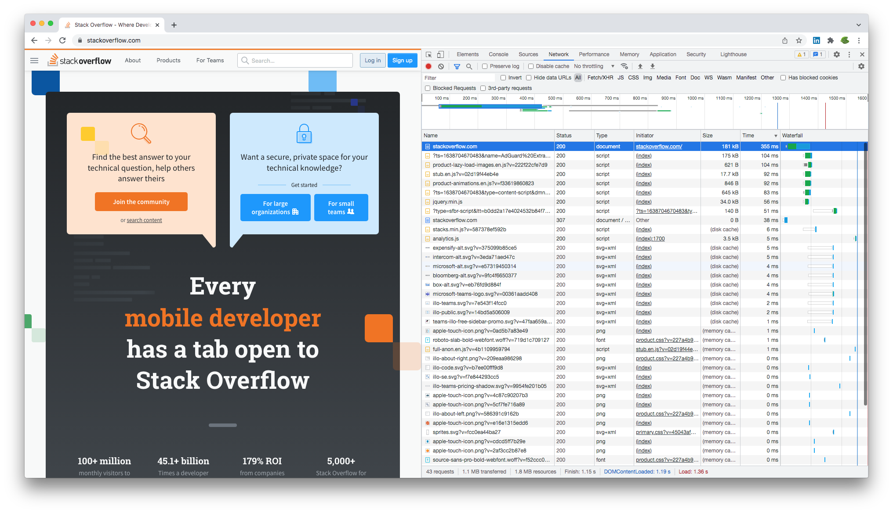
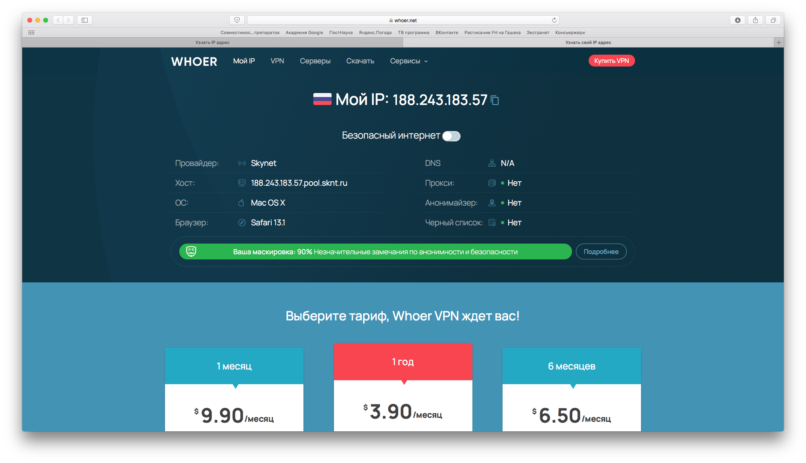
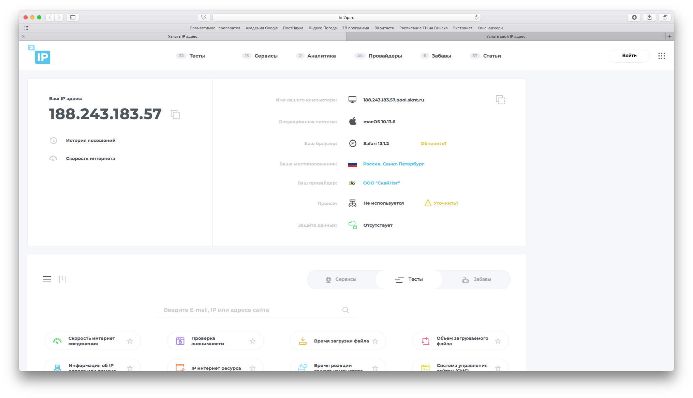
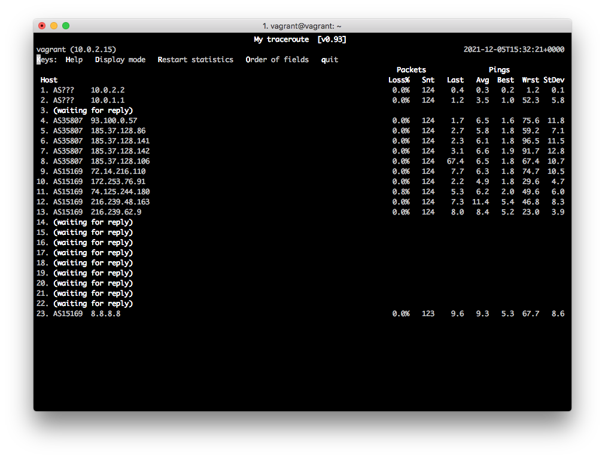

#### 1. Работа c HTTP через телнет. В ответе укажите полученный HTTP код, что он означает?

````bash
vagrant@vagrant:~$ telnet stackoverflow.com 80
Trying 151.101.1.69...
Connected to stackoverflow.com.
Escape character is '^]'.
GET /questions HTTP/1.0
HOST: stackoverflow.com

HTTP/1.1 301 Moved Permanently
cache-control: no-cache, no-store, must-revalidate
location: https://stackoverflow.com/questions
x-request-guid: 1c86390c-66dd-4f22-9376-ca7a2818b0c4
feature-policy: microphone 'none'; speaker 'none'
content-security-policy: upgrade-insecure-requests; frame-ancestors 'self' https://stackexchange.com
Accept-Ranges: bytes
Date: Sun, 05 Dec 2021 13:43:49 GMT
Via: 1.1 varnish
Connection: close
X-Served-By: cache-hhn4075-HHN
X-Cache: MISS
X-Cache-Hits: 0
X-Timer: S1638711829.261993,VS0,VE170
Vary: Fastly-SSL
X-DNS-Prefetch-Control: off
Set-Cookie: prov=03d455fa-5414-a5b8-e71b-4a2176120b3b; domain=.stackoverflow.com; expires=Fri, 01-Jan-2055 00:00:00 GMT; path=/; HttpOnly

Connection closed by foreign host.
````

Мы получили код `301 Moved Permanently`, что значит, что `stackoverflow.com` был перемещен в новое месторасположение и происходит постоянное перенаправление. В поле `location` мы видим, что происходит перенаправление на `https://stackoverflow.com`.

#### 2. Повторите задание 1 в браузере, используя консоль разработчика F12.

Первый ответ HTTP-сервера: `Status Code: 307 Internal Redirect`. 307 код, по идее, означает, что запрошенный ресурс был временно перемещен в другое место и будет возвращен обратно.

Дольше всего обрабатывался запрос самого `stackoverflow.com` с кодом 200 (успешный ответ), поскольку у нас загружалась страница `stackoverflow.com`.



#### 3. Какой IP адрес у вас в интернете?

На виртуальной машине можно сделать это через терминал:
````bash
vagrant@vagrant:~$ wget -qO- eth0.me
188.243.183.57
````

Проверим на локальной машине:



#### 4. Какому провайдеру принадлежит ваш IP адрес? Какой автономной системе AS? Воспользуйтесь утилитой `whois`

И на локальной, и на виртуальной машине вывод одинаковый, немного отличается преамбула перед выводом ответа.

На виртуальной машине:
````bash
vagrant@vagrant:~$ whois 188.243.183.57
% This is the RIPE Database query service.
% The objects are in RPSL format.
%
% The RIPE Database is subject to Terms and Conditions.
% See http://www.ripe.net/db/support/db-terms-conditions.pdf

% Note: this output has been filtered.
%       To receive output for a database update, use the "-B" flag.

% Information related to '188.243.128.0 - 188.243.255.255'

% Abuse contact for '188.243.128.0 - 188.243.255.255' is 'abuse@sknt.ru'

inetnum:        188.243.128.0 - 188.243.255.255
netname:        SKYNET
descr:          SkyNet Network
country:        RU
admin-c:        SKNT2-RIPE
tech-c:         SKNT2-RIPE
status:         ASSIGNED PA
mnt-by:         MNT-SKNT
mnt-lower:      MNT-SKNT
mnt-routes:     MNT-SKNT
created:        2014-09-30T14:25:55Z
last-modified:  2014-09-30T14:25:55Z
source:         RIPE

role:           SKYNET NOC
address:        SkyNet LLC
address:        192239 St. Petersburg
address:        Russian Federation
phone:          +7 (812) 386 20 20
remarks:        -----------------------------------------
remarks:        Routing and peering issues: tp2@hub.sknt.ru
remarks:        Abuse and security: tp2@hub.sknt.ru
remarks:        -----------------------------------------
abuse-mailbox:  abuse@sknt.ru
admin-c:        MK5687-RIPE
tech-c:         MK5687-RIPE
nic-hdl:        SKNT2-RIPE
mnt-by:         MNT-SKNT
created:        2008-04-21T16:28:30Z
last-modified:  2020-05-16T12:43:27Z
source:         RIPE # Filtered

% Information related to '188.243.128.0/18AS35807'

route:          188.243.128.0/18
descr:          SkyNet Networks
origin:         AS35807
mnt-by:         MNT-SKNT
created:        2009-07-06T09:26:47Z
last-modified:  2009-07-06T09:26:47Z
source:         RIPE

% This query was served by the RIPE Database Query Service version 1.101 (BLAARKOP)
````

На локальной машине:
````bash
Opalennyi-iMac-2:~ opalennyi$ whois 188.243.183.57
% IANA WHOIS server
% for more information on IANA, visit http://www.iana.org
% This query returned 1 object

refer:        whois.ripe.net

inetnum:      188.0.0.0 - 188.255.255.255
organisation: Administered by RIPE NCC
status:       LEGACY

whois:        whois.ripe.net

changed:      1993-05
source:       IANA

% This is the RIPE Database query service.
% The objects are in RPSL format.
%
% The RIPE Database is subject to Terms and Conditions.
% See http://www.ripe.net/db/support/db-terms-conditions.pdf

% Note: this output has been filtered.
%       To receive output for a database update, use the "-B" flag.

% Information related to '188.243.128.0 - 188.243.255.255'

% Abuse contact for '188.243.128.0 - 188.243.255.255' is 'abuse@sknt.ru'

inetnum:        188.243.128.0 - 188.243.255.255
netname:        SKYNET
descr:          SkyNet Network
country:        RU
admin-c:        SKNT2-RIPE
tech-c:         SKNT2-RIPE
status:         ASSIGNED PA
mnt-by:         MNT-SKNT
mnt-lower:      MNT-SKNT
mnt-routes:     MNT-SKNT
created:        2014-09-30T14:25:55Z
last-modified:  2014-09-30T14:25:55Z
source:         RIPE

role:           SKYNET NOC
address:        SkyNet LLC
address:        192239 St. Petersburg
address:        Russian Federation
phone:          +7 (812) 386 20 20
remarks:        -----------------------------------------
remarks:        Routing and peering issues: tp2@hub.sknt.ru
remarks:        Abuse and security: tp2@hub.sknt.ru
remarks:        -----------------------------------------
abuse-mailbox:  abuse@sknt.ru
admin-c:        MK5687-RIPE
tech-c:         MK5687-RIPE
nic-hdl:        SKNT2-RIPE
mnt-by:         MNT-SKNT
created:        2008-04-21T16:28:30Z
last-modified:  2020-05-16T12:43:27Z
source:         RIPE # Filtered

% Information related to '188.243.128.0/18AS35807'

route:          188.243.128.0/18
descr:          SkyNet Networks
origin:         AS35807
mnt-by:         MNT-SKNT
created:        2009-07-06T09:26:47Z
last-modified:  2009-07-06T09:26:47Z
source:         RIPE

% This query was served by the RIPE Database Query Service version 1.101 (WAGYU)
````

Провайдер — SkyNet, автономная система — AS35807.

#### 5. Через какие сети проходит пакет, отправленный с вашего компьютера на адрес 8.8.8.8? Через какие AS? Воспользуйтесь утилитой `traceroute`

На виртуальной машине:
````bash
vagrant@vagrant:~$ traceroute -An 8.8.8.8
traceroute to 8.8.8.8 (8.8.8.8), 30 hops max, 60 byte packets
 1  10.0.2.2 [*]  0.229 ms  0.164 ms  0.292 ms
 2  10.0.1.1 [*]  4.303 ms  4.555 ms  4.457 ms
 3  * * *
 4  93.100.0.57 [AS35807]  3.838 ms  7.389 ms  7.518 ms
 5  185.37.128.86 [AS35807]  7.381 ms  7.348 ms  7.260 ms
 6  185.37.128.141 [AS35807]  7.064 ms  2.212 ms  6.049 ms
 7  185.37.128.142 [AS35807]  5.533 ms  3.996 ms  3.949 ms
 8  185.37.128.106 [AS35807]  3.914 ms  3.970 ms  4.268 ms
 9  72.14.216.110 [AS15169]  4.175 ms  4.467 ms  4.384 ms
10  * * *
11  209.85.240.254 [AS15169]  4.226 ms  4.268 ms 74.125.244.129 [AS15169]  8.049 ms
12  74.125.244.180 [AS15169]  8.013 ms  21.288 ms 74.125.244.132 [AS15169]  4.085 ms
13  142.251.61.219 [AS15169]  9.848 ms 142.251.61.221 [AS15169]  10.177 ms 72.14.232.85 [AS15169]  54.371 ms
14  216.239.42.23 [AS15169]  10.074 ms 142.251.61.219 [AS15169]  10.021 ms 216.239.48.163 [AS15169]  9.775 ms
15  * * 216.239.47.201 [AS15169]  9.965 ms
16  * * *
17  * * *
18  * * *
19  * * *
20  * * *
21  * * *
22  * * *
23  * * *
24  * * *
25  8.8.8.8 [AS15169]  10.781 ms  13.279 ms  10.946 ms
````

На локальной машине:
````bash
Opalennyi-iMac-2:~ opalennyi$ traceroute -an 8.8.8.8
traceroute to 8.8.8.8 (8.8.8.8), 64 hops max, 52 byte packets
 1  [AS0] 10.0.1.1  1.157 ms  0.839 ms  0.860 ms
 2  * * *
 3  [AS35807] 93.100.0.57  1.734 ms  2.648 ms  2.760 ms
 4  [AS35807] 185.37.128.86  3.539 ms  3.029 ms  2.014 ms
 5  [AS35807] 185.37.128.141  2.685 ms  5.139 ms  3.538 ms
 6  [AS35807] 185.37.128.142  1.653 ms  2.500 ms  2.563 ms
 7  [AS35807] 185.37.128.106  2.604 ms  2.530 ms  2.556 ms
 8  [AS15169] 72.14.216.110  2.632 ms  4.840 ms  1.887 ms
 9  * * *
10  [AS15169] 74.125.244.129  3.383 ms
    [AS15169] 209.85.245.238  3.151 ms  2.477 ms
11  [AS15169] 74.125.244.132  4.917 ms
    [AS15169] 74.125.244.181  2.547 ms  2.469 ms
12  [AS15169] 72.14.232.85  2.608 ms  2.723 ms  3.663 ms
13  [AS15169] 142.251.51.187  6.608 ms
    [AS15169] 142.251.61.219  6.422 ms
    [AS15169] 172.253.51.243  6.450 ms
14  * * [AS15169] 209.85.246.111  7.649 ms
15  * * *
16  * * *
17  * * *
18  * * *
19  * * *
20  * * *
21  * * *
22  * * *
23  * [AS0] 8.8.8.8  6.577 ms
````

На виртуальной машине добавляется узел 10.0.2.2 — полагаю, что это какой-то виртуализированный узел, к которому идет запрос от виртуальной машины в первую очередь.

#### 6. Повторите задание 5 в утилите `mtr`. На каком участке наибольшая задержка - delay?

````bash
                                                    My traceroute  [v0.93]
vagrant (10.0.2.15)                                                                                   2021-12-05T15:28:50+0000
Keys:  Help   Display mode   Restart statistics   Order of fields   quit
                                                                                      Packets               Pings
 Host                                                                               Loss%   Snt   Last   Avg  Best  Wrst StDev
 1. AS???    10.0.2.2                                                                0.0%     8    0.3   0.3   0.3   0.4   0.1
 2. AS???    10.0.1.1                                                                0.0%     7    8.9   7.3   3.4   9.9   2.7
 3. (waiting for reply)
 4. AS35807  93.100.0.57                                                             0.0%     7    8.3  17.3   2.6  70.8  24.1
 5. AS35807  185.37.128.86                                                           0.0%     7   16.3  10.4   3.2  25.6   7.9
 6. AS35807  185.37.128.141                                                          0.0%     7   60.8  18.0   3.1  60.8  19.9
 7. AS35807  185.37.128.142                                                          0.0%     7   16.6  12.0   2.2  30.9   9.6
 8. AS35807  185.37.128.106                                                          0.0%     7   66.3  16.3   5.1  66.3  22.1
 9. AS15169  72.14.216.110                                                           0.0%     7   18.9  26.9   2.3  74.7  30.3
10. AS15169  172.253.76.91                                                           0.0%     7   13.8  10.8   2.3  23.6   7.3
11. AS15169  74.125.244.180                                                          0.0%     7   20.5  14.7   6.1  27.0   8.1
12. AS15169  216.239.48.163                                                          0.0%     7   10.2  16.4  10.2  27.4   6.8
13. AS15169  216.239.62.9                                                            0.0%     7   14.4  16.3   5.2  23.0   6.6
14. (waiting for reply)
15. (waiting for reply)
16. (waiting for reply)
17. (waiting for reply)
18. (waiting for reply)
19. (waiting for reply)
20. (waiting for reply)
21. (waiting for reply)
22. (waiting for reply)
23. AS15169  8.8.8.8                                                                 0.0%     7   46.5  18.5   8.4  46.5  13.
````

На небольшом количестве пакетов наибольшая задержка была на 72.14.216.110, при увеличении числа пакетов — на 216.239.48.163.


#### 7. Какие DNS сервера отвечают за доменное имя dns.google? Какие A записи? воспользуйтесь утилитой `dig`

````bash
vagrant@vagrant:~$ dig +trace dns.google

; <<>> DiG 9.16.1-Ubuntu <<>> +trace dns.google
;; global options: +cmd
.			975	IN	NS	g.root-servers.net.
.			975	IN	NS	j.root-servers.net.
.			975	IN	NS	l.root-servers.net.
.			975	IN	NS	b.root-servers.net.
.			975	IN	NS	a.root-servers.net.
.			975	IN	NS	f.root-servers.net.
.			975	IN	NS	e.root-servers.net.
.			975	IN	NS	d.root-servers.net.
.			975	IN	NS	h.root-servers.net.
.			975	IN	NS	i.root-servers.net.
.			975	IN	NS	m.root-servers.net.
.			975	IN	NS	c.root-servers.net.
.			975	IN	NS	k.root-servers.net.
;; Received 262 bytes from 127.0.0.53#53(127.0.0.53) in 11 ms

google.			172800	IN	NS	ns-tld1.charlestonroadregistry.com.
google.			172800	IN	NS	ns-tld2.charlestonroadregistry.com.
google.			172800	IN	NS	ns-tld3.charlestonroadregistry.com.
google.			172800	IN	NS	ns-tld4.charlestonroadregistry.com.
google.			172800	IN	NS	ns-tld5.charlestonroadregistry.com.
google.			86400	IN	DS	6125 8 2 80F8B78D23107153578BAD3800E9543500474E5C30C29698B40A3DB2 3ED9DA9F
google.			86400	IN	RRSIG	DS 8 1 86400 20211218050000 20211205040000 14748 . dUTYlakAtWqSgNqKZZ/AGauWab48UiK8aSWEA2F1O12/yobh3hmzWvda SxAwOKom8KZn6jMWCPR96vNjqYBNC5p5NGLKTGwrQ3L3rBkyqhLmJMgl jFxxhV/fTLHqTPTG6LvUK/kfPufNPu8xqDbJLPSn46oC4+wf8wFGeius iVZoYQSf6jL7eaNxMiDkr1BHICiEiA13BieAVapcJZwQAwIfa55/M3HL TDhsqmY44TRE0ZmmNdv9MSJRyDLkMGSe2V8TwdOPLtFHrZ6znL1bHj+R tiGwcDBBwxDnqtmRgFadagYfHOK1JkO3XN7Hkc++P8UZGIU+pQGVkMGV MESyRQ==
;; Received 730 bytes from 193.0.14.129#53(k.root-servers.net) in 3 ms

dns.google.		10800	IN	NS	ns3.zdns.google.
dns.google.		10800	IN	NS	ns2.zdns.google.
dns.google.		10800	IN	NS	ns1.zdns.google.
dns.google.		10800	IN	NS	ns4.zdns.google.
dns.google.		3600	IN	DS	56044 8 2 1B0A7E90AA6B1AC65AA5B573EFC44ABF6CB2559444251B997103D2E4 0C351B08
dns.google.		3600	IN	RRSIG	DS 8 2 3600 20211224065947 20211202065947 8830 google. gCiH8I5mmwAZxSjKw2Qt70gXmCRwDL93QGDPXV0Ctip2tRRIB9y849jh WxbDT0gYblgqjXlrCpMcNWcTv0lFZsNG8VrZxInNf0MBl1zN4qlWawlp BMU3ry+L0LmeuGMnP6Rrwvzhrae68RYmWDjO/oHlcMSqdwEGJLtGLsHQ 9UY=
;; Received 506 bytes from 216.239.34.105#53(ns-tld2.charlestonroadregistry.com) in 47 ms

dns.google.		900	IN	A	8.8.4.4
dns.google.		900	IN	A	8.8.8.8
dns.google.		900	IN	RRSIG	A 8 2 900 20220104080948 20211205080948 1773 dns.google. EKtspRpdgFYq2NMi4lcjFHgMq7saAUu/3m3FhQ01anMBtotAYJzrAMH7 V9VZJLJS+wOVcMItjgy1+dBqlYpmwGDIe7h4ewbSRzOrXoJOVrQwW7fd oAanE92f3l2IWwdVcB7S1Uz3elVffpTqcv4uY87faK02knr6HO96yA8g kH0=
;; Received 241 bytes from 216.239.36.114#53(ns3.zdns.google) in 7 ms
````

На локальной машине получаем такой же вывод, но необходимо явно указать сервер.
````bash
Opalennyi-iMac-2:~ opalennyi$ dig +trace dns.google

; <<>> DiG 9.10.6 <<>> +trace dns.google
;; global options: +cmd
;; connection timed out; no servers could be reached
Opalennyi-iMac-2:~ opalennyi$ dig +trace @8.8.8.8 dns.google

; <<>> DiG 9.10.6 <<>> +trace @8.8.8.8 dns.google
; (1 server found)
;; global options: +cmd
.			39671	IN	NS	l.root-servers.net.
.			39671	IN	NS	m.root-servers.net.
.			39671	IN	NS	i.root-servers.net.
.			39671	IN	NS	c.root-servers.net.
.			39671	IN	NS	b.root-servers.net.
.			39671	IN	NS	d.root-servers.net.
.			39671	IN	NS	k.root-servers.net.
.			39671	IN	NS	e.root-servers.net.
.			39671	IN	NS	f.root-servers.net.
.			39671	IN	NS	h.root-servers.net.
.			39671	IN	NS	j.root-servers.net.
.			39671	IN	NS	g.root-servers.net.
.			39671	IN	NS	a.root-servers.net.
.			39671	IN	RRSIG	NS 8 0 518400 20211217170000 20211204160000 14748 . UrFGGIzMOHts82VW6ezZP1Pt4Pu/oSHbnMZnlQKovBzlz86Wu50e2sYI UaAl8xYM9Py0QD/3GNwNWJHqNQEaCAVhAHRC7ZfL22IdS44DNIb2f25+ yOpwSFpwyX+cXJevyYxlw6BiXYT0ddh/1mB/rvHp4Zj6dyeydPQ/gr5b YVmQ1Vlse2b42bqCQTJ2O/UNkjUDs6mEuv5Q1rzzDC4aLAR0aV2BynQ5 LeR6go5J2+2VBbRYGnvKHm8yH1rPIU7yyp27LEZG1iUWRE0nY+qfdLx5 sQXNYpV9YCdc+F+J325nv1ZKvUDNLIuIoR/Lp/PFdWCBFr43iSgduLHS 8C+e5A==
;; Received 525 bytes from 8.8.8.8#53(8.8.8.8) in 53 ms

google.			172800	IN	NS	ns-tld1.charlestonroadregistry.com.
google.			172800	IN	NS	ns-tld2.charlestonroadregistry.com.
google.			172800	IN	NS	ns-tld3.charlestonroadregistry.com.
google.			172800	IN	NS	ns-tld4.charlestonroadregistry.com.
google.			172800	IN	NS	ns-tld5.charlestonroadregistry.com.
google.			86400	IN	DS	6125 8 2 80F8B78D23107153578BAD3800E9543500474E5C30C29698B40A3DB2 3ED9DA9F
google.			86400	IN	RRSIG	DS 8 1 86400 20211218050000 20211205040000 14748 . dUTYlakAtWqSgNqKZZ/AGauWab48UiK8aSWEA2F1O12/yobh3hmzWvda SxAwOKom8KZn6jMWCPR96vNjqYBNC5p5NGLKTGwrQ3L3rBkyqhLmJMgl jFxxhV/fTLHqTPTG6LvUK/kfPufNPu8xqDbJLPSn46oC4+wf8wFGeius iVZoYQSf6jL7eaNxMiDkr1BHICiEiA13BieAVapcJZwQAwIfa55/M3HL TDhsqmY44TRE0ZmmNdv9MSJRyDLkMGSe2V8TwdOPLtFHrZ6znL1bHj+R tiGwcDBBwxDnqtmRgFadagYfHOK1JkO3XN7Hkc++P8UZGIU+pQGVkMGV MESyRQ==
;; Received 730 bytes from 198.97.190.53#53(h.root-servers.net) in 45 ms

dns.google.		10800	IN	NS	ns4.zdns.google.
dns.google.		10800	IN	NS	ns1.zdns.google.
dns.google.		10800	IN	NS	ns3.zdns.google.
dns.google.		10800	IN	NS	ns2.zdns.google.
dns.google.		3600	IN	DS	56044 8 2 1B0A7E90AA6B1AC65AA5B573EFC44ABF6CB2559444251B997103D2E4 0C351B08
dns.google.		3600	IN	RRSIG	DS 8 2 3600 20211224065947 20211202065947 8830 google. gCiH8I5mmwAZxSjKw2Qt70gXmCRwDL93QGDPXV0Ctip2tRRIB9y849jh WxbDT0gYblgqjXlrCpMcNWcTv0lFZsNG8VrZxInNf0MBl1zN4qlWawlp BMU3ry+L0LmeuGMnP6Rrwvzhrae68RYmWDjO/oHlcMSqdwEGJLtGLsHQ 9UY=
;; Received 506 bytes from 216.239.60.105#53(ns-tld5.charlestonroadregistry.com) in 122 ms

dns.google.		900	IN	A	8.8.8.8
dns.google.		900	IN	A	8.8.4.4
dns.google.		900	IN	RRSIG	A 8 2 900 20220104080948 20211205080948 1773 dns.google. EKtspRpdgFYq2NMi4lcjFHgMq7saAUu/3m3FhQ01anMBtotAYJzrAMH7 V9VZJLJS+wOVcMItjgy1+dBqlYpmwGDIe7h4ewbSRzOrXoJOVrQwW7fd oAanE92f3l2IWwdVcB7S1Uz3elVffpTqcv4uY87faK02knr6HO96yA8g kH0=
;; Received 241 bytes from 216.239.38.114#53(ns4.zdns.google) in 9 ms
````

За доменное имя отвечают DNS-сервера `ns{1-4}.zdns.google`.

A-записей две: 8.8.8.8 и 8.8.4.4.

#### 8. Проверьте PTR записи для IP адресов из задания 7. Какое доменное имя привязано к IP? воспользуйтесь утилитой `dig`

```bash
vagrant@vagrant:~$ dig -x 8.8.8.8

; <<>> DiG 9.16.1-Ubuntu <<>> -x 8.8.8.8
;; global options: +cmd
;; Got answer:
;; ->>HEADER<<- opcode: QUERY, status: NOERROR, id: 1050
;; flags: qr rd ra; QUERY: 1, ANSWER: 1, AUTHORITY: 0, ADDITIONAL: 1

;; OPT PSEUDOSECTION:
; EDNS: version: 0, flags:; udp: 65494
;; QUESTION SECTION:
;8.8.8.8.in-addr.arpa.		IN	PTR

;; ANSWER SECTION:
8.8.8.8.in-addr.arpa.	769	IN	PTR	dns.google.

;; Query time: 7 msec
;; SERVER: 127.0.0.53#53(127.0.0.53)
;; WHEN: Sun Dec 05 15:46:08 UTC 2021
;; MSG SIZE  rcvd: 73

vagrant@vagrant:~$ dig -x 8.8.4.4

; <<>> DiG 9.16.1-Ubuntu <<>> -x 8.8.4.4
;; global options: +cmd
;; Got answer:
;; ->>HEADER<<- opcode: QUERY, status: NOERROR, id: 54833
;; flags: qr rd ra; QUERY: 1, ANSWER: 1, AUTHORITY: 0, ADDITIONAL: 1

;; OPT PSEUDOSECTION:
; EDNS: version: 0, flags:; udp: 65494
;; QUESTION SECTION:
;4.4.8.8.in-addr.arpa.		IN	PTR

;; ANSWER SECTION:
4.4.8.8.in-addr.arpa.	829	IN	PTR	dns.google.

;; Query time: 3 msec
;; SERVER: 127.0.0.53#53(127.0.0.53)
;; WHEN: Sun Dec 05 15:46:11 UTC 2021
;; MSG SIZE  rcvd: 73
```

В целом, ожидаемо, к обоим адресам привязано доменное имя dns.google :)