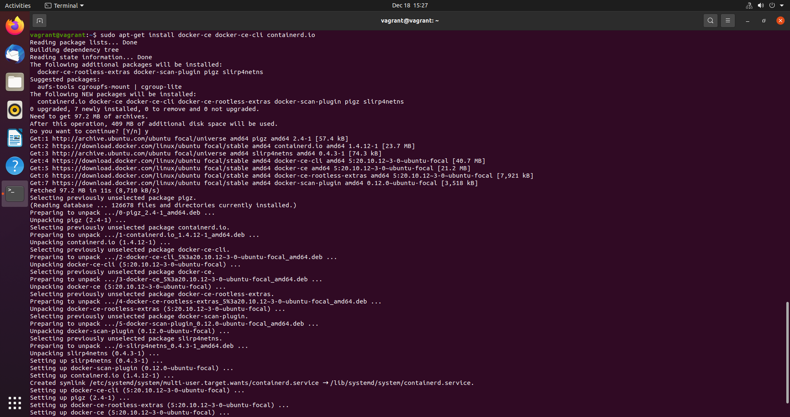
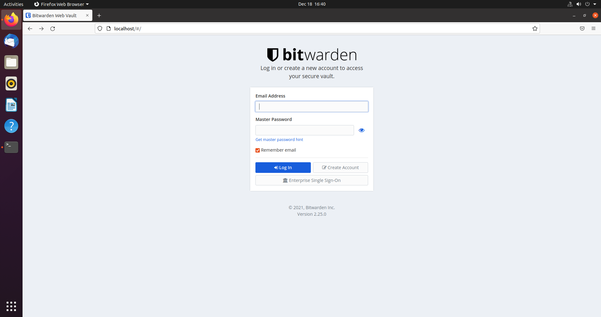
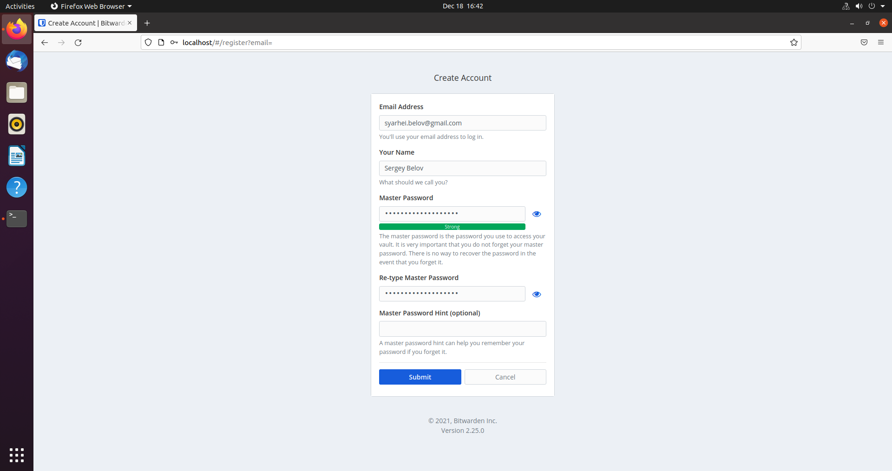
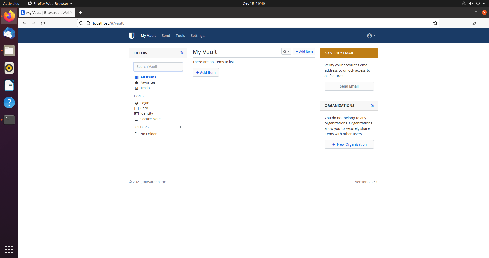
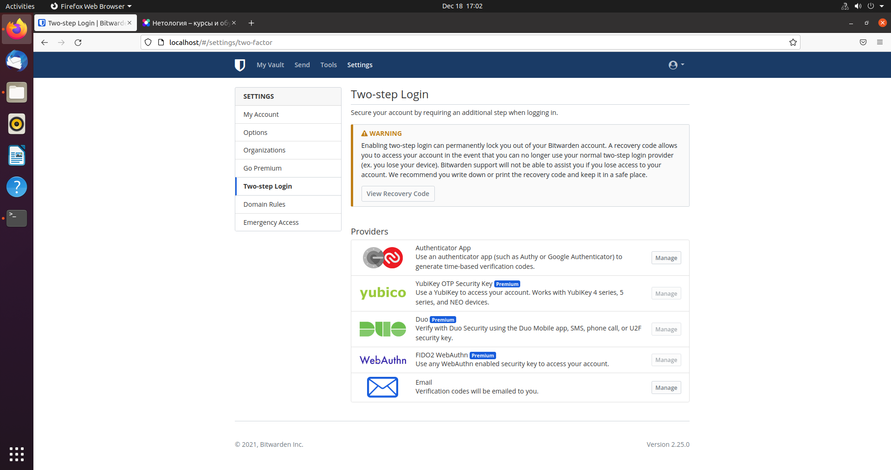
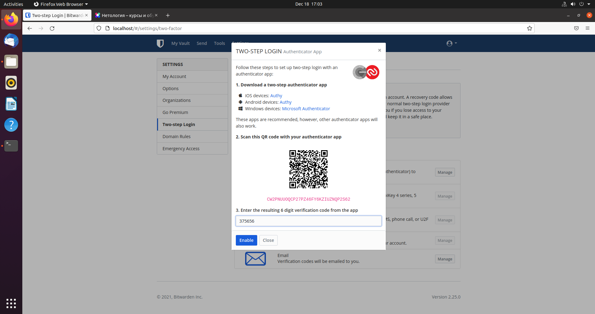
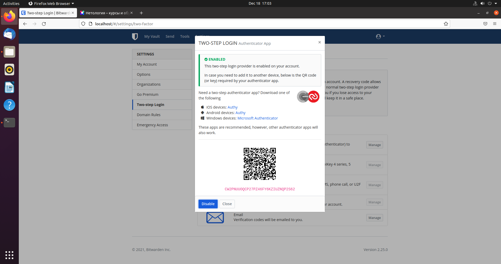
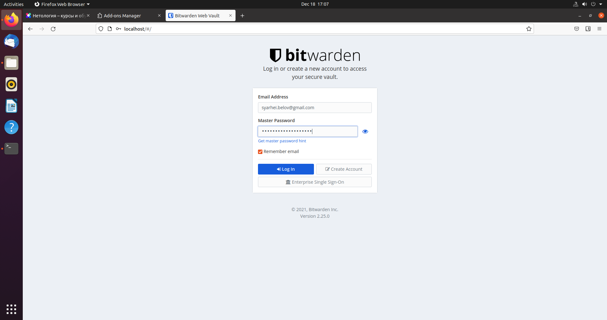
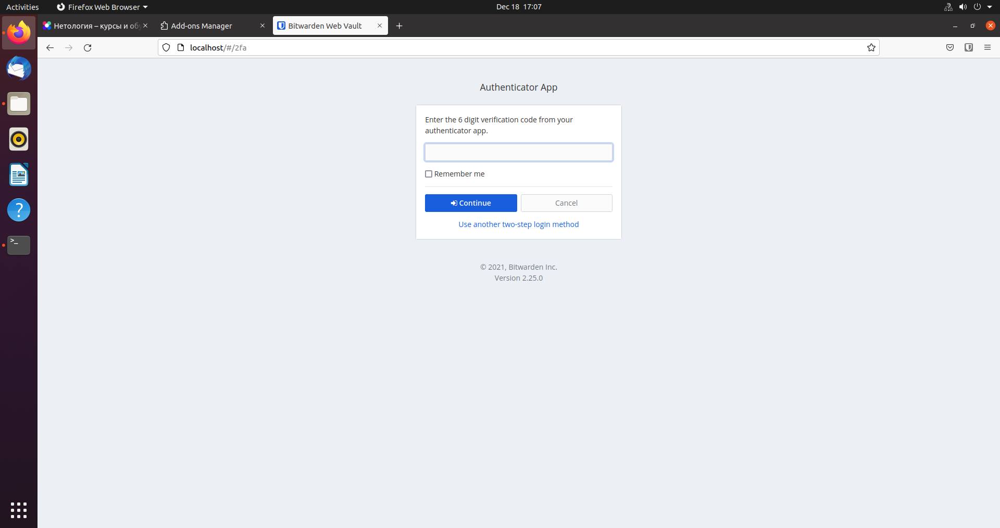

#### 1. Установите Bitwarden плагин для браузера. Зарегистрируйтесь и сохраните несколько паролей.

Установим Docker:
````bash
vagrant@vagrant:~$ sudo apt-get remove docker docker-engine docker.io containerd runc
<...>
vagrant@vagrant:~$ sudo apt-get install \
>     ca-certificates \
>     curl \
>     gnupg \
>     lsb-release
<...>
vagrant@vagrant:~$ curl -fsSL https://download.docker.com/linux/ubuntu/gpg | sudo gpg --dearmor -o /usr/share/keyrings/docker-archive-keyring.gpg
vagrant@vagrant:~$ echo \
>   "deb [arch=$(dpkg --print-architecture) signed-by=/usr/share/keyrings/docker-archive-keyring.gpg] https://download.docker.com/linux/ubuntu \
>   $(lsb_release -cs) stable" | sudo tee /etc/apt/sources.list.d/docker.list > /dev/null
vagrant@vagrant:~$ sudo apt-get update
<...>
vagrant@vagrant:~$ sudo apt-get install docker-ce docker-ce-cli containerd.io
<...>
vagrant@vagrant:~$ sudo docker run hello-world
Unable to find image 'hello-world:latest' locally
latest: Pulling from library/hello-world
2db29710123e: Pull complete 
Digest: sha256:2498fce14358aa50ead0cc6c19990fc6ff866ce72aeb5546e1d59caac3d0d60f
Status: Downloaded newer image for hello-world:latest

Hello from Docker!
This message shows that your installation appears to be working correctly.

To generate this message, Docker took the following steps:
 1. The Docker client contacted the Docker daemon.
 2. The Docker daemon pulled the "hello-world" image from the Docker Hub.
    (amd64)
 3. The Docker daemon created a new container from that image which runs the
    executable that produces the output you are currently reading.
 4. The Docker daemon streamed that output to the Docker client, which sent it
    to your terminal.

To try something more ambitious, you can run an Ubuntu container with:
 $ docker run -it ubuntu bash

Share images, automate workflows, and more with a free Docker ID:
 https://hub.docker.com/

For more examples and ideas, visit:
 https://docs.docker.com/get-started/
 
vagrant@vagrant:~$ sudo apt-get install docker-ce docker-ce-cli containerd.io
Reading package lists... Done
Building dependency tree       
Reading state information... Done
containerd.io is already the newest version (1.4.12-1).
docker-ce-cli is already the newest version (5:20.10.12~3-0~ubuntu-focal).
docker-ce is already the newest version (5:20.10.12~3-0~ubuntu-focal).
0 upgraded, 0 newly installed, 0 to remove and 0 not upgraded.
````



Создадим нового пользователя и добавим его в группу docker, чтобы не работать из-под root'а, как и в посте на Хабре:
````bash
vagrant@vagrant:~$ sudo adduser bitwarden
Adding user `bitwarden' ...
Adding new group `bitwarden' (1001) ...
Adding new user `bitwarden' (1001) with group `bitwarden' ...
Creating home directory `/home/bitwarden' ...
Copying files from `/etc/skel' ...
New password: 
Retype new password: 
passwd: password updated successfully
Changing the user information for bitwarden
Enter the new value, or press ENTER for the default
	Full Name []: 
	Room Number []: 
	Work Phone []: 
	Home Phone []: 
	Other []: 
Is the information correct? [Y/n] y
vagrant@vagrant:~$ sudo groupadd docker
groupadd: group 'docker' already exists
vagrant@vagrant:~$ sudo usermod -aG docker bitwarden
vagrant@vagrant:~$ sudo mkdir /opt/bitwarden
vagrant@vagrant:~$ sudo chmod -R 700 /opt/bitwarden
vagrant@vagrant:~$ sudo chown -R bitwarden:bitwarden /opt/bitwarden
````

Установим и настроим Bitwarden:
````bash
vagrant@vagrant:~$ whoami
vagrant
vagrant@vagrant:~$ su - bitwarden
Password: 
bitwarden@vagrant:~$ whoami
bitwarden
bitwarden@vagrant:~$ curl -Lso bitwarden.sh https://go.btwrdn.co/bw-sh \
>     && chmod 700 bitwarden.sh
bitwarden@vagrant:~$ ./bitwarden.sh install
 _     _ _                         _            
| |__ (_) |___      ____ _ _ __ __| | ___ _ __  
| '_ \| | __\ \ /\ / / _` | '__/ _` |/ _ \ '_ \ 
| |_) | | |_ \ V  V / (_| | | | (_| |  __/ | | |
|_.__/|_|\__| \_/\_/ \__,_|_|  \__,_|\___|_| |_|

Open source password management solutions
Copyright 2015-2021, 8bit Solutions LLC
https://bitwarden.com, https://github.com/bitwarden

===================================================

bitwarden.sh version 1.45.2
Docker version 20.10.12, build e91ed57
docker-compose version 1.28.2, build 67630359

(!) Enter the domain name for your Bitwarden instance (ex. bitwarden.example.com): localhost

(!) Enter the database name for your Bitwarden instance (ex. vault): vault

1.45.2: Pulling from bitwarden/setup
Digest: sha256:be005aacce4916fa5f5406a9f21f681dba9c439ba9c8ade225fa0c68d29caacf
Status: Image is up to date for bitwarden/setup:1.45.2
docker.io/bitwarden/setup:1.45.2

(!) Enter your installation id (get at https://bitwarden.com/host): 8ae17e3d-d994-45d4-b26e-ae02010e189a

(!) Enter your installation key: Xs1uXQpgExabLpdLimP9

(!) Do you have a SSL certificate to use? (y/n): n

(!) Do you want to generate a self-signed SSL certificate? (y/n): n

Generating key for IdentityServer.
Generating a RSA private key
........................++++
.++++
writing new private key to 'identity.key'
-----

!!!!!!!!!! WARNING !!!!!!!!!!
You are not using a SSL certificate. Bitwarden requires HTTPS to operate. 
You must front your installation with a HTTPS proxy or the web vault (and 
other Bitwarden apps) will not work properly.

Building nginx config.
Building docker environment files.
Building docker environment override files.
Building FIDO U2F app id.
Building docker-compose.yml.

Installation complete

If you need to make additional configuration changes, you can modify
the settings in `./bwdata/config.yml` and then run:
`./bitwarden.sh rebuild` or `./bitwarden.sh update`

Next steps, run:
`./bitwarden.sh start`

bitwarden@vagrant:~$ ./bitwarden.sh start
 _     _ _                         _            
| |__ (_) |___      ____ _ _ __ __| | ___ _ __  
| '_ \| | __\ \ /\ / / _` | '__/ _` |/ _ \ '_ \ 
| |_) | | |_ \ V  V / (_| | | | (_| |  __/ | | |
|_.__/|_|\__| \_/\_/ \__,_|_|  \__,_|\___|_| |_|

Open source password management solutions
Copyright 2015-2021, 8bit Solutions LLC
https://bitwarden.com, https://github.com/bitwarden

===================================================

bitwarden.sh version 1.45.2
Docker version 20.10.12, build e91ed57
docker-compose version 1.28.2, build 67630359

Pulling mssql         ... done
Pulling web           ... done
Pulling attachments   ... done
Pulling api           ... done
Pulling identity      ... done
Pulling sso           ... done
Pulling admin         ... done
Pulling icons         ... done
Pulling notifications ... done
Pulling events        ... done
Pulling nginx         ... done
Creating directory /home/bitwarden/bwdata/core
Creating directory /home/bitwarden/bwdata/core/attachments
Creating directory /home/bitwarden/bwdata/logs
Creating directory /home/bitwarden/bwdata/logs/admin
Creating directory /home/bitwarden/bwdata/logs/api
Creating directory /home/bitwarden/bwdata/logs/events
Creating directory /home/bitwarden/bwdata/logs/icons
Creating directory /home/bitwarden/bwdata/logs/identity
Creating directory /home/bitwarden/bwdata/logs/mssql
Creating directory /home/bitwarden/bwdata/logs/nginx
Creating directory /home/bitwarden/bwdata/logs/notifications
Creating directory /home/bitwarden/bwdata/logs/sso
Creating directory /home/bitwarden/bwdata/logs/portal
Creating directory /home/bitwarden/bwdata/mssql/backups
Creating directory /home/bitwarden/bwdata/mssql/data
Building with native build. Learn about native build in Compose here: https://docs.docker.com/go/compose-native-build/
Creating network "docker_default" with the default driver
Creating network "docker_public" with the default driver
Creating bitwarden-sso           ... done
Creating bitwarden-mssql         ... done
Creating bitwarden-identity      ... done
Creating bitwarden-web           ... done
Creating bitwarden-notifications ... done
Creating bitwarden-api           ... done
Creating bitwarden-icons         ... done
Creating bitwarden-attachments   ... done
Creating bitwarden-events        ... done
Creating bitwarden-admin         ... done
Creating bitwarden-nginx         ... done
1.45.2: Pulling from bitwarden/setup
Digest: sha256:be005aacce4916fa5f5406a9f21f681dba9c439ba9c8ade225fa0c68d29caacf
Status: Image is up to date for bitwarden/setup:1.45.2
docker.io/bitwarden/setup:1.45.2


Bitwarden is up and running!
===================================================

visit http://localhost
to update, run `./bitwarden.sh updateself` and then `./bitwarden.sh update`
````

Зайдем на localhost в браузере, зарегистрируем нового пользователя и зайдем под ним в панель управления:







Добавим пароль от Нетологии в менеджер:


#### 2. Установите Google authenticator на мобильный телефон. Настройте вход в Bitwarden акаунт через Google authenticator OTP.







Проверим, что аутентификация происходит с запросом одноразового пароля:





#### 3. Установите apache2, сгенерируйте самоподписанный сертификат, настройте тестовый сайт для работы по HTTPS.

# [ ЭТО НЕ ПАШЕТ, НАДО ПЕРЕДЕЛАТЬ ]

````bash
not-vagrant@not-vagrant:~$ sudo apt-get update && sudo apt-get upgrade
not-vagrant@not-vagrant:~$ sudo apt install apache2
not-vagrant@not-vagrant:~$ sudo ufw allow "Apache Full"
Rules updated
Rules updated (v6)
///

vagrant@vagrant:~$ sudo a2enmod ssl
Considering dependency setenvif for ssl:
Module setenvif already enabled
Considering dependency mime for ssl:
Module mime already enabled
Considering dependency socache_shmcb for ssl:
Enabling module socache_shmcb.
Enabling module ssl.
See /usr/share/doc/apache2/README.Debian.gz on how to configure SSL and create self-signed certificates.
To activate the new configuration, you need to run:
  systemctl restart apache2

vagrant@vagrant:~$ sudo systemctl restart apache2
vagrant@vagrant:~$ sudo openssl req -x509 -nodes -days 365 -newkey rsa:2048 -keyout /etc/ssl/private/apache-selfsigned.key -out /etc/ssl/certs/apache-selfsigned.crt
Generating a RSA private key
........................+++++
.+++++
writing new private key to '/etc/ssl/private/apache-selfsigned.key'
-----
You are about to be asked to enter information that will be incorporated
into your certificate request.
What you are about to enter is what is called a Distinguished Name or a DN.
There are quite a few fields but you can leave some blank
For some fields there will be a default value,
If you enter '.', the field will be left blank.
-----
Country Name (2 letter code) [AU]:RU
State or Province Name (full name) [Some-State]:.
Locality Name (eg, city) []:St. Petersburg
Organization Name (eg, company) [Internet Widgits Pty Ltd]:Netology
Organizational Unit Name (eg, section) []:Students
Common Name (e.g. server FQDN or YOUR name) []:localhost
Email Address []:syarhei.belov@gmail.com

vagrant@vagrant:~$ sudo nano /etc/apache2/sites-available/localhost.conf
vagrant@vagrant:~$ sudo cat /etc/apache2/sites-available/localhost.conf
<VirtualHost *:443>
   ServerName localhost
   DocumentRoot /var/www/localhost

   SSLEngine on
   SSLCertificateFile /etc/ssl/certs/apache-selfsigned.crt
   SSLCertificateKeyFile /etc/ssl/private/apache-selfsigned.key
</VirtualHost>

vagrant@vagrant:~$ sudo mkdir /var/www/localhost
vagrant@vagrant:~$ sudo nano /var/www/localhost/index.html
vagrant@vagrant:~$ cat /var/www/localhost/index.html
<h1>it worked!</h1>

vagrant@vagrant:~$ sudo a2ensite localhost.conf
Enabling site localhost.
To activate the new configuration, you need to run:
  systemctl reload apache2
vagrant@vagrant:~$ sudo apache2ctl configtest
Syntax OK
vagrant@vagrant:~$ sudo systemctl reload apache2
````

#### 4. Проверьте на TLS уязвимости произвольный сайт в интернете (кроме сайтов МВД, ФСБ, МинОбр, НацБанк, РосКосмос, РосАтом, РосНАНО и любых госкомпаний, объектов КИИ, ВПК ... и тому подобное).

````bash
vagrant@vagrant:~$ sudo testssl.sh/testssl.sh -e --fast --parallel https://netology.ru

###########################################################
    testssl.sh       3.1dev from https://testssl.sh/dev/

      This program is free software. Distribution and
             modification under GPLv2 permitted.
      USAGE w/o ANY WARRANTY. USE IT AT YOUR OWN RISK!

       Please file bugs @ https://testssl.sh/bugs/

###########################################################

 Using "OpenSSL 1.0.2-chacha (1.0.2k-dev)" [~183 ciphers]
 on vagrant:testssl.sh/bin/openssl.Linux.x86_64
 (built: "Jan 18 17:12:17 2019", platform: "linux-x86_64")


Testing all IPv4 addresses (port 443): 104.22.40.171 104.22.41.171 172.67.21.207
-------------------------------------------------------------------------------------------------------------------------------------------------------------------------------------
 Start 2021-12-18 21:56:43        -->> 104.22.40.171:443 (netology.ru) <<--

 Further IP addresses:   172.67.21.207 104.22.41.171 2606:4700:10::6816:29ab 2606:4700:10::6816:28ab 2606:4700:10::ac43:15cf
 rDNS (104.22.40.171):   --
 Service detected:       HTTP


 Testing all 183 locally available ciphers against the server, ordered by encryption strength


Hexcode  Cipher Suite Name (OpenSSL)       KeyExch.   Encryption  Bits     Cipher Suite Name (IANA/RFC)
-----------------------------------------------------------------------------------------------------------------------------
 xcc14   ECDHE-ECDSA-CHACHA20-POLY1305-OLD ECDH 256   ChaCha20    256      TLS_ECDHE_ECDSA_WITH_CHACHA20_POLY1305_SHA256_OLD
 xcc13   ECDHE-RSA-CHACHA20-POLY1305-OLD   ECDH 256   ChaCha20    256      TLS_ECDHE_RSA_WITH_CHACHA20_POLY1305_SHA256_OLD
 xc030   ECDHE-RSA-AES256-GCM-SHA384       ECDH 256   AESGCM      256      TLS_ECDHE_RSA_WITH_AES_256_GCM_SHA384
 xc02c   ECDHE-ECDSA-AES256-GCM-SHA384     ECDH 256   AESGCM      256      TLS_ECDHE_ECDSA_WITH_AES_256_GCM_SHA384
 xc028   ECDHE-RSA-AES256-SHA384           ECDH 256   AES         256      TLS_ECDHE_RSA_WITH_AES_256_CBC_SHA384
 xc024   ECDHE-ECDSA-AES256-SHA384         ECDH 256   AES         256      TLS_ECDHE_ECDSA_WITH_AES_256_CBC_SHA384
 xc014   ECDHE-RSA-AES256-SHA              ECDH 256   AES         256      TLS_ECDHE_RSA_WITH_AES_256_CBC_SHA
 xc00a   ECDHE-ECDSA-AES256-SHA            ECDH 256   AES         256      TLS_ECDHE_ECDSA_WITH_AES_256_CBC_SHA
 x9d     AES256-GCM-SHA384                 RSA        AESGCM      256      TLS_RSA_WITH_AES_256_GCM_SHA384
 x3d     AES256-SHA256                     RSA        AES         256      TLS_RSA_WITH_AES_256_CBC_SHA256
 x35     AES256-SHA                        RSA        AES         256      TLS_RSA_WITH_AES_256_CBC_SHA
 xc02f   ECDHE-RSA-AES128-GCM-SHA256       ECDH 256   AESGCM      128      TLS_ECDHE_RSA_WITH_AES_128_GCM_SHA256
 xc02b   ECDHE-ECDSA-AES128-GCM-SHA256     ECDH 256   AESGCM      128      TLS_ECDHE_ECDSA_WITH_AES_128_GCM_SHA256
 xc027   ECDHE-RSA-AES128-SHA256           ECDH 256   AES         128      TLS_ECDHE_RSA_WITH_AES_128_CBC_SHA256
 xc023   ECDHE-ECDSA-AES128-SHA256         ECDH 256   AES         128      TLS_ECDHE_ECDSA_WITH_AES_128_CBC_SHA256
 xc013   ECDHE-RSA-AES128-SHA              ECDH 256   AES         128      TLS_ECDHE_RSA_WITH_AES_128_CBC_SHA
 xc009   ECDHE-ECDSA-AES128-SHA            ECDH 256   AES         128      TLS_ECDHE_ECDSA_WITH_AES_128_CBC_SHA
 x9c     AES128-GCM-SHA256                 RSA        AESGCM      128      TLS_RSA_WITH_AES_128_GCM_SHA256
 x3c     AES128-SHA256                     RSA        AES         128      TLS_RSA_WITH_AES_128_CBC_SHA256
 x2f     AES128-SHA                        RSA        AES         128      TLS_RSA_WITH_AES_128_CBC_SHA
 x0a     DES-CBC3-SHA                      RSA        3DES        168      TLS_RSA_WITH_3DES_EDE_CBC_SHA


 Done 2021-12-18 21:56:50 [   9s] -->> 104.22.40.171:443 (netology.ru) <<--

-------------------------------------------------------------------------------------------------------------------------------------------------------------------------------------
 Start 2021-12-18 21:56:50        -->> 104.22.41.171:443 (netology.ru) <<--

 Further IP addresses:   172.67.21.207 104.22.40.171 2606:4700:10::6816:29ab 2606:4700:10::6816:28ab 2606:4700:10::ac43:15cf
 rDNS (104.22.41.171):   --
 Service detected:       HTTP


 Testing all 183 locally available ciphers against the server, ordered by encryption strength


Hexcode  Cipher Suite Name (OpenSSL)       KeyExch.   Encryption  Bits     Cipher Suite Name (IANA/RFC)
-----------------------------------------------------------------------------------------------------------------------------
 xcc14   ECDHE-ECDSA-CHACHA20-POLY1305-OLD ECDH 256   ChaCha20    256      TLS_ECDHE_ECDSA_WITH_CHACHA20_POLY1305_SHA256_OLD
 xcc13   ECDHE-RSA-CHACHA20-POLY1305-OLD   ECDH 256   ChaCha20    256      TLS_ECDHE_RSA_WITH_CHACHA20_POLY1305_SHA256_OLD
 xc030   ECDHE-RSA-AES256-GCM-SHA384       ECDH 256   AESGCM      256      TLS_ECDHE_RSA_WITH_AES_256_GCM_SHA384
 xc02c   ECDHE-ECDSA-AES256-GCM-SHA384     ECDH 256   AESGCM      256      TLS_ECDHE_ECDSA_WITH_AES_256_GCM_SHA384
 xc028   ECDHE-RSA-AES256-SHA384           ECDH 256   AES         256      TLS_ECDHE_RSA_WITH_AES_256_CBC_SHA384
 xc024   ECDHE-ECDSA-AES256-SHA384         ECDH 256   AES         256      TLS_ECDHE_ECDSA_WITH_AES_256_CBC_SHA384
 xc014   ECDHE-RSA-AES256-SHA              ECDH 256   AES         256      TLS_ECDHE_RSA_WITH_AES_256_CBC_SHA
 xc00a   ECDHE-ECDSA-AES256-SHA            ECDH 256   AES         256      TLS_ECDHE_ECDSA_WITH_AES_256_CBC_SHA
 x9d     AES256-GCM-SHA384                 RSA        AESGCM      256      TLS_RSA_WITH_AES_256_GCM_SHA384
 x3d     AES256-SHA256                     RSA        AES         256      TLS_RSA_WITH_AES_256_CBC_SHA256
 x35     AES256-SHA                        RSA        AES         256      TLS_RSA_WITH_AES_256_CBC_SHA
 xc02f   ECDHE-RSA-AES128-GCM-SHA256       ECDH 256   AESGCM      128      TLS_ECDHE_RSA_WITH_AES_128_GCM_SHA256
 xc02b   ECDHE-ECDSA-AES128-GCM-SHA256     ECDH 256   AESGCM      128      TLS_ECDHE_ECDSA_WITH_AES_128_GCM_SHA256
 xc027   ECDHE-RSA-AES128-SHA256           ECDH 256   AES         128      TLS_ECDHE_RSA_WITH_AES_128_CBC_SHA256
 xc023   ECDHE-ECDSA-AES128-SHA256         ECDH 256   AES         128      TLS_ECDHE_ECDSA_WITH_AES_128_CBC_SHA256
 xc013   ECDHE-RSA-AES128-SHA              ECDH 256   AES         128      TLS_ECDHE_RSA_WITH_AES_128_CBC_SHA
 xc009   ECDHE-ECDSA-AES128-SHA            ECDH 256   AES         128      TLS_ECDHE_ECDSA_WITH_AES_128_CBC_SHA
 x9c     AES128-GCM-SHA256                 RSA        AESGCM      128      TLS_RSA_WITH_AES_128_GCM_SHA256
 x3c     AES128-SHA256                     RSA        AES         128      TLS_RSA_WITH_AES_128_CBC_SHA256
 x2f     AES128-SHA                        RSA        AES         128      TLS_RSA_WITH_AES_128_CBC_SHA
 x0a     DES-CBC3-SHA                      RSA        3DES        168      TLS_RSA_WITH_3DES_EDE_CBC_SHA


 Done 2021-12-18 21:56:57 [  16s] -->> 104.22.41.171:443 (netology.ru) <<--

-------------------------------------------------------------------------------------------------------------------------------------------------------------------------------------
 Start 2021-12-18 21:56:57        -->> 172.67.21.207:443 (netology.ru) <<--

 Further IP addresses:   104.22.41.171 104.22.40.171 2606:4700:10::6816:29ab 2606:4700:10::6816:28ab 2606:4700:10::ac43:15cf
 rDNS (172.67.21.207):   --
 Service detected:       HTTP


 Testing all 183 locally available ciphers against the server, ordered by encryption strength


Hexcode  Cipher Suite Name (OpenSSL)       KeyExch.   Encryption  Bits     Cipher Suite Name (IANA/RFC)
-----------------------------------------------------------------------------------------------------------------------------
 xcc14   ECDHE-ECDSA-CHACHA20-POLY1305-OLD ECDH 256   ChaCha20    256      TLS_ECDHE_ECDSA_WITH_CHACHA20_POLY1305_SHA256_OLD
 xcc13   ECDHE-RSA-CHACHA20-POLY1305-OLD   ECDH 256   ChaCha20    256      TLS_ECDHE_RSA_WITH_CHACHA20_POLY1305_SHA256_OLD
 xc030   ECDHE-RSA-AES256-GCM-SHA384       ECDH 256   AESGCM      256      TLS_ECDHE_RSA_WITH_AES_256_GCM_SHA384
 xc02c   ECDHE-ECDSA-AES256-GCM-SHA384     ECDH 256   AESGCM      256      TLS_ECDHE_ECDSA_WITH_AES_256_GCM_SHA384
 xc028   ECDHE-RSA-AES256-SHA384           ECDH 256   AES         256      TLS_ECDHE_RSA_WITH_AES_256_CBC_SHA384
 xc024   ECDHE-ECDSA-AES256-SHA384         ECDH 256   AES         256      TLS_ECDHE_ECDSA_WITH_AES_256_CBC_SHA384
 xc014   ECDHE-RSA-AES256-SHA              ECDH 256   AES         256      TLS_ECDHE_RSA_WITH_AES_256_CBC_SHA
 xc00a   ECDHE-ECDSA-AES256-SHA            ECDH 256   AES         256      TLS_ECDHE_ECDSA_WITH_AES_256_CBC_SHA
 x9d     AES256-GCM-SHA384                 RSA        AESGCM      256      TLS_RSA_WITH_AES_256_GCM_SHA384
 x3d     AES256-SHA256                     RSA        AES         256      TLS_RSA_WITH_AES_256_CBC_SHA256
 x35     AES256-SHA                        RSA        AES         256      TLS_RSA_WITH_AES_256_CBC_SHA
 xc02f   ECDHE-RSA-AES128-GCM-SHA256       ECDH 256   AESGCM      128      TLS_ECDHE_RSA_WITH_AES_128_GCM_SHA256
 xc02b   ECDHE-ECDSA-AES128-GCM-SHA256     ECDH 256   AESGCM      128      TLS_ECDHE_ECDSA_WITH_AES_128_GCM_SHA256
 xc027   ECDHE-RSA-AES128-SHA256           ECDH 256   AES         128      TLS_ECDHE_RSA_WITH_AES_128_CBC_SHA256
 xc023   ECDHE-ECDSA-AES128-SHA256         ECDH 256   AES         128      TLS_ECDHE_ECDSA_WITH_AES_128_CBC_SHA256
 xc013   ECDHE-RSA-AES128-SHA              ECDH 256   AES         128      TLS_ECDHE_RSA_WITH_AES_128_CBC_SHA
 xc009   ECDHE-ECDSA-AES128-SHA            ECDH 256   AES         128      TLS_ECDHE_ECDSA_WITH_AES_128_CBC_SHA
 x9c     AES128-GCM-SHA256                 RSA        AESGCM      128      TLS_RSA_WITH_AES_128_GCM_SHA256
 x3c     AES128-SHA256                     RSA        AES         128      TLS_RSA_WITH_AES_128_CBC_SHA256
 x2f     AES128-SHA                        RSA        AES         128      TLS_RSA_WITH_AES_128_CBC_SHA
 x0a     DES-CBC3-SHA                      RSA        3DES        168      TLS_RSA_WITH_3DES_EDE_CBC_SHA


 Done 2021-12-18 21:57:04 [  23s] -->> 172.67.21.207:443 (netology.ru) <<--

-------------------------------------------------------------------------------------------------------------------------------------------------------------------------------------
Done testing now all IP addresses (on port 443): 104.22.40.171 104.22.41.171 172.67.21.207
````