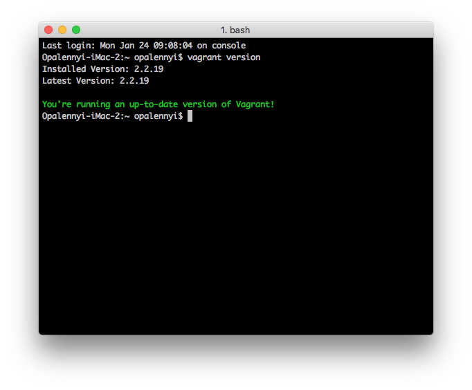

## Задача 1

- _Опишите своими словами основные преимущества применения на практике IaaC паттернов._
- _Какой из принципов IaaC является основополагающим?_

**Паттерны IaaC**
* **CI (Continuous Integration, непрерывная интеграция)** — паттерн, согласно которому при разработке ПО все ветки, в которых ведется разработка продукта, сливаются в основную гит-ветку проекта. Важный элемент паттерна — периодические автоматизированные сборки проекта, что позволяет избежать нам ручной работы по мерджу. Плюс на более ранней стадии можно выловить ошибки, поскольку части кода все время добавляются к основной ветке, не происходит единовременной выкладки тысяч строк кода, в которых невозможно разобраться и выловить баги.
* **CD (Continuous Delivery, непрерывная доставка)** — паттерн, который позволяет добавлять небольшие обновления и фичи, выпускать изменения небольшими частями. Нет необходимости готовить огромную новую версию продукта, можно делать небольшие апдейты, а в случае появления ошибок быстро откатиться до предыдущей стабильной версии. Разворачивание доработок в тестовой среде происходит по нажатию одной кнопки, но ее все еще кто-то должен нажимать.
* **CD (Continuous Deployment, непрерывное развертывание)** — паттерн, при котором автоматизировано и разворачивание приложения в тестовой среде, но остается одна последняя кнопка, которую нужно нажать — выпуск версии в продакшн. Это сделано для минимизации бизнес-рисков.

А **основополагающий принцип IaaC** — идемпотентность. При повторении одних и тех же действий мы будем получать один и тот же результат, он не будет отлчиаться от перезапуска к перезапуску.

## Задача 2

- _Чем Ansible выгодно отличается от других систем управления конфигурациями?_

Он реализован как бесплатное open-source решение с проприетарной своей версией, если необходим расширенный функционал. В сети много примеров его применения и загатовленных конфигураций, что упрощает поиск информации. Нет необходимости устанавливать клиент на удаленную машину, достаточно ssh-соединения. Его плейбуки построены на YAML'е, что проще и удобнее для работы, это язык разметки, а не язык программирования. 

- _Какой, на ваш взгляд, метод работы систем конфигурации более надёжный push или pull?_

Более надежный — гибридный. :) Мне кажется, всегда система, позволяющая большее пространство для маневра, надежнее. :)

Если же отойти от лирики, то с первого взгляда мне кажется, что pull-метод надежнее, поскольку непрерывность работы мастер-сервера мы гарантируем с намного большей вероятностью, а удаленный сервер может быть по каким-то причинам недоступен в момент, когда мы начнем пушить обновления на него. С pull-методом удаленные сервера с некоторой периодичностью (которую можно настроить, чтобы единовременно к мастер-серверу не обращались сотни серверов) запрашивает обновления у мастер-сервера.

Хотя, конечно, я допускаю, что при краше ВМ может покрашиться и скрипт, запрашивающий обновления, и тогда сервер так же перестанет обновляться, а в случае с push-моделью мы всегда как минимум попробуем отправить обновление, и нам легче контролировать отправку и успешность доставки обновлений, потому что все эти данные остаются у нас на мастер-сервере, а не распределены по десяткам и сотням удаленных серверов. С такой точки зрения push все-таки надежнее.

## Задача 3

_Установить на личный компьютер:_

- _VirtualBox_
- _Vagrant_
- _Ansible_

*Приложить вывод команд установленных версий каждой из программ, оформленный в markdown.*

VirtualBox был установлен в рамках задания `03-sysadmin-01-terminal`:


Vagrant был установлен в рамках того же задания:



Установка Ansible:
```bash
Opalennyi-iMac-2:~ opalennyi$ curl https://bootstrap.pypa.io/get-pip.py -o get-pip.py
  % Total    % Received % Xferd  Average Speed   Time    Time     Time  Current
                                 Dload  Upload   Total   Spent    Left  Speed
100 2108k  100 2108k    0     0  2655k      0 --:--:-- --:--:-- --:--:-- 2655k
Opalennyi-iMac-2:~ opalennyi$ python get-pip.py --user
ERROR: This script does not work on Python 2.7 The minimum supported Python version is 3.6. Please use https://bootstrap.pypa.io/pip/2.7/get-pip.py instead.
Opalennyi-iMac-2:~ opalennyi$ python3 get-pip.py --user
Collecting pip
  Downloading pip-21.3.1-py3-none-any.whl (1.7 MB)
     |████████████████████████████████| 1.7 MB 1.9 MB/s
Installing collected packages: pip
/usr/local/lib/python3.9/site-packages/setuptools/command/install.py:34: SetuptoolsDeprecationWarning: setup.py install is deprecated. Use build and pip and other standards-based tools.
  warnings.warn(
  WARNING: The scripts pip, pip3 and pip3.9 are installed in '/Users/opalennyi/Library/Python/3.9/bin' which is not on PATH.
  Consider adding this directory to PATH or, if you prefer to suppress this warning, use --no-warn-script-location.
/usr/local/lib/python3.9/site-packages/setuptools/command/install.py:34: SetuptoolsDeprecationWarning: setup.py install is deprecated. Use build and pip and other standards-based tools.
  warnings.warn(
Successfully installed pip-21.3.1


Opalennyi-iMac-2:~ opalennyi$ export PATH="/Users/opalennyi/Library/Python/3.9/bin:$PATH"
Opalennyi-iMac-2:~ opalennyi$ $PATH
-bash: /Users/opalennyi/Library/Python/3.9/bin:/usr/local/git/bin:/usr/local/bin:/usr/bin:/bin:/usr/sbin:/sbin:/Library/TeX/texbin: No such file or directory
Opalennyi-iMac-2:~ opalennyi$ python3 get-pip.py --user
Collecting pip
  Using cached pip-21.3.1-py3-none-any.whl (1.7 MB)
Installing collected packages: pip
  Attempting uninstall: pip
    Found existing installation: pip 21.3.1
    Uninstalling pip-21.3.1:
      Successfully uninstalled pip-21.3.1
/usr/local/lib/python3.9/site-packages/setuptools/command/install.py:34: SetuptoolsDeprecationWarning: setup.py install is deprecated. Use build and pip and other standards-based tools.
  warnings.warn(
/usr/local/lib/python3.9/site-packages/setuptools/command/install.py:34: SetuptoolsDeprecationWarning: setup.py install is deprecated. Use build and pip and other standards-based tools.
  warnings.warn(
Successfully installed pip-21.3.1
Opalennyi-iMac-2:~ opalennyi$ sudo python -m pip install ansible
/usr/bin/python: No module named pip
Opalennyi-iMac-2:~ opalennyi$ sudo python3 -m pip install ansible
WARNING: The directory '/Users/opalennyi/Library/Caches/pip' or its parent directory is not owned or is not writable by the current user. The cache has been disabled. Check the permissions and owner of that directory. If executing pip with sudo, you should use sudo's -H flag.
DEPRECATION: Configuring installation scheme with distutils config files is deprecated and will no longer work in the near future. If you are using a Homebrew or Linuxbrew Python, please see discussion at https://github.com/Homebrew/homebrew-core/issues/76621
Collecting ansible
  Downloading ansible-5.2.0.tar.gz (37.9 MB)
     |████████████████████████████████| 37.9 MB 2.0 MB/s
  Preparing metadata (setup.py) ... done
Requirement already satisfied: ansible-core~=2.12.1 in ./Library/Python/3.9/lib/python/site-packages (from ansible) (2.12.1)
Requirement already satisfied: resolvelib<0.6.0,>=0.5.3 in ./Library/Python/3.9/lib/python/site-packages (from ansible-core~=2.12.1->ansible) (0.5.4)
Requirement already satisfied: PyYAML in /usr/local/lib/python3.9/site-packages (from ansible-core~=2.12.1->ansible) (6.0)
Requirement already satisfied: jinja2 in ./Library/Python/3.9/lib/python/site-packages (from ansible-core~=2.12.1->ansible) (3.0.3)
Requirement already satisfied: cryptography in ./Library/Python/3.9/lib/python/site-packages (from ansible-core~=2.12.1->ansible) (36.0.1)
Requirement already satisfied: packaging in ./Library/Python/3.9/lib/python/site-packages (from ansible-core~=2.12.1->ansible) (21.3)
Requirement already satisfied: cffi>=1.12 in ./Library/Python/3.9/lib/python/site-packages (from cryptography->ansible-core~=2.12.1->ansible) (1.15.0)
Requirement already satisfied: MarkupSafe>=2.0 in ./Library/Python/3.9/lib/python/site-packages (from jinja2->ansible-core~=2.12.1->ansible) (2.0.1)
Requirement already satisfied: pyparsing!=3.0.5,>=2.0.2 in ./Library/Python/3.9/lib/python/site-packages (from packaging->ansible-core~=2.12.1->ansible) (3.0.7)
Requirement already satisfied: pycparser in ./Library/Python/3.9/lib/python/site-packages (from cffi>=1.12->cryptography->ansible-core~=2.12.1->ansible) (2.21)
Building wheels for collected packages: ansible
  Building wheel for ansible (setup.py) ... done
  Created wheel for ansible: filename=ansible-5.2.0-py3-none-any.whl size=62990797 sha256=a66b80834c264776438fc624099c2588492a5ed13efb9fc6d1dbe782efd1c32a
  Stored in directory: /private/tmp/pip-ephem-wheel-cache-bllkq2c5/wheels/b9/98/66/280aee7abbd81c45cba7b4cb6b6550a812f932e4c1fc47602f
Successfully built ansible
Installing collected packages: ansible
DEPRECATION: Configuring installation scheme with distutils config files is deprecated and will no longer work in the near future. If you are using a Homebrew or Linuxbrew Python, please see discussion at https://github.com/Homebrew/homebrew-core/issues/76621
Successfully installed ansible-5.2.0
WARNING: Running pip as the 'root' user can result in broken permissions and conflicting behaviour with the system package manager. It is recommended to use a virtual environment instead: https://pip.pypa.io/warnings/venv
Opalennyi-iMac-2:~ opalennyi$ ansible --version
ansible [core 2.12.1]
  config file = None
  configured module search path = ['/Users/opalennyi/.ansible/plugins/modules', '/usr/share/ansible/plugins/modules']
  ansible python module location = /Users/opalennyi/Library/Python/3.9/lib/python/site-packages/ansible
  ansible collection location = /Users/opalennyi/.ansible/collections:/usr/share/ansible/collections
  executable location = /Users/opalennyi/Library/Python/3.9/bin/ansible
  python version = 3.9.9 (main, Dec 19 2021, 16:14:55) [Clang 10.0.0 (clang-1000.11.45.5)]
  jinja version = 3.0.3
  libyaml = True
  


Opalennyi-iMac-2:~ opalennyi$ python3 -m pip install --user paramiko
Collecting paramiko
  Downloading paramiko-2.9.2-py2.py3-none-any.whl (210 kB)
     |████████████████████████████████| 210 kB 1.9 MB/s
Requirement already satisfied: cryptography>=2.5 in ./Library/Python/3.9/lib/python/site-packages (from paramiko) (36.0.1)
Collecting pynacl>=1.0.1
  Downloading PyNaCl-1.5.0-cp36-abi3-macosx_10_10_universal2.whl (349 kB)
     |████████████████████████████████| 349 kB 7.0 MB/s
Collecting bcrypt>=3.1.3
  Downloading bcrypt-3.2.0-cp36-abi3-macosx_10_10_universal2.whl (49 kB)
     |████████████████████████████████| 49 kB 7.8 MB/s
Requirement already satisfied: cffi>=1.1 in ./Library/Python/3.9/lib/python/site-packages (from bcrypt>=3.1.3->paramiko) (1.15.0)
Collecting six>=1.4.1
  Downloading six-1.16.0-py2.py3-none-any.whl (11 kB)
Requirement already satisfied: pycparser in ./Library/Python/3.9/lib/python/site-packages (from cffi>=1.1->bcrypt>=3.1.3->paramiko) (2.21)
Installing collected packages: six, pynacl, bcrypt, paramiko
Successfully installed bcrypt-3.2.0 paramiko-2.9.2 pynacl-1.5.0 six-1.16.0
```

## Задача 4 (*)

_Воспроизвести практическую часть лекции самостоятельно._

- _Создать виртуальную машину._
- _Зайти внутрь ВМ, убедиться, что Docker установлен с помощью команды_
```
docker ps
```

```bash
Opalennyi-iMac-2:netology-devops opalennyi$ mkdir 05-virt-02-iaac
Opalennyi-iMac-2:netology-devops opalennyi$ cd 05-virt-02-iaac
Opalennyi-iMac-2:05-virt-02-iaac opalennyi$ mkdir ansible
Opalennyi-iMac-2:05-virt-02-iaac opalennyi$ mkdir vagrant
Opalennyi-iMac-2:05-virt-02-iaac opalennyi$ cd vagrant
Opalennyi-iMac-2:vagrant opalennyi$ vagrant init
A `Vagrantfile` has been placed in this directory. You are now
ready to `vagrant up` your first virtual environment! Please read
the comments in the Vagrantfile as well as documentation on
`vagrantup.com` for more information on using Vagrant.
Opalennyi-iMac-2:vagrant opalennyi$ echo > Vagrantfile
Opalennyi-iMac-2:vagrant opalennyi$ nano Vagrantfile
Opalennyi-iMac-2:vagrant opalennyi$ cat Vagrantfile
# -*- mode: ruby -*-

ISO = "bento/ubuntu-20.04"
NET = "192.168.192."
DOMAIN = ".netology"
HOST_PREFIX = "server"
INVENTORY_PATH = "../ansible/inventory"

servers = [
  {
    :hostname => HOST_PREFIX + "1" + DOMAIN,
    :ip => NET + "11",
    :ssh_host => "20011",
    :ssh_vm => "22",
    :ram => 1024,
    :core => 1
  }
]

Vagrant.configure(2) do |config|
  config.vm.synced_folder ".", "/vagrant", disabled: false
  servers.each do |machine|
    config.vm.define machine[:hostname] do |node|
      node.vm.box = ISO
      node.vm.hostname = machine[:hostname]
      node.vm.network "private_network", ip: machine[:ip]
      node.vm.network :forwarded_port, guest: machine[:ssh_vm], host: machine[:ssh_host]
      node.vm.provider "virtualbox" do |vb|
        vb.customize ["modifyvm", :id, "--memory", machine[:ram]]
        vb.customize ["modifyvm", :id, "--cpus", machine[:core]]
        vb.name = machine[:hostname]
      end
      node.vm.provision "ansible" do |setup|
        setup.inventory_path = INVENTORY_PATH
        setup.playbook = "../ansible/provision.yml"
        setup.become = true
        setup.extra_vars = { ansible_user: 'vagrant' }
      end
    end
  end
end


Opalennyi-iMac-2:vagrant opalennyi$ nano ansible.cfg
Opalennyi-iMac-2:vagrant opalennyi$ cat ansible.cfg
[defaults]
inventory=./inventory
deprecation_warnings=False
command_warnings=False
ansible_port=22
interpreter_python=/usr/bin/python3


Opalennyi-iMac-2:vagrant opalennyi$ cd ../ansible
Opalennyi-iMac-2:ansible opalennyi$ nano inventory
Opalennyi-iMac-2:ansible opalennyi$ cat inventory
[nodes:children]
manager

[manager]
server1.netology ansible_host=127.0.0.1 ansible_port=20011 ansible_user=vagrant
Opalennyi-iMac-2:ansible opalennyi$ nano provision.yml
Opalennyi-iMac-2:ansible opalennyi$ cat provision.yml
---

  - hosts: nodes
    become: yes
    become_user: root
    remote_user: vagrant

    tasks:
      - name: Create directory for ssh-keys
        file: state=directory mode=0700 dest=/root/.ssh/

      - name: Adding rsa-key in /root/.ssh/authorized_keys
        copy: src=~/.ssh/id_rsa.pub dest=/root/.ssh/authorized_keys owner=root mode=0600
        ignore_errors: yes

      - name: Checking DNS
        command: host -t A google.com

      - name: Installing tools
        apt: >
          package={{ item }}
          state=present
          update_cache=yes
        with_items:
          - git
          - curl

      - name: Installing docker
        shell: curl -fsSL get.docker.com -o get-docker.sh && chmod +x get-docker.sh && ./get-docker.sh

      - name: Add the current user to docker group
        user: name=vagrant append=yes groups=docker


Opalennyi-iMac-2:ansible opalennyi$ cd ../vagrant
Opalennyi-iMac-2:vagrant opalennyi$ vagrant up
Bringing machine 'server1.netology' up with 'virtualbox' provider...
==> server1.netology: Importing base box 'bento/ubuntu-20.04'...
==> server1.netology: Matching MAC address for NAT networking...
==> server1.netology: Checking if box 'bento/ubuntu-20.04' version '202112.19.0' is up to date...
==> server1.netology: Setting the name of the VM: server1.netology
==> server1.netology: Clearing any previously set network interfaces...
The IP address configured for the host-only network is not within the
allowed ranges. Please update the address used to be within the allowed
ranges and run the command again.

  Address: 192.168.192.11
  Ranges: 192.168.56.0/21

Valid ranges can be modified in the /etc/vbox/networks.conf file. For
more information including valid format see:

  https://www.virtualbox.org/manual/ch06.html#network_hostonly  
```

Заменим IP-адрес в конфигурационном файле и запустим Vagrant снова.

```bash
Opalennyi-iMac-2:vagrant opalennyi$ nano Vagrantfile
Opalennyi-iMac-2:vagrant opalennyi$ cat Vagrantfile
# -*- mode: ruby -*-

ISO = "bento/ubuntu-20.04"
NET = "192.168.56."

<...>

      end
    end
  end
end

Opalennyi-iMac-2:vagrant opalennyi$ vagrant up
Bringing machine 'server1.netology' up with 'virtualbox' provider...
==> server1.netology: Checking if box 'bento/ubuntu-20.04' version '202112.19.0' is up to date...
==> server1.netology: Clearing any previously set network interfaces...
==> server1.netology: Preparing network interfaces based on configuration...
    server1.netology: Adapter 1: nat
    server1.netology: Adapter 2: hostonly
==> server1.netology: Forwarding ports...
    server1.netology: 22 (guest) => 20011 (host) (adapter 1)
    server1.netology: 22 (guest) => 2222 (host) (adapter 1)
==> server1.netology: Running 'pre-boot' VM customizations...
==> server1.netology: Booting VM...
==> server1.netology: Waiting for machine to boot. This may take a few minutes...
    server1.netology: SSH address: 127.0.0.1:2222
    server1.netology: SSH username: vagrant
    server1.netology: SSH auth method: private key
    server1.netology: Warning: Connection reset. Retrying...
    server1.netology: Warning: Remote connection disconnect. Retrying...
    server1.netology:
    server1.netology: Vagrant insecure key detected. Vagrant will automatically replace
    server1.netology: this with a newly generated keypair for better security.
    server1.netology:
    server1.netology: Inserting generated public key within guest...
    server1.netology: Removing insecure key from the guest if it's present...
    server1.netology: Key inserted! Disconnecting and reconnecting using new SSH key...
==> server1.netology: Machine booted and ready!
==> server1.netology: Checking for guest additions in VM...
==> server1.netology: Setting hostname...
==> server1.netology: Configuring and enabling network interfaces...
==> server1.netology: Mounting shared folders...
    server1.netology: /vagrant => /Users/opalennyi/netology-devops/05-virt-02-iaac/vagrant
==> server1.netology: Running provisioner: ansible...
    server1.netology: Running ansible-playbook...

PLAY [nodes] *******************************************************************

TASK [Gathering Facts] *********************************************************
ok: [server1.netology]

TASK [Create directory for ssh-keys] *******************************************
ok: [server1.netology]

TASK [Adding rsa-key in /root/.ssh/authorized_keys] ****************************
An exception occurred during task execution. To see the full traceback, use -vvv. The error was: If you are using a module and expect the file to exist on the remote, see the remote_src option
fatal: [server1.netology]: FAILED! => {"changed": false, "msg": "Could not find or access '~/.ssh/id_rsa.pub' on the Ansible Controller.\nIf you are using a module and expect the file to exist on the remote, see the remote_src option"}
...ignoring

TASK [Checking DNS] ************************************************************
changed: [server1.netology]

TASK [Installing tools] ********************************************************
ok: [server1.netology] => (item=git)
ok: [server1.netology] => (item=curl)

TASK [Installing docker] *******************************************************
changed: [server1.netology]

TASK [Add the current user to docker group] ************************************
changed: [server1.netology]

PLAY RECAP *********************************************************************
server1.netology           : ok=7    changed=3    unreachable=0    failed=0    skipped=0    rescued=0    ignored=1

Opalennyi-iMac-2:vagrant opalennyi$ vagrant ssh
Welcome to Ubuntu 20.04.3 LTS (GNU/Linux 5.4.0-91-generic x86_64)

 * Documentation:  https://help.ubuntu.com
 * Management:     https://landscape.canonical.com
 * Support:        https://ubuntu.com/advantage

 System information disabled due to load higher than 1.0


This system is built by the Bento project by Chef Software
More information can be found at https://github.com/chef/bento
Last login: Sat Jan 29 14:54:50 2022 from 10.0.2.2
vagrant@server1:~$ docker ps
CONTAINER ID   IMAGE     COMMAND   CREATED   STATUS    PORTS     NAMES
```