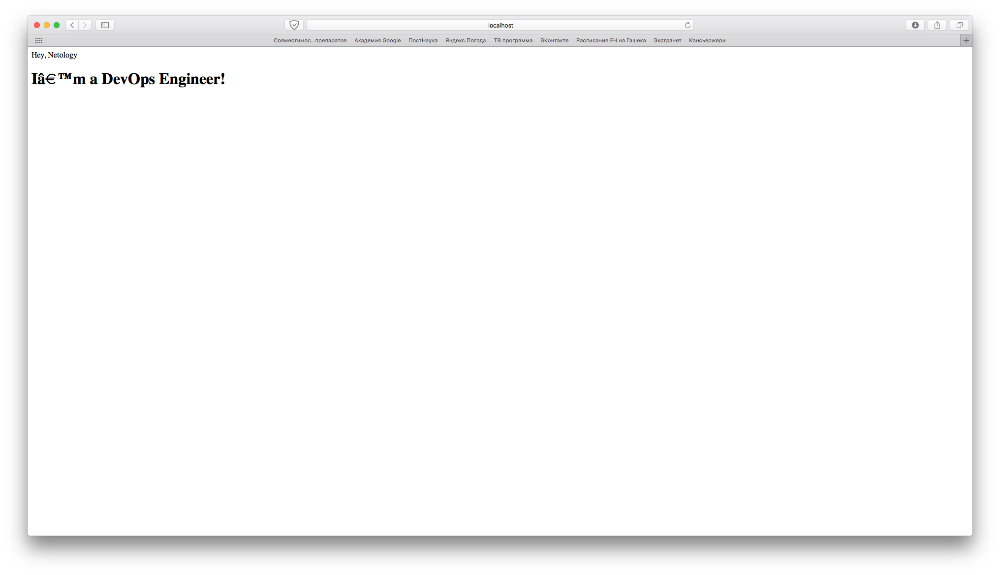
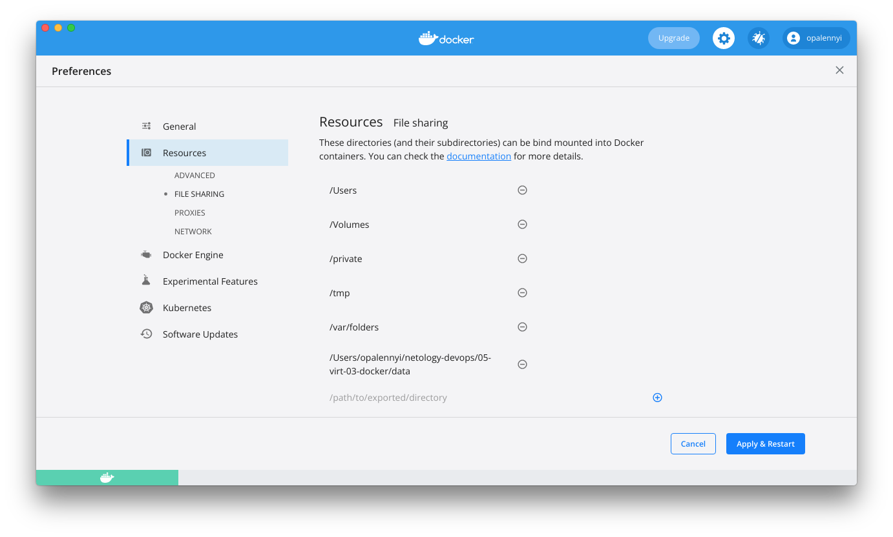

# Задача 1

_Сценарий выполнения задачи:_

- _создайте свой репозиторий на https://hub.docker.com;_
- _выберите любой образ, который содержит веб-сервер Nginx;_
- _создайте свой fork образа;_
- _реализуйте функциональность:_
_запуск веб-сервера в фоне с индекс-страницей, содержащей HTML-код ниже:_
```
<html>
<head>
Hey, Netology
</head>
<body>
<h1>I’m DevOps Engineer!</h1>
</body>
</html>
```
_Опубликуйте созданный форк в своем репозитории и предоставьте ответ в виде ссылки на https://hub.docker.com/username_repo._

Создадим Dockerfile и пропишем в нем команду `COPY` для копирования html-файла со стартовой страницей в контейнер.
```bash
Opalennyi-iMac-2:05-virt-03-docker opalennyi$ nano Dockerfile
Opalennyi-iMac-2:05-virt-03-docker opalennyi$ cat Dockerfile
FROM nginx:latest
COPY ./index.html /usr/share/nginx/html/index.html
Opalennyi-iMac-2:05-virt-03-docker opalennyi$ nano index.html
Opalennyi-iMac-2:05-virt-03-docker opalennyi$ cat index.html
<html>
<head>
Hey, Netology
</head>
<body>
<h1>I’m a DevOps Engineer!</h1>
</body>
</html>
```

Построим Docker-образ `webserver`:
```bash
Opalennyi-iMac-2:05-virt-03-docker opalennyi$ docker build -t webserver .
[+] Building 21.1s (7/7) FINISHED
 => [internal] load build definition from Dockerfile                                                                                                                                                                                                                       0.1s
 => => transferring dockerfile: 111B                                                                                                                                                                                                                                       0.0s
 => [internal] load .dockerignore                                                                                                                                                                                                                                          0.0s
 => => transferring context: 2B                                                                                                                                                                                                                                            0.0s
 => [internal] load metadata for docker.io/library/nginx:latest                                                                                                                                                                                                            3.0s
 => [internal] load build context                                                                                                                                                                                                                                          0.5s
 => => transferring context: 130B                                                                                                                                                                                                                                          0.0s
 => [1/2] FROM docker.io/library/nginx:latest@sha256:2834dc507516af02784808c5f48b7cbe38b8ed5d0f4837f16e78d00deb7e7767                                                                                                                                                     15.1s
 => => resolve docker.io/library/nginx:latest@sha256:2834dc507516af02784808c5f48b7cbe38b8ed5d0f4837f16e78d00deb7e7767                                                                                                                                                      0.3s
 => => sha256:c316d5a335a5cf324b0dc83b3da82d7608724769f6454f6d9a621f3ec2534a5a 7.66kB / 7.66kB                                                                                                                                                                             0.0s
 => => sha256:2834dc507516af02784808c5f48b7cbe38b8ed5d0f4837f16e78d00deb7e7767 1.86kB / 1.86kB                                                                                                                                                                             0.0s
 => => sha256:bb129a712c2431ecce4af8dde831e980373b26368233ef0f3b2bae9e9ec515ee 1.57kB / 1.57kB                                                                                                                                                                             0.0s
 => => sha256:5eb5b503b37671af16371272f9c5313a3e82f1d0756e14506704489ad9900803 31.37MB / 31.37MB                                                                                                                                                                           8.2s
 => => sha256:1ae07ab881bd848493ad54c2ba32017f94d1d8dbfd0ba41b618f17e80f834a0f 25.35MB / 25.35MB                                                                                                                                                                           7.9s
 => => sha256:78091884b7bea0fa918527207924e9993bcc21bf7f1c9687da40042ceca31ac9 601B / 601B                                                                                                                                                                                 0.7s
 => => sha256:091c283c6a66ad0edd2ab84cb10edacc00a1a7bc5277f5365c0d5c5457a75aff 893B / 893B                                                                                                                                                                                 1.0s
 => => sha256:55de5851019b8f65ed6e28120c6300e35e556689d021e4b3411c7f4e90a9704b 666B / 666B                                                                                                                                                                                 1.5s
 => => sha256:b559bad762bec166fd028483dd2a03f086d363ee827d8c98b7268112c508665a 1.39kB / 1.39kB                                                                                                                                                                             1.9s
 => => extracting sha256:5eb5b503b37671af16371272f9c5313a3e82f1d0756e14506704489ad9900803                                                                                                                                                                                  3.1s
 => => extracting sha256:1ae07ab881bd848493ad54c2ba32017f94d1d8dbfd0ba41b618f17e80f834a0f                                                                                                                                                                                  2.0s
 => => extracting sha256:78091884b7bea0fa918527207924e9993bcc21bf7f1c9687da40042ceca31ac9                                                                                                                                                                                  0.0s
 => => extracting sha256:091c283c6a66ad0edd2ab84cb10edacc00a1a7bc5277f5365c0d5c5457a75aff                                                                                                                                                                                  0.0s
 => => extracting sha256:55de5851019b8f65ed6e28120c6300e35e556689d021e4b3411c7f4e90a9704b                                                                                                                                                                                  0.0s
 => => extracting sha256:b559bad762bec166fd028483dd2a03f086d363ee827d8c98b7268112c508665a                                                                                                                                                                                  0.0s
 => [2/2] COPY ./index.html /usr/share/nginx/html/index.html                                                                                                                                                                                                               1.1s
 => exporting to image                                                                                                                                                                                                                                                     1.2s
 => => exporting layers                                                                                                                                                                                                                                                    0.5s
 => => writing image sha256:df40c911627d71e1252a3bb16199e1a877d147aa5c48e37f90bce7d7ab084c71                                                                                                                                                                               0.1s
 => => naming to docker.io/library/webserver                                                                                                                                                                                                                               0.1s

Use 'docker scan' to run Snyk tests against images to find vulnerabilities and learn how to fix them
```

Проверим что он корректно загрузился:

```bash
Opalennyi-iMac-2:05-virt-03-docker opalennyi$ docker image ls
REPOSITORY   TAG       IMAGE ID       CREATED          SIZE
webserver    latest    df40c911627d   18 minutes ago   142MB
```

Запустим Docker-контейнер netology в фоновом режиме. Используем порт 8080 на хостовой машине:

```bash
Opalennyi-iMac-2:05-virt-03-docker opalennyi$ docker run -it --rm -d -p 8080:80 --name netology webserver
418a29eed3a4b069639eeb490d90b339ed8cfcbbc93bb63475f3da842f0a0980
```



Добавим тег `latest` и опубликуем образ в Docker Hub:
```bash
Opalennyi-iMac-2:05-virt-03-docker opalennyi$ docker image tag webserver opalennyi/webserver:latest
Opalennyi-iMac-2:05-virt-03-docker opalennyi$ docker image push opalennyi/webserver:latest
The push refers to repository [docker.io/opalennyi/webserver]
e5c1fc213837: Pushed
762b147902c0: Mounted from library/nginx
235e04e3592a: Mounted from library/nginx
6173b6fa63db: Mounted from library/nginx
9a94c4a55fe4: Mounted from library/nginx
9a3a6af98e18: Mounted from library/nginx
7d0ebbe3f5d2: Mounted from library/nginx
latest: digest: sha256:9f3da3b8a4f054bac61288ad98692e8bf3df91d117aa273ebe027954ad520ac9 size: 1777
```

Образ опубликован по ссылке: https://hub.docker.com/r/opalennyi/webserver

## Задача 2

_Посмотрите на сценарий ниже и ответьте на вопрос:_

_"Подходит ли в этом сценарии использование Docker контейнеров или лучше подойдет виртуальная машина, физическая машина? Может быть возможны разные варианты?"_
_Детально опишите и обоснуйте свой выбор._

--

_Сценарий:_

- _Высоконагруженное монолитное java веб-приложение;_

Поскольку контейнеры поьзуются ресурсами хостовой операционной системы, у нас нет дополнительного слоя эмуляции аппаратного обеспечения, контейнер вполне может подойти для такого приложения. Если по каким-то причинам мы готовы отдать под него отдельный хост, то можно разместить его и на физической машине.

- _Nodejs веб-приложение;_

Я исхожу из предпосылки, что для практически всех веб-приложений контейнеры базово подходят, поскольку обеспечивают гораздо большую гибкость в масштабировании при увеличении нагрузки, если это необходимо. Плюс контейнер проще развернуть, чем виртуальную машину, а работать он будет быстрее.

- _Мобильное приложение c версиями для Android и iOS;_

Насколько я понял, Android предоставляет намного больше возможностей для контейнеризации, iOS же остается достаточно закрытой системой, с которой можно работать только в рамках, которые задает Apple. В этом случае эффективнее всего выбрать классическую виртуализацию с виртуальной машиной.

- _Шина данных на базе Apache Kafka;_

Подойдет Docker-контейнер, можем сконфигурировать Kafka в нем. Если нам нужно будет перенести шину на другие, более мощные серверы, мы можем перенести контейнер.

- _Elasticsearch кластер для реализации логирования продуктивного веб-приложения - три ноды elasticsearch, два logstash и две ноды kibana;_

У всех трех приложений есть образы в Docker Hub'е: https://hub.docker.com/_/elasticsearch, https://hub.docker.com/_/logstash, https://hub.docker.com/_/kibana

На мой взгляд, в таком варианте быстрее и проще поднять приложения в контейнерах, используя готовые образы. Плюс поскольку необходимо развернуть несколько нод приложений, это опять же будет быстрее сделать в стандартных контейнерах.

- _Мониторинг-стек на базе Prometheus и Grafana;_

По сути, оба приложения — это веб-приложения, для веб-приложений контейнеры подходят лучше всего. Поскольку работают они на Linux'е, вряд ли ОС хоста, в таком случае, будет отличаться — мониторить ими Windows мы все равно не сможем.

- _MongoDB, как основное хранилище данных для java-приложения;_

В Docker Hub'е есть образ приложения: https://hub.docker.com/_/mongo

В принципе, для баз данных контейнеры тоже неплохо подходят, нам может быть нужно распределить нагрузку и децентрализировать БД, для этого можно развернуть несколько стандартных stateful-контейнеров, которые будут сохранять в себе все данные после остановки.

- _Gitlab сервер для реализации CI/CD процессов и приватный (закрытый) Docker Registry._

Если у нас есть хост на Linux'е, удобно использовать контейнер, чтобы поднимать Gitlab-сервер. Если по какой-то причине это  Windows-based хост, тогда нужно будет вернуться к классической виртуализации.

## Задача 3

- _Запустите первый контейнер из образа ***centos*** c любым тэгом в фоновом режиме, подключив папку ```/data``` из текущей рабочей директории на хостовой машине в ```/data``` контейнера;_

Загрузим образ centos:
```bash
Opalennyi-iMac-2:05-virt-03-docker opalennyi$ docker pull centos
Using default tag: latest
latest: Pulling from library/centos
a1d0c7532777: Pull complete
Digest: sha256:a27fd8080b517143cbbbab9dfb7c8571c40d67d534bbdee55bd6c473f432b177
Status: Downloaded newer image for centos:latest
docker.io/library/centos:latest
Opalennyi-iMac-2:05-virt-03-docker opalennyi$ docker image ls
REPOSITORY                  TAG       IMAGE ID       CREATED        SIZE
webserver                   latest    df40c911627d   5 hours ago    142MB
opalennyi/netology-devops   latest    df40c911627d   5 hours ago    142MB
opalennyi/webserver         latest    df40c911627d   5 hours ago    142MB
centos                      latest    5d0da3dc9764   4 months ago   231MB
```

Попробуем запустить контейнер:
```bash
Opalennyi-iMac-2:05-virt-03-docker opalennyi$ docker run -v /data:/data --name centos-container-1 -d centos
2fa9af9653add3f6912015f81ed57626f20800c06182d58f47201e4252da05a5
docker: Error response from daemon: Mounts denied:
The path /data is not shared from the host and is not known to Docker.
You can configure shared paths from Docker -> Preferences... -> Resources -> File Sharing.
See https://docs.docker.com/desktop/mac for more info.
```

На Маке необходимо расшарить директор через GUI Docker'а:



Попробуем запустить контейнер еще раз:
```bash
Opalennyi-iMac-2:05-virt-03-docker opalennyi$ docker run -v /Users/opalennyi/netology-devops/05-virt-03-docker/data:/data --name centos-container-1 -t -d centos
7d2deb0c52b001abef6713daae0bbc62a874508bfa8a1cddf5ec17dd361f95ea
Opalennyi-iMac-2:05-virt-03-docker opalennyi$ docker container ls -a
CONTAINER ID   IMAGE     COMMAND       CREATED         STATUS         PORTS     NAMES
7d2deb0c52b0   centos    "/bin/bash"   4 seconds ago   Up 3 seconds             centos-container-1
```

- _Запустите второй контейнер из образа ***debian*** в фоновом режиме, подключив папку ```/data``` из текущей рабочей директории на хостовой машине в ```/data``` контейнера;_

```bash
Opalennyi-iMac-2:05-virt-03-docker opalennyi$ docker run -v /Users/opalennyi/netology-devops/05-virt-03-docker/data:/data --name debian-container-2 -t -d debian
Unable to find image 'debian:latest' locally
latest: Pulling from library/debian
0c6b8ff8c37e: Pull complete
Digest: sha256:fb45fd4e25abe55a656ca69a7bef70e62099b8bb42a279a5e0ea4ae1ab410e0d
Status: Downloaded newer image for debian:latest
6eb0ba4e92187eecdca81ba8eacecfbeae77abad67d98d9723692b1fd24b888a
Opalennyi-iMac-2:05-virt-03-docker opalennyi$ docker container ls -a
CONTAINER ID   IMAGE     COMMAND       CREATED              STATUS              PORTS     NAMES
6eb0ba4e9218   debian    "bash"        9 seconds ago        Up 7 seconds                  debian-container-2
7d2deb0c52b0   centos    "/bin/bash"   About a minute ago   Up About a minute             centos-container-1
```

- _Подключитесь к первому контейнеру с помощью ```docker exec``` и создайте текстовый файл любого содержания в ```/data```;_

```bash
Opalennyi-iMac-2:05-virt-03-docker opalennyi$ docker exec -it centos-container-1 /bin/bash
[root@7d2deb0c52b0 /]# pwd
/
[root@7d2deb0c52b0 /]# ls
bin  data  dev	etc  home  lib	lib64  lost+found  media  mnt  opt  proc  root	run  sbin  srv	sys  tmp  usr  var
[root@7d2deb0c52b0 /]# touch data/file-created-in-centos
[root@7d2deb0c52b0 /]# ls data
file-created-in-centos
[root@7d2deb0c52b0 /]# exit
exit
```

- _Добавьте еще один файл в папку ```/data``` на хостовой машине;_

```bash
Opalennyi-iMac-2:05-virt-03-docker opalennyi$ touch data/file-created-in-the-host-Mac
Opalennyi-iMac-2:05-virt-03-docker opalennyi$ ls data/
file-created-in-centos		file-created-in-the-host-Mac
```

- _Подключитесь во второй контейнер и отобразите листинг и содержание файлов в ```/data``` контейнера._

```bash
Opalennyi-iMac-2:05-virt-03-docker opalennyi$ docker exec -it debian-container-2 /bin/bash
root@6eb0ba4e9218:/# ls data/
file-created-in-centos	file-created-in-the-host-Mac
root@6eb0ba4e9218:/# cat data/file-created-in-centos
root@6eb0ba4e9218:/# cat data/file-created-in-the-host-Mac
```

Содержание файлов не выводится, поскольку я создал их пустыми через `touch`.

## Задача 4 (*)

_Воспроизвести практическую часть лекции самостоятельно._

_Соберите Docker образ с Ansible, загрузите на Docker Hub и пришлите ссылку вместе с остальными ответами к задачам._

```bash
Opalennyi-iMac-2:05-virt-03-docker opalennyi$ mkdir ansible
Opalennyi-iMac-2:05-virt-03-docker opalennyi$ cd ansible
Opalennyi-iMac-2:ansible opalennyi$ ls
Opalennyi-iMac-2:ansible opalennyi$ nano Dockerfile
Opalennyi-iMac-2:ansible opalennyi$ cat Dockerfile
FROM alpine:3.14

RUN CARGO_NET_GIT_FETCH_WITH_CLI=1 && \
    apk --no-cache add \
        sudo \
        python3\
        py3-pip \
        openssl \
        ca-certificates \
        sshpass \
        openssh-client \
        rsync \
        git && \
    apk --no-cache add --virtual build-dependencies \
        python3-dev \
        libffi-dev \
        musl-dev \
        gcc \
        cargo \
        openssl-dev \
        libressl-dev \
        build-base && \
    pip install --upgrade pip wheel && \
    pip install --upgrade cryptography cffi && \
    pip install ansible==2.9.24 && \
    pip install mitogen ansible-lint jmespath && \
    pip install --upgrade pywinrm && \
    apk del build-dependencies && \
    rm -rf /var/cache/apk/* && \
    rm -rf /root/.cache/pip && \
    rm -rf /root/.cargo

RUN mkdir /ansible && \
    mkdir -p /etc/ansible && \
    echo 'localhost' > /etc/ansible/hosts

WORKDIR /ansible

CMD [ "ansible-playbook", "--version" ]
Opalennyi-iMac-2:ansible opalennyi$ docker build -t opalennyi/ansible:2.9.24 .
[+] Building 2.1s (9/9) FINISHED
 => [internal] load build definition from Dockerfile                                                                                                                                                                                                                       0.1s
 => => transferring dockerfile: 37B                                                                                                                                                                                                                                        0.1s
 => [internal] load .dockerignore                                                                                                                                                                                                                                          0.1s
 => => transferring context: 2B                                                                                                                                                                                                                                            0.0s
 => [internal] load metadata for docker.io/library/alpine:3.14                                                                                                                                                                                                             1.9s
 => [auth] library/alpine:pull token for registry-1.docker.io                                                                                                                                                                                                              0.0s
 => [1/4] FROM docker.io/library/alpine:3.14@sha256:635f0aa53d99017b38d1a0aa5b2082f7812b03e3cdb299103fe77b5c8a07f1d2                                                                                                                                                       0.0s
 => CACHED [2/4] RUN CARGO_NET_GIT_FETCH_WITH_CLI=1 &&     apk --no-cache add         sudo         python3        py3-pip         openssl         ca-certificates         sshpass         openssh-client         rsync         git &&     apk --no-cache add --virtual bu  0.0s
 => CACHED [3/4] RUN mkdir /ansible &&     mkdir -p /etc/ansible &&     echo 'localhost' > /etc/ansible/hosts                                                                                                                                                              0.0s
 => CACHED [4/4] WORKDIR /ansible                                                                                                                                                                                                                                          0.0s
 => exporting to image                                                                                                                                                                                                                                                     0.0s
 => => exporting layers                                                                                                                                                                                                                                                    0.0s
 => => writing image sha256:7988f8f6c6a543de424c053e6b397de7d9b8d7d3bfcd968dcbe5ea4871b5d35a                                                                                                                                                                               0.0s
 => => naming to docker.io/opalennyi/ansible:2.9.24                                                                                                                                                                                                                        0.0s

Use 'docker scan' to run Snyk tests against images to find vulnerabilities and learn how to fix them


Opalennyi-iMac-2:ansible opalennyi$ docker push opalennyi/ansible:2.9.24
The push refers to repository [docker.io/opalennyi/ansible]
5f70bf18a086: Pushed
908d6c4985f5: Pushed
180b289cdc75: Pushed
1a058d5342cc: Mounted from olegbukatchuk/ansible
2.9.24: digest: sha256:27942d538001c54a15711102460d0232eacfba3d37cee540fa4bc856a1f85390 size: 1153
```

Образ находится вот здесь: https://hub.docker.com/repository/docker/opalennyi/ansible