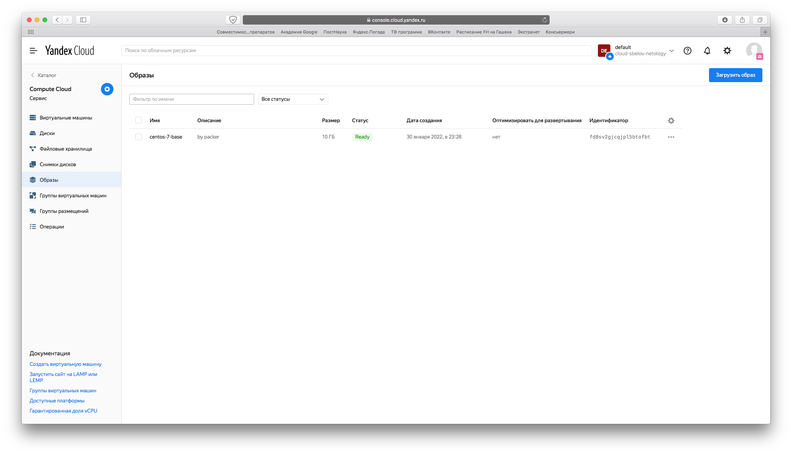
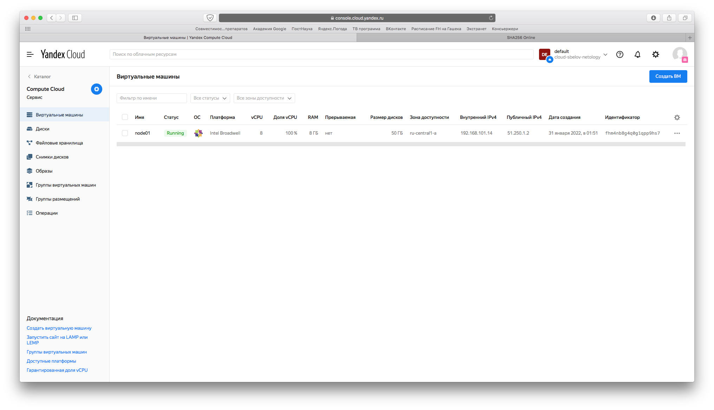
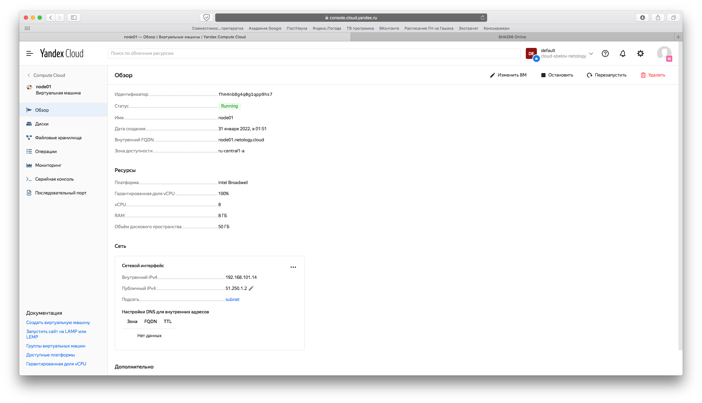
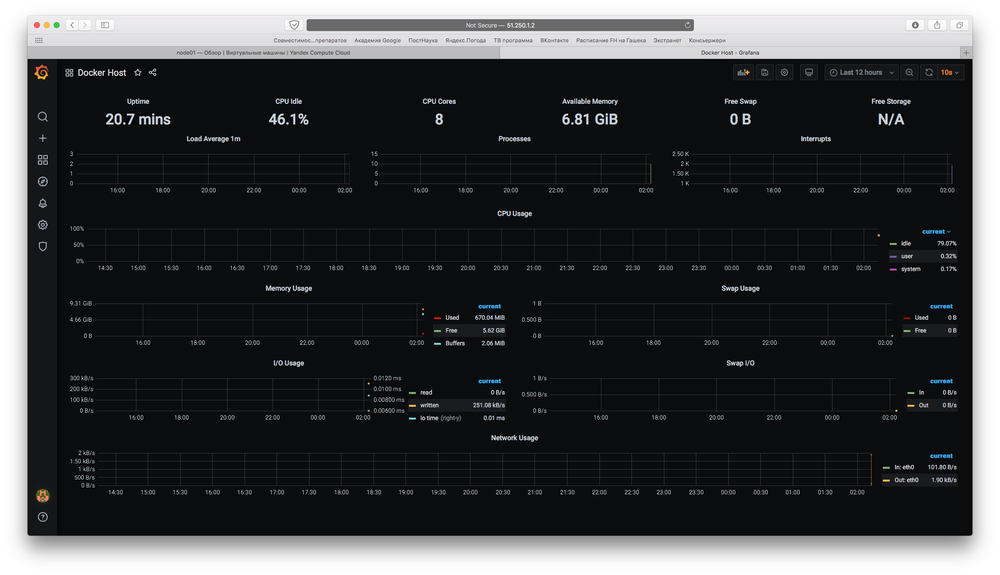
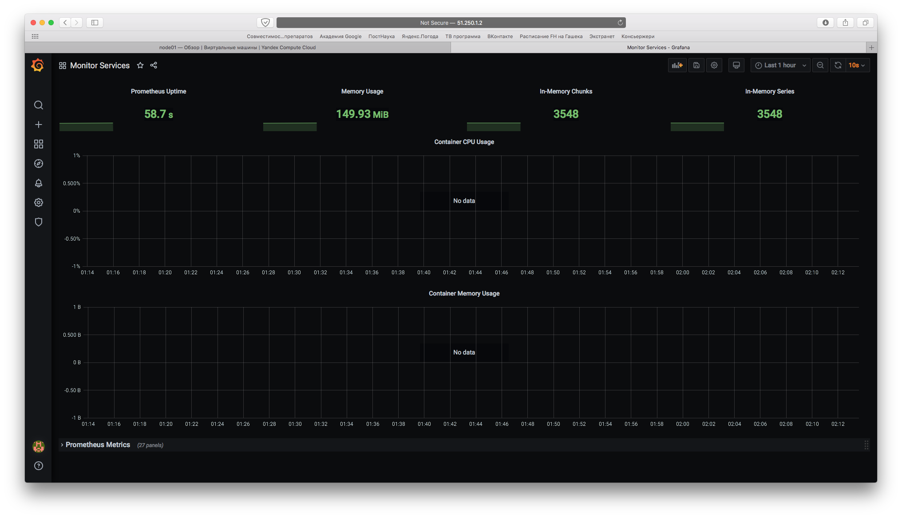

## Задача 1

_Создать собственный образ операционной системы с помощью Packer._

_Для получения зачета, вам необходимо предоставить:_
- _Скриншот страницы, как на слайде из презентации (слайд 37)._

Поскольку Docker Compose включен в десктопную версию Docker для Mac'а, которую я поставил в прошлом задании, ничего дополнительно устанавливать не нужно. Установим `yc`, убедимся, что установка прошла успешно:
```bash
Last login: Sun Jan 30 22:46:49 on ttys000
Opalennyi-iMac-2:~ opalennyi$ yc --version
Yandex.Cloud CLI 0.87.0 darwin/amd64


Opalennyi-iMac-2:~ opalennyi$ yc init
Welcome! This command will take you through the configuration process.
Please go to https://oauth.yandex.ru/authorize?response_type=token&client_id=1a6990aa636648e9b2ef855fa7bec2fb in order to obtain OAuth token.

Please enter OAuth token: AQAAAABcxrM8AATuwco6wsF_XkzpkKJN05LW_Fk
You have one cloud available: 'cloud-sbelov-netology' (id = b1g5aj0059rir9ncrco6). It is going to be used by default.
Please choose folder to use:
 [1] default (id = b1g8r0f10etvpuveg0rm)
 [2] Create a new folder
Please enter your numeric choice: 1
Your current folder has been set to 'default' (id = b1g8r0f10etvpuveg0rm).
Do you want to configure a default Compute zone? [Y/n] y
Which zone do you want to use as a profile default?
 [1] ru-central1-a
 [2] ru-central1-b
 [3] ru-central1-c
 [4] Don't set default zone
Please enter your numeric choice: 1
Your profile default Compute zone has been set to 'ru-central1-a'.
```

Создадим сеть и ее подсеть:
```bash
Opalennyi-iMac-2:~ opalennyi$ yc vpc network create --name netology-cloud-net --labels my-label=netology --description "my first network via yc"
id: enp9bupq1p8trcbm9db5
folder_id: b1g8r0f10etvpuveg0rm
created_at: "2022-01-30T20:07:07Z"
name: netology-cloud-net
description: my first network via yc
labels:
  my-label: netology
  
Opalennyi-iMac-2:~ opalennyi$ yc vpc subnet create --name netology-cloud-SUBnet --zone ru-central1-a --range 10.1.2.0/24 --network-name netology-cloud-net --description "my first subnet via yc"
id: e9b66orb9jenkfune4g8
folder_id: b1g8r0f10etvpuveg0rm
created_at: "2022-01-30T20:16:22Z"
name: netology-cloud-SUBnet
description: my first subnet via yc
network_id: enp9bupq1p8trcbm9db5
zone_id: ru-central1-a
v4_cidr_blocks:
- 10.1.2.0/24

Opalennyi-iMac-2:~ opalennyi$ yc vpc network list
+----------------------+--------------------+
|          ID          |        NAME        |
+----------------------+--------------------+
| enp7bhmvji7mkbudb0e7 | default            |
| enp9bupq1p8trcbm9db5 | netology-cloud-net |
+----------------------+--------------------+
```

Установим Packer:
```bash
Opalennyi-iMac-2:~ opalennyi$ brew tap hashicorp/tap
Running `brew update --preinstall`...
==> Auto-updated Homebrew!
Updated 1 tap (homebrew/core).
==> Updated Formulae
Updated 5 formulae.

==> Tapping hashicorp/tap
Cloning into '/usr/local/Homebrew/Library/Taps/hashicorp/homebrew-tap'...
remote: Enumerating objects: 1841, done.
remote: Counting objects: 100% (595/595), done.
remote: Compressing objects: 100% (274/274), done.
remote: Total 1841 (delta 410), reused 486 (delta 321), pack-reused 1246
Receiving objects: 100% (1841/1841), 330.23 KiB | 1.78 MiB/s, done.
Resolving deltas: 100% (1106/1106), done.
Tapped 1 cask and 15 formulae (47 files, 468.3KB).
Opalennyi-iMac-2:~ opalennyi$ brew install hashicorp/tap/packer
Warning: You are using macOS 10.13.
We (and Apple) do not provide support for this old version.
You will encounter build failures with some formulae.
Please create pull requests instead of asking for help on Homebrew's GitHub,
Twitter or any other official channels. You are responsible for resolving
any issues you experience while you are running this
old version.

==> Downloading https://releases.hashicorp.com/packer/1.7.9/packer_1.7.9_darwin_amd64.zip
######################################################################## 100.0%
==> Installing packer from hashicorp/tap
🍺  /usr/local/Cellar/packer/1.7.9: 3 files, 170.1MB, built in 38 seconds
==> Running `brew cleanup packer`...
Disable this behaviour by setting HOMEBREW_NO_INSTALL_CLEANUP.
Hide these hints with HOMEBREW_NO_ENV_HINTS (see `man brew`).

Opalennyi-iMac-2:~ opalennyi$ packer --version
1.7.9
```

Соберем образ:
```bash
Opalennyi-iMac-2:~ opalennyi$ packer build centos-7-base.json
yandex: output will be in this color.

==> yandex: Creating temporary RSA SSH key for instance...
==> yandex: Using as source image: fd8ksb92cu689husemj7 (name: "centos-7-v20220124", family: "centos-7")
==> yandex: Use provided subnet id e9b66orb9jenkfune4g8

<...>

==> yandex: Destroying boot disk...
    yandex: Disk has been deleted!
Build 'yandex' finished after 2 minutes 6 seconds.

==> Wait completed after 2 minutes 6 seconds

==> Builds finished. The artifacts of successful builds are:
--> yandex: A disk image was created: centos-7-base (id: fd8sv2gjcqjpl5btofbt) with family name centos
Opalennyi-iMac-2:~ opalennyi$ yc compute image list
+----------------------+---------------+--------+----------------------+--------+
|          ID          |     NAME      | FAMILY |     PRODUCT IDS      | STATUS |
+----------------------+---------------+--------+----------------------+--------+
| fd8sv2gjcqjpl5btofbt | centos-7-base | centos | f2e6u62hbpkah20ftmhi | READY  |
+----------------------+---------------+--------+----------------------+--------+
```



## Задача 2

_Создать вашу первую виртуальную машину в Яндекс.Облаке._

_Для получения зачета, вам необходимо предоставить:_
- _Скриншот страницы свойств созданной ВМ_

В консоли Яндекс.Облака создадим сервисный аккаунт и сгенерируем ключ для него:
```bash
Opalennyi-iMac-2:terraform opalennyi$ yc iam key create --service-account-name netology-sa --output key.json
id: aje7i0gs0magj230s2p1
service_account_id: ajemtogn7fbo7pju19t5
created_at: "2022-01-30T21:01:21.674062050Z"
key_algorithm: RSA_2048
```

Запустим Terraform:
```bash
Opalennyi-iMac-2:terraform opalennyi$ terraform init

Initializing the backend...

Initializing provider plugins...
- Reusing previous version of yandex-cloud/yandex from the dependency lock file
- Using previously-installed yandex-cloud/yandex v0.70.0

Terraform has been successfully initialized!

You may now begin working with Terraform. Try running "terraform plan" to see
any changes that are required for your infrastructure. All Terraform commands
should now work.

If you ever set or change modules or backend configuration for Terraform,
rerun this command to reinitialize your working directory. If you forget, other
commands will detect it and remind you to do so if necessary.
Opalennyi-iMac-2:terraform opalennyi$ terraform plan

Terraform used the selected providers to generate the following execution plan. Resource actions are indicated with the following symbols:
  + create

Terraform will perform the following actions:

  # yandex_compute_instance.node01 will be created
  + resource "yandex_compute_instance" "node01" {

<...>

Changes to Outputs:
  + external_ip_address_node01_yandex_cloud = (known after apply)
  + internal_ip_address_node01_yandex_cloud = (known after apply)

───────────────────────────────────────────────────────────────────────────────────────────────────────────────────────────────────────────────────────────────────────────────────────────────────────────────────────────────────────────────────────────────────────────────

Note: You didn't use the -out option to save this plan, so Terraform can't guarantee to take exactly these actions if you run "terraform apply" now.
```

Применим Terraform-план:
```bash
Opalennyi-iMac-2:terraform opalennyi$ terraform apply -auto-approve

Terraform used the selected providers to generate the following execution plan. Resource actions are indicated with the following symbols:
  + create

Terraform will perform the following actions:

<...>

yandex_compute_instance.node01: Creating...
yandex_compute_instance.node01: Still creating... [10s elapsed]
yandex_compute_instance.node01: Still creating... [20s elapsed]
yandex_compute_instance.node01: Still creating... [30s elapsed]
yandex_compute_instance.node01: Still creating... [40s elapsed]
yandex_compute_instance.node01: Creation complete after 41s [id=fhmfp835kqvve2m29dkb]

Apply complete! Resources: 3 added, 0 changed, 0 destroyed.

Outputs:

external_ip_address_node01_yandex_cloud = "51.250.5.126"
internal_ip_address_node01_yandex_cloud = "192.168.101.32"
```





## Задача 3

_Создать ваш первый готовый к боевой эксплуатации компонент мониторинга, состоящий из стека микросервисов._

_Для получения зачета, вам необходимо предоставить:_
- _Скриншот работающего веб-интерфейса Grafana с текущими метриками_



