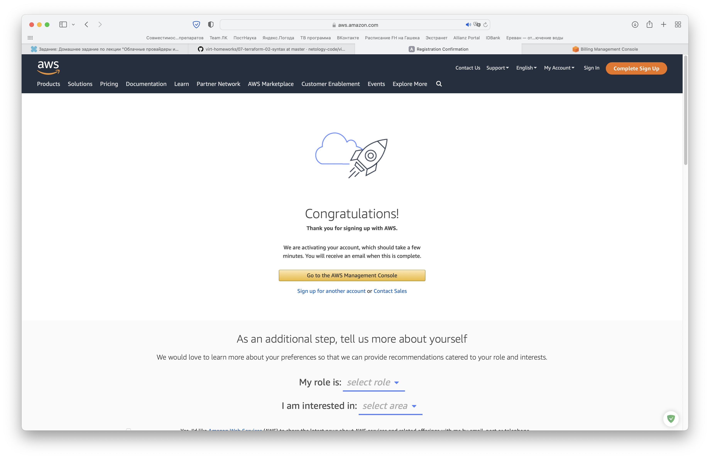
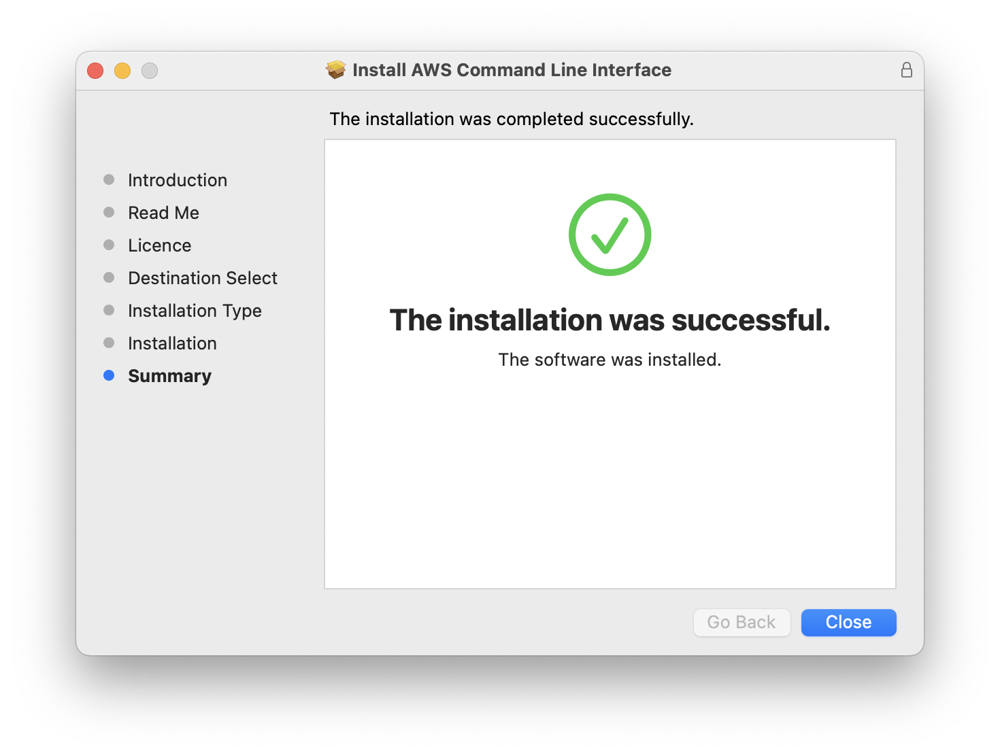
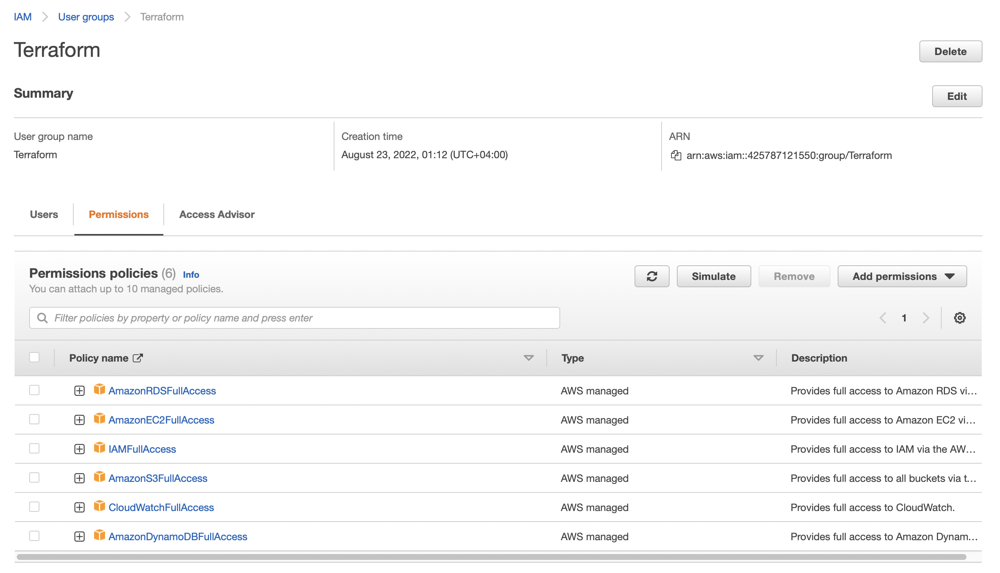
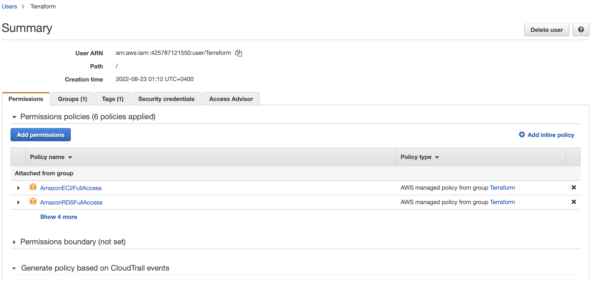
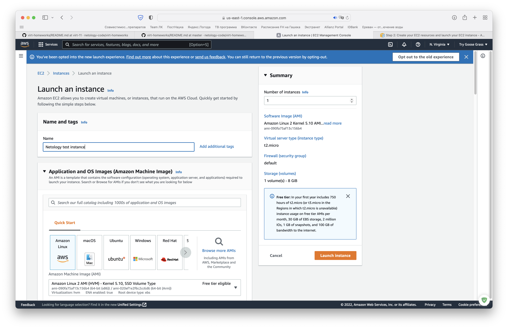
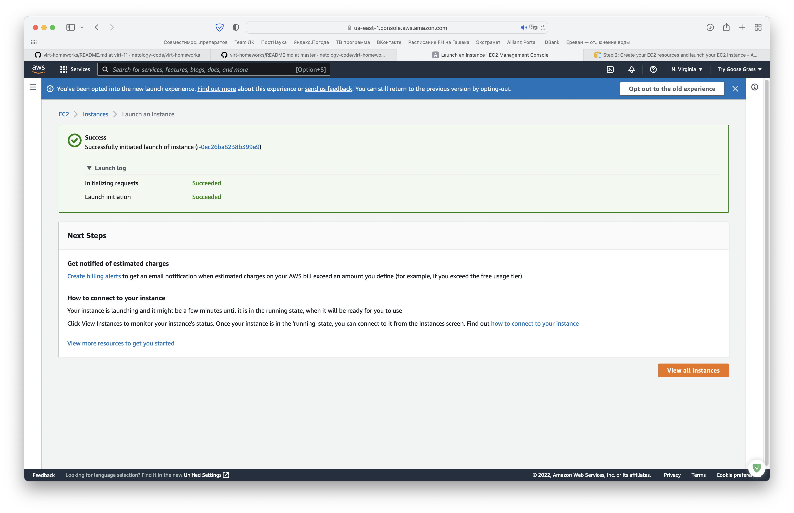
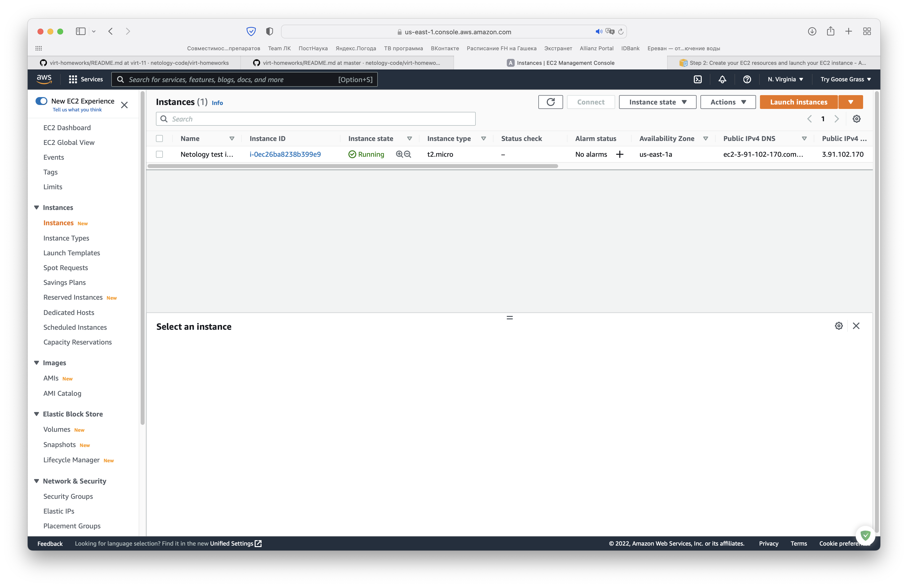
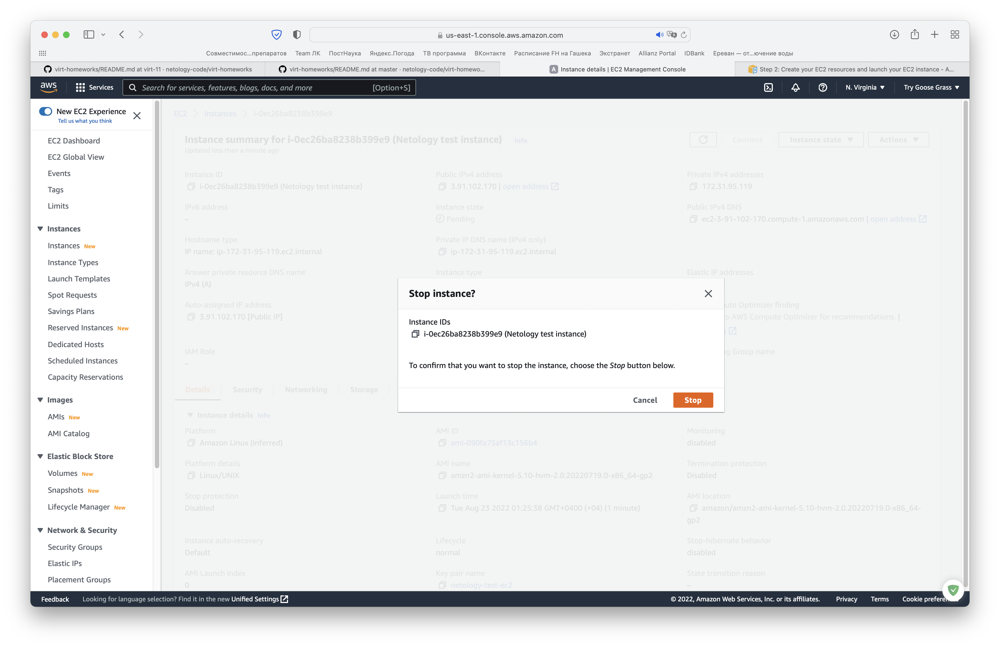
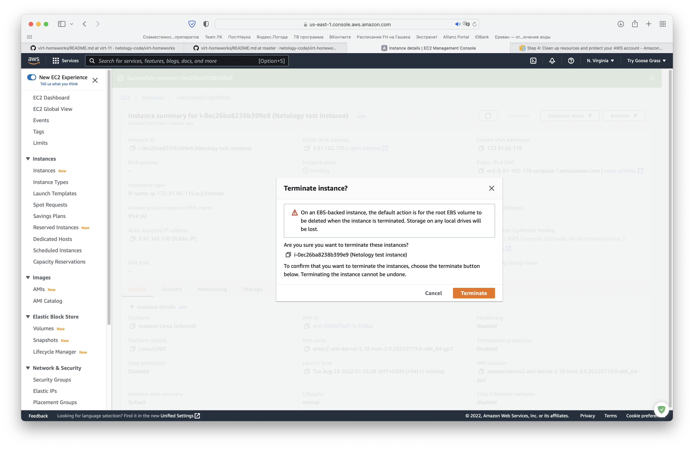
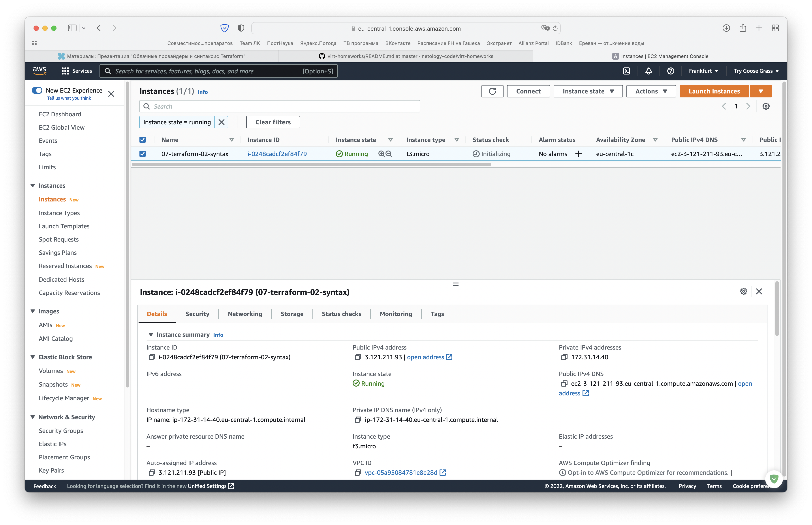

# Домашнее задание к занятию "7.2. Облачные провайдеры и синтаксис Terraform."

## Задача 1 (вариант с AWS). Регистрация в aws и знакомство с основами (необязательно, но крайне желательно).

_1. Создайте аккаут aws._



_2. Установите c aws-cli https://aws.amazon.com/cli/._



```zsh
sergey.belov@Try-Goose-Grass-MacBook-Pro ~ % which aws
/usr/local/bin/aws
sergey.belov@Try-Goose-Grass-MacBook-Pro ~ % aws --version
aws-cli/2.7.25 Python/3.9.11 Darwin/21.6.0 exe/x86_64 prompt/off
```

_3. Выполните первичную настройку aws-sli https://docs.aws.amazon.com/cli/latest/userguide/cli-configure-quickstart.html._

```zsh
sergey.belov@Try-Goose-Grass-MacBook-Pro ~ % aws configure
AWS Access Key ID [None]: <...>
AWS Secret Access Key [None]: <...>
Default region name [None]: eu-central-1
Default output format [None]: json

sergey.belov@Try-Goose-Grass-MacBook-Pro ~ % aws configure list
      Name                    Value             Type    Location
      ----                    -----             ----    --------
   profile                <not set>             None    None
access_key     ****************     shared-credentials-file
secret_key     ****************     shared-credentials-file
    region             eu-central-1      config-file    ~/.aws/config
```

4. _Создайте IAM политику для терраформа c правами_
    * _AmazonEC2FullAccess_
    * _AmazonS3FullAccess_
    * _AmazonDynamoDBFullAccess_
    * _AmazonRDSFullAccess_
    * _CloudWatchFullAccess_
    * _IAMFullAccess_

Поскольку я не понимаю, как можно создать policy с указанными выше правами (каждое из которых и так отдельная IAM policy), я создал новую группу и нового пользователя в этой группе:





_5. Добавьте переменные окружения_

```zsh
sergey.belov@Try-Goose-Grass-MacBook-Pro ~ % export AWS_ACCESS_KEY_ID=<access_key_id_for_Terraform_user>
sergey.belov@Try-Goose-Grass-MacBook-Pro ~ % export AWS_SECRET_ACCESS_KEY=<secret_access_key_for_Terraform_user>
```

_6. Создайте, остановите и удалите ec2 инстанс (любой с пометкой `free tier`) через веб интерфейс._












## Задача 1 (Вариант с Yandex.Cloud). Регистрация в ЯО и знакомство с основами (необязательно, но крайне желательно).

_1. Подробная инструкция на русском языке содержится [здесь](https://cloud.yandex.ru/docs/solutions/infrastructure-management/terraform-quickstart)._

_2. Обратите внимание на период бесплатного использования после регистрации аккаунта._

_3. Используйте раздел "Подготовьте облако к работе" для регистрации аккаунта. Далее раздел "Настройте провайдер" для подготовки
базового терраформ конфига._

```zsh
sergey.belov@Try-Goose-Grass-MacBook-Pro ~ % which terraform
/opt/homebrew/bin/terraform
sergey.belov@Try-Goose-Grass-MacBook-Pro ~ % export PATH=$PATH:/opt/homebrew/bin/terraform
```

_4. Воспользуйтесь [инструкцией](https://registry.terraform.io/providers/yandex-cloud/yandex/latest/docs) на сайте терраформа, что бы 
не указывать авторизационный токен в коде, а терраформ провайдер брал его из переменных окружений._


## Задача 2. Создание aws ec2 или yandex_compute_instance через терраформ. 

_1. В каталоге `terraform` вашего основного репозитория, который был создан в начале курсе, создайте файл `main.tf` и `versions.tf`._

_2. Зарегистрируйте провайдер_

   1. _для [aws](https://registry.terraform.io/providers/hashicorp/aws/latest/docs). В файл `main.tf` добавьте
   блок `provider`, а в `versions.tf` блок `terraform` с вложенным блоком `required_providers`. Укажите любой выбранный вами регион 
   внутри блока `provider`._

   2. _либо для [yandex.cloud](https://registry.terraform.io/providers/yandex-cloud/yandex/latest/docs). Подробную инструкцию можно найти 
   [здесь](https://cloud.yandex.ru/docs/solutions/infrastructure-management/terraform-quickstart)._

   3. _Внимание! В гит репозиторий нельзя пушить ваши личные ключи доступа к аккаунту. Поэтому в предыдущем задании мы указывали
их в виде переменных окружения._

   4. _В файле `main.tf` воспользуйтесь блоком `data "aws_ami` для поиска ami образа последнего Ubuntu._

   5. _В файле `main.tf` создайте рессурс_ 
      1. _либо [ec2 instance](https://registry.terraform.io/providers/hashicorp/aws/latest/docs/resources/instance).
      Постарайтесь указать как можно больше параметров для его определения. Минимальный набор параметров указан в первом блоке 
      `Example Usage`, но желательно, указать большее количество параметров._

      2. _либо [yandex_compute_image](https://registry.terraform.io/providers/yandex-cloud/yandex/latest/docs/resources/compute_image)._

   6. _Также в случае использования aws:_

      1. _Добавьте data-блоки `aws_caller_identity` и `aws_region`._

      2. _В файл `outputs.tf` поместить блоки `output` с данными об используемых в данный момент:_ 
          * _AWS account ID,_
          * _AWS user ID,_
          * _AWS регион, который используется в данный момент,_ 
          * _Приватный IP ec2 инстансы,_
          * _Идентификатор подсети в которой создан инстанс._  
   8. _Если вы выполнили первый пункт, то добейтесь того, что бы команда `terraform plan` выполнялась без ошибок._ 

```zsh
sergey.belov@Try-Goose-Grass-MacBook-Pro terraform % terraform plan
data.aws_caller_identity.current: Reading...
data.aws_region.current: Reading...
data.aws_ami.ubuntu: Reading...
data.aws_region.current: Read complete after 0s [id=eu-central-1]
data.aws_ami.ubuntu: Read complete after 0s [id=ami-05210ba6bdf75db36]
data.aws_caller_identity.current: Read complete after 1s [id=425787121550]

Terraform used the selected providers to generate the following execution plan. Resource actions are indicated with the following symbols:
  + create

Terraform will perform the following actions:

<...>

Plan: 1 to add, 0 to change, 0 to destroy.

Changes to Outputs:
  + account_id          = "425787121550"
  + caller_user         = "AIDAWGIXD36HJZGCXN5OJ"
  + current_aws_region  = "eu-central-1"
  + instance_private_ip = (known after apply)
  + instance_subnet_id  = (known after apply)
```

Применим полученный план:

```zsh
sergey.belov@Try-Goose-Grass-MacBook-Pro terraform % terraform apply -auto-approve
data.aws_caller_identity.current: Reading...
data.aws_region.current: Reading...
data.aws_ami.ubuntu: Reading...
data.aws_region.current: Read complete after 0s [id=eu-central-1]
data.aws_ami.ubuntu: Read complete after 1s [id=ami-05210ba6bdf75db36]
data.aws_caller_identity.current: Read complete after 1s [id=425787121550]

Terraform used the selected providers to generate the following execution plan. Resource actions are indicated with the following symbols:
  + create

Terraform will perform the following actions:

<...>

Apply complete! Resources: 1 added, 0 changed, 0 destroyed.

Outputs:

account_id = "425787121550"
caller_user = "AIDAWGIXD36HJZGCXN5OJ"
current_aws_region = "eu-central-1"
instance_private_ip = "172.31.14.40"
instance_subnet_id = "subnet-0abfea24eeb8c89fd"
```

В интерфейсе AWS это будет выглядеть так:



_В качестве результата задания предоставьте:_
1. _Ответ на вопрос: при помощи какого инструмента (из разобранных на прошлом занятии) можно создать свой образ ami?_

Собрать ami-образ можно собрать при помощи Packer'а.

2. _Ссылку на репозиторий с исходной конфигурацией терраформа._

https://github.com/Opalennyi/Netology_DevOps/tree/master/terraform