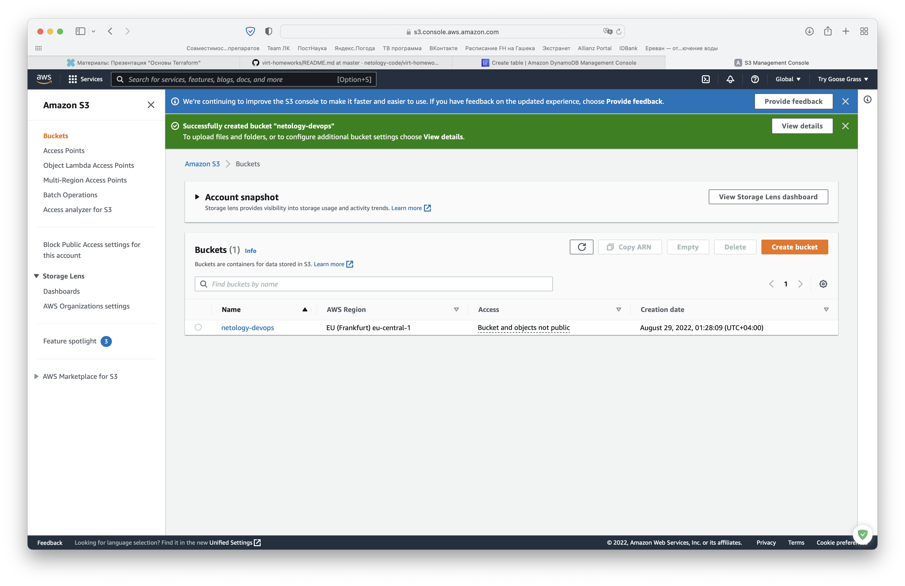
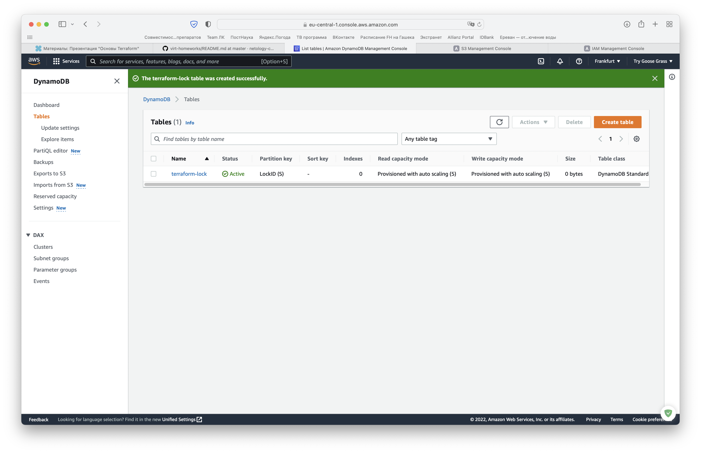
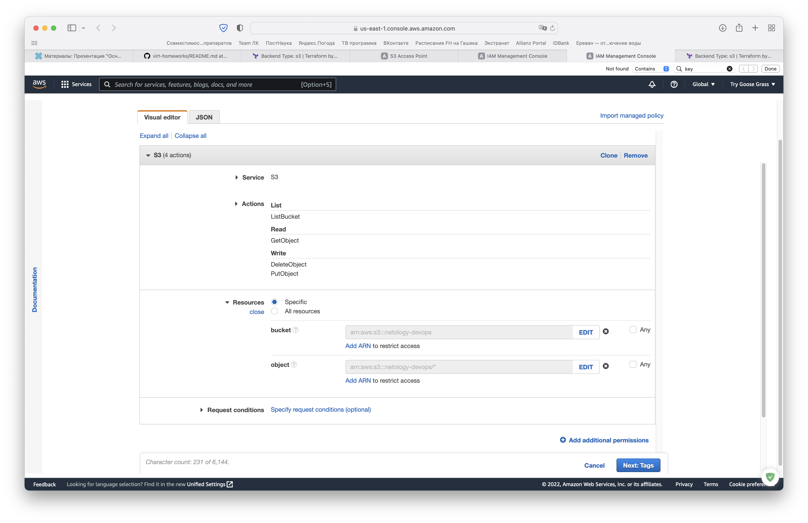
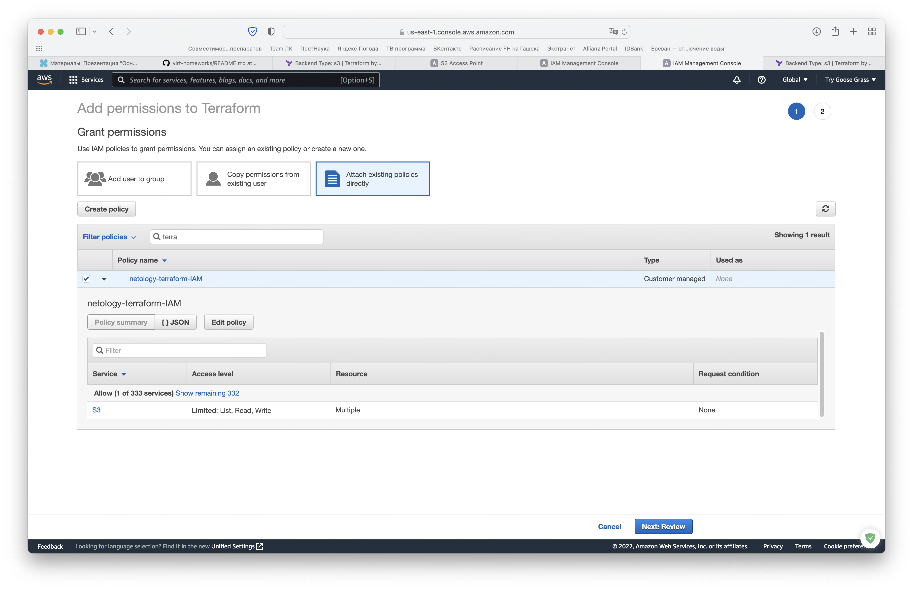
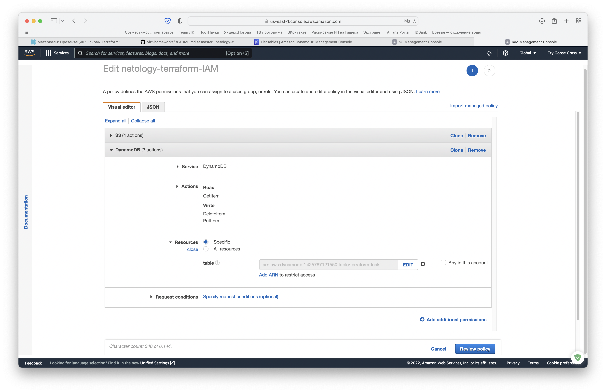
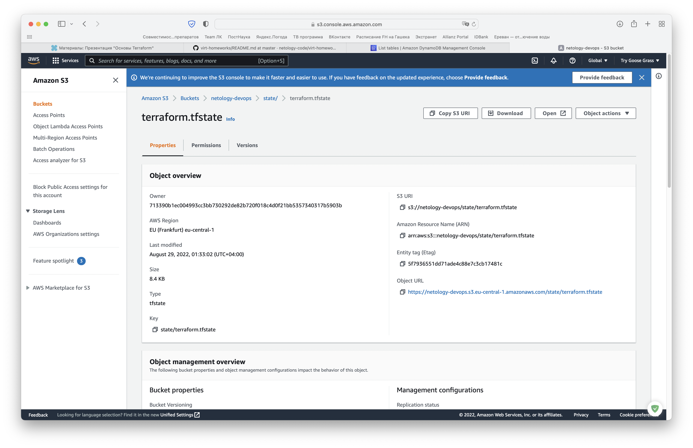
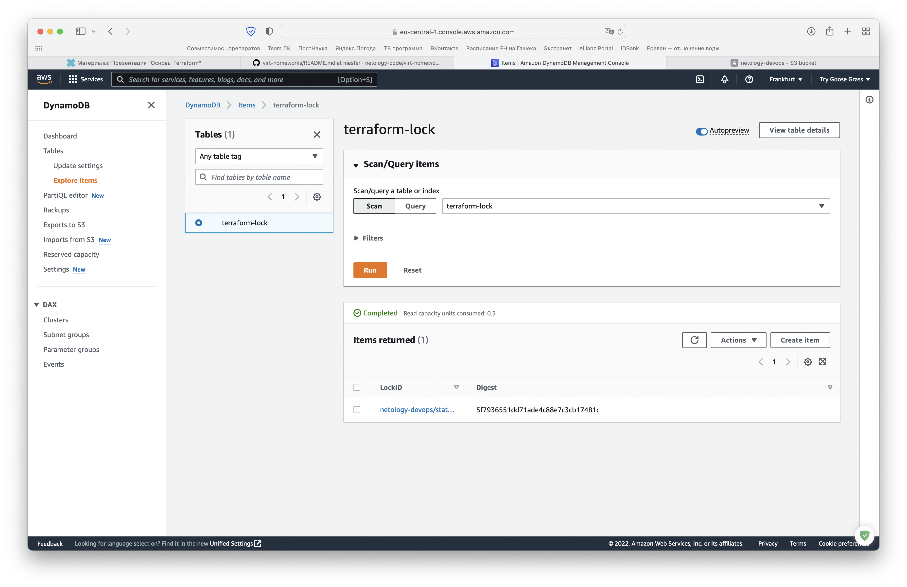
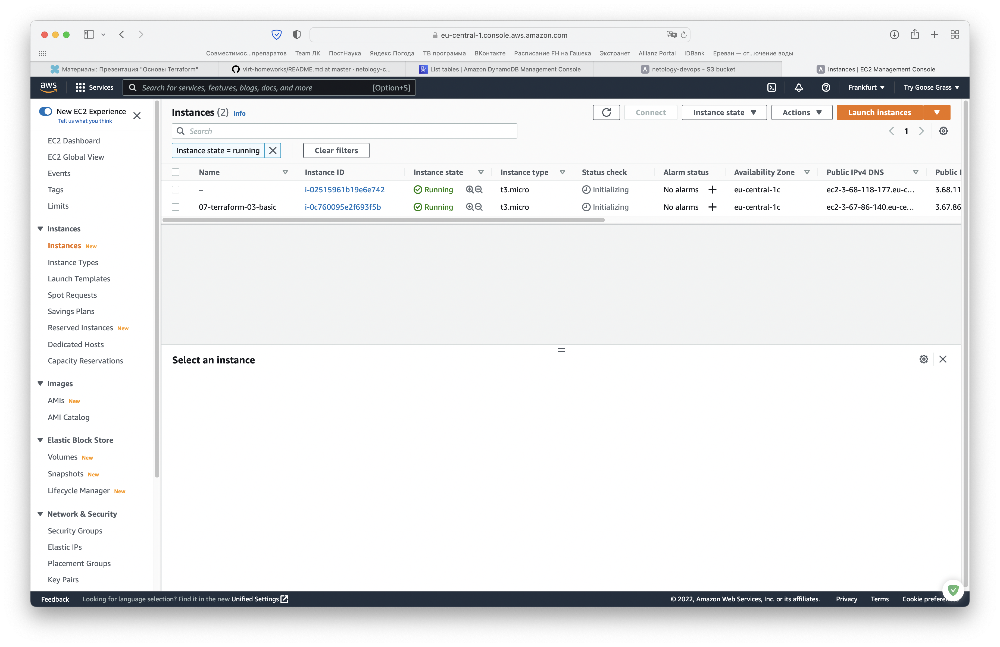
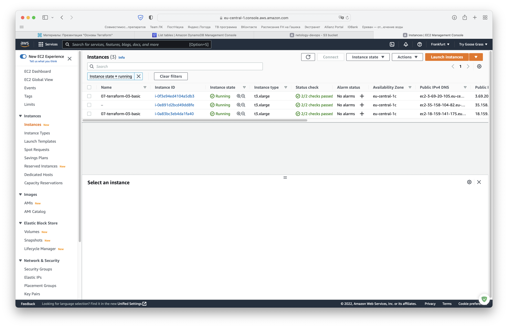

# Домашнее задание к занятию "7.3. Основы и принцип работы Терраформ"

## Задача 1. Создадим бэкэнд в S3 (необязательно, но крайне желательно).

_Если в рамках предыдущего задания у вас уже есть аккаунт AWS, то давайте продолжим знакомство со взаимодействием
терраформа и aws._

_1. Создайте s3 бакет, iam роль и пользователя от которого будет работать терраформ. Можно создать отдельного пользователя,
а можно использовать созданного в рамках предыдущего задания, просто добавьте ему необходимы права, как описано 
[здесь](https://www.terraform.io/docs/backends/types/s3.html)._

Создадим новый S3 bucket через GUI, включив версионирование при создании:



Создадим новую DynamoDB-таблицу:



Добавим нужные права уже созданному пользователю:







_2. Зарегистрируйте бэкэнд в терраформ проекте как описано по ссылке выше._

В уже существующей директории `terraform` создадим файл `state.tf` ([здесь](terraform/state.tf)) и добавим следующую конфигурацию:
```terraform
terraform {
  backend "s3" {
    bucket         = "netology-devops"
    key            = "state/terraform.tfstate"
    region         = "eu-central-1"
    dynamodb_table = "terraform-lock"
    encrypt        = true
    }
  }
}
```

## Задача 2. Инициализируем проект и создаем воркспейсы. 

_1. Выполните `terraform init`:_
    * _если был создан бэкэнд в S3, то терраформ создат файл стейтов в S3 и запись в таблице 
dynamodb._
    * _иначе будет создан локальный файл со стейтами._  

```zsh
sergey.belov@Try-Goose-Grass-MacBook-Pro terraform % terraform init

Initializing the backend...
Do you want to copy existing state to the new backend?
  Pre-existing state was found while migrating the previous "local" backend to the
  newly configured "s3" backend. No existing state was found in the newly
  configured "s3" backend. Do you want to copy this state to the new "s3"
  backend? Enter "yes" to copy and "no" to start with an empty state.

  Enter a value: yes

Releasing state lock. This may take a few moments...

Successfully configured the backend "s3"! Terraform will automatically
use this backend unless the backend configuration changes.

Initializing provider plugins...
- Reusing previous version of hashicorp/aws from the dependency lock file
- Using previously-installed hashicorp/aws v3.75.2

Terraform has been successfully initialized!

You may now begin working with Terraform. Try running "terraform plan" to see
any changes that are required for your infrastructure. All Terraform commands
should now work.

If you ever set or change modules or backend configuration for Terraform,
rerun this command to reinitialize your working directory. If you forget, other
commands will detect it and remind you to do so if necessary.
```

Проверим бакет. В бакете был создан `terraform.tfstate`:



В таблице была создана запись:



_2. Создайте два воркспейса `stage` и `prod`._

```zsh
sergey.belov@Try-Goose-Grass-MacBook-Pro terraform % terraform workspace new stage
Created and switched to workspace "stage"!

You're now on a new, empty workspace. Workspaces isolate their state,
so if you run "terraform plan" Terraform will not see any existing state
for this configuration.
sergey.belov@Try-Goose-Grass-MacBook-Pro terraform % terraform workspace new prod
Created and switched to workspace "prod"!

You're now on a new, empty workspace. Workspaces isolate their state,
so if you run "terraform plan" Terraform will not see any existing state
for this configuration.
sergey.belov@Try-Goose-Grass-MacBook-Pro terraform % terraform workspace list
  default
* prod
  stage
```

_3. В уже созданный `aws_instance` добавьте зависимость типа инстанса от вокспейса, что бы в разных ворскспейсах 
использовались разные `instance_type`._

Добавим изменения в файл  `main.tf`. В блоке `resource "aws_instance" "web"` переопределим несколько переменных:

```terraform
instance_type         = local.web_instance_type_map[terraform.workspace]
cpu_core_count        = local.cpu_core_count_map[terraform.workspace]
cpu_threads_per_core  = local.cpu_threads_per_core_map[terraform.workspace]
```

Создадим файл `locals.tf` ([здесь](terraform/locals.tf)), где определим локальные переменные:
```terraform
locals {
  web_instance_type_map = {
    stage = "t3.micro"
    prod  = "t3.xlarge"
  }

  cpu_core_count_map = {
    stage = 1
    prod  = 2
  }

  cpu_threads_per_core_map = {
    stage = 1 # Disabling multithreading
    prod  = 2
  }
}
```

_4. Добавим `count`. Для `stage` должен создаться один экземпляр `ec2`, а для `prod` два._ 

Добавим `count         = local.web_count_map[terraform.workspace]` в `main.tf` и еще одну переменную в `locals.tf`:
```terraform
web_count_map = { 
  stage = 1
  prod  = 2
}
```

_5. Создайте рядом еще один `aws_instance`, но теперь определите их количество при помощи `for_each`, а не `count`._

В `main.tf` добавим:

```terraform
resource "aws_instance" "web_with_for_each" {
  ami           = data.aws_ami.ubuntu.id
  instance_type = local.web_instance_type_map[terraform.workspace]

  for_each = local.web_vm_map[terraform.workspace]

  monitoring = true

  tags = {
    name = "ubuntu_instance"
  }
}
```

В `locals.tf` добавим:
```terraform
web_vm_map = {
  stage = { count = 1 }
  prod  = { count = 2 }
}
```

_6. Что бы при изменении типа инстанса не возникло ситуации, когда не будет ни одного инстанса добавьте параметр
жизненного цикла `create_before_destroy = true` в один из рессурсов `aws_instance`._

Добавлено в `resource "aws_instance" "web"`.

_7. При желании поэкспериментируйте с другими параметрами и рессурсами._

_В виде результата работы пришлите:_
* _Вывод команды `terraform workspace list`._
* _Вывод команды `terraform plan` для воркспейса `prod`._ 

Попробуем спланировать для воркспейса `stage`:
```zsh
sergey.belov@Try-Goose-Grass-MacBook-Pro terraform % terraform workspace select stage
Switched to workspace "stage".
sergey.belov@Try-Goose-Grass-MacBook-Pro terraform % terraform workspace list
  default
  prod
* stage

sergey.belov@Try-Goose-Grass-MacBook-Pro terraform % terraform plan
Acquiring state lock. This may take a few moments...
data.aws_region.current: Reading...
data.aws_caller_identity.current: Reading...
data.aws_region.current: Read complete after 0s [id=eu-central-1]
data.aws_ami.ubuntu: Reading...
data.aws_ami.ubuntu: Read complete after 1s [id=ami-05210ba6bdf75db36]
data.aws_caller_identity.current: Read complete after 1s [id=425787121550]

Terraform used the selected providers to generate the following execution plan. Resource actions are indicated with the following symbols:
  + create

Terraform will perform the following actions:

  # aws_instance.web[0] will be created

<...>

sergey.belov@Try-Goose-Grass-MacBook-Pro terraform % terraform apply
data.aws_caller_identity.current: Reading...
data.aws_region.current: Reading...
data.aws_ami.ubuntu: Reading...
data.aws_region.current: Read complete after 0s [id=eu-central-1]
data.aws_ami.ubuntu: Read complete after 0s [id=ami-05210ba6bdf75db36]
data.aws_caller_identity.current: Read complete after 0s [id=425787121550]

Terraform used the selected providers to generate the following execution plan. Resource actions are indicated with the following symbols:
  + create

Terraform will perform the following actions:

<...>
```

Все получилось:


Повторим то же самое для воркспейса `prod`. Вывод `terraform plan` в [лог-файле](log-prod).

```zsh
Apply complete! Resources: 2 added, 0 changed, 0 destroyed.
sergey.belov@Try-Goose-Grass-MacBook-Pro terraform % terraform workspace select prod
terraform workspace list
Switched to workspace "prod".
sergey.belov@Try-Goose-Grass-MacBook-Pro terraform % terraform workspace list
  default
* prod
  stage
```

Проверим консоль. Должно было создаться три EC2-инстанса:
