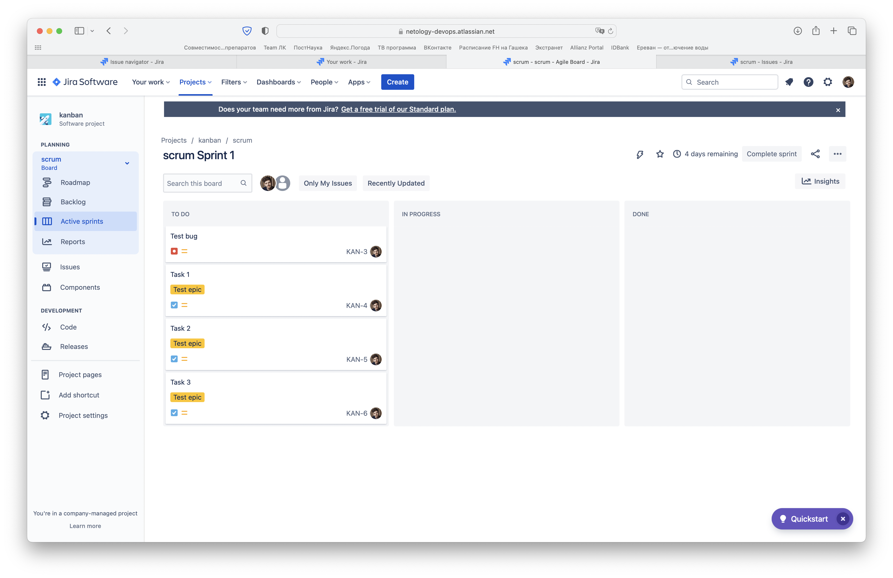

# Домашнее задание к занятию "09.01 Жизненный цикл ПО"

## _Подготовка к выполнению_
1. _Получить бесплатную [JIRA](https://www.atlassian.com/ru/software/jira/free)_
2. _Настроить её для своей "команды разработки"_
3. _Создать доски kanban и scrum_

## Основная часть
_В рамках основной части необходимо создать собственные workflow для двух типов задач: bug и остальные типы задач. Задачи типа bug должны проходить следующий жизненный цикл:_
1. _Open -> On reproduce_
2. _On reproduce <-> Open, Done reproduce_
3. _Done reproduce -> On fix_
4. _On fix <-> On reproduce, Done fix_
5. _Done fix -> On test_
6. _On test <-> On fix, Done_
7. _Done <-> Closed, Open_

_Остальные задачи должны проходить по упрощённому workflow:_
1. _Open -> On develop_
2. _On develop <-> Open, Done develop_
3. _Done develop -> On test_
4. _On test <-> On develop, Done_
5. _Done <-> Closed, Open_

_Создать задачу с типом bug, попытаться провести его по всему workflow до Done. Создать задачу с типом epic, к ней привязать несколько задач с типом task, провести их по всему workflow до Done. При проведении обеих задач по статусам использовать kanban. Вернуть задачи в статус Open._

_Перейти в scrum, запланировать новый спринт, состоящий из задач эпика и одного бага, стартовать спринт, провести задачи до состояния Closed. Закрыть спринт._

_Если всё отработало в рамках ожидания - выгрузить схемы workflow для импорта в XML. Файлы с workflow приложить к решению задания._

Workflow schemes находятся [вот здесь](/09-ci-01-intro/worklow_schemes/).