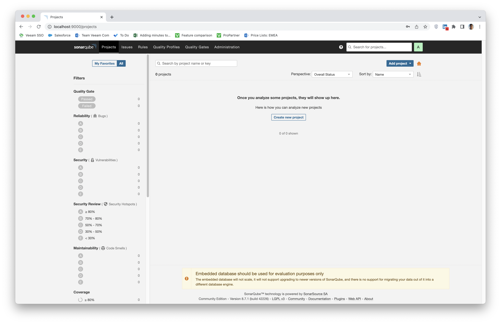

# Домашнее задание к занятию "09.02 CI\CD"

## Знакомоство с SonarQube

### Подготовка к выполнению

1. _Выполняем `docker pull sonarqube:8.7-community`_

```shell
sergey.belov@Try-Goose-Grass-MacBook-Pro ~ % docker pull sonarqube:8.7-community
8.7-community: Pulling from library/sonarqube
no matching manifest for linux/arm64/v8 in the manifest list entries

sergey.belov@Try-Goose-Grass-MacBook-Pro ~ % docker pull sonarqube:8.7-community --platform linux/x86_64
8.7-community: Pulling from library/sonarqube
22599d3e9e25: Pull complete
00bb4d95f2aa: Pull complete
3ef8cf8a60c8: Pull complete
928990dd1bda: Pull complete
07cca701c22e: Pull complete
Digest: sha256:70496f44067bea15514f0a275ee898a7e4a3fedaaa6766e7874d24a39be336dc
Status: Downloaded newer image for sonarqube:8.7-community
docker.io/library/sonarqube:8.7-community
```

2. _Выполняем `docker run -d --name sonarqube -e SONAR_ES_BOOTSTRAP_CHECKS_DISABLE=true -p 9000:9000 sonarqube:8.7-community`_

```shell
sergey.belov@Try-Goose-Grass-MacBook-Pro ~ % cp ~/Downloads/sonar-scanner-4.7.0.2747-macosx/bin/sonar-scanner /usr/local/bin/

sergey.belov@Try-Goose-Grass-MacBook-Pro ~ % docker run -d --name sonarqube -e SONAR_ES_BOOTSTRAP_CHECKS_DISABLE=true -p 9000:9000 sonarqube:8.7-community
WARNING: The requested image's platform (linux/amd64) does not match the detected host platform (linux/arm64/v8) and no specific platform was requested
a3468ce66ae75c93ebd69c82813d40cbdcdb460481843c23f182f8533b15c3b6
```

3. _Ждём запуск, смотрим логи через `docker logs -f sonarqube`_
4. _Проверяем готовность сервиса через [браузер](http://localhost:9000)_
5. _Заходим под admin\admin, меняем пароль на свой_



_В целом, в [этой статье](https://docs.sonarqube.org/latest/setup/install-server/) описаны все варианты установки, включая и docker, но так как нам он нужен разово, то достаточно того набора действий, который я указал выше._

### Основная часть

1. Создаём новый проект, название произвольное
2. Скачиваем пакет sonar-scanner, который нам предлагает скачать сам sonarqube
3. Делаем так, чтобы binary был доступен через вызов в shell (или меняем переменную PATH или любой другой удобный вам способ)

```shell
sergey.belov@Try-Goose-Grass-MacBook-Pro ~ % export PATH=/Users/sergey.belov/Downloads/sonar-scanner-4.7.0.2747-macosx/bin/:$PATH
```

4. Проверяем `sonar-scanner --version`

```shell
sergey.belov@Try-Goose-Grass-MacBook-Pro ~ % sonar-scanner --version
INFO: Scanner configuration file: /Users/sergey.belov/Downloads/sonar-scanner-4.7.0.2747-macosx/conf/sonar-scanner.properties
INFO: Project root configuration file: NONE
INFO: SonarScanner 4.7.0.2747
INFO: Java 11.0.14.1 Eclipse Adoptium (64-bit)
INFO: Mac OS X 12.6 x86_64
```

5. Запускаем анализатор против кода из директории [example](./example) с дополнительным ключом `-Dsonar.coverage.exclusions=fail.py`


6. Смотрим результат в интерфейсе
7. Исправляем ошибки, которые он выявил(включая warnings)
8. Запускаем анализатор повторно - проверяем, что QG пройдены успешно
9. Делаем скриншот успешного прохождения анализа, прикладываем к решению ДЗ

## Знакомство с Nexus

### Подготовка к выполнению

1. Выполняем `docker pull sonatype/nexus3`
2. Выполняем `docker run -d -p 8081:8081 --name nexus sonatype/nexus3`
3. Ждём запуск, смотрим логи через `docker logs -f nexus`
4. Проверяем готовность сервиса через [бразуер](http://localhost:8081)
5. Узнаём пароль от admin через `docker exec -it nexus /bin/bash`
6. Подключаемся под админом, меняем пароль, сохраняем анонимный доступ

### Основная часть

1. В репозиторий `maven-public` загружаем артефакт с GAV параметрами:
   1. groupId: netology
   2. artifactId: java
   3. version: 8_282
   4. classifier: distrib
   5. type: tar.gz
2. В него же загружаем такой же артефакт, но с version: 8_102
3. Проверяем, что все файлы загрузились успешно
4. В ответе присылаем файл `maven-metadata.xml` для этого артефекта

### Знакомство с Maven

### Подготовка к выполнению

1. Скачиваем дистрибутив с [maven](https://maven.apache.org/download.cgi)
2. Разархивируем, делаем так, чтобы binary был доступен через вызов в shell (или меняем переменную PATH или любой другой удобный вам способ)
3. Проверяем `mvn --version`
4. Забираем директорию [mvn](./mvn) с pom

### Основная часть

1. Меняем в `pom.xml` блок с зависимостями под наш артефакт из первого пункта задания для Nexus (java с версией 8_282)
2. Запускаем команду `mvn package` в директории с `pom.xml`, ожидаем успешного окончания
3. Проверяем директорию `~/.m2/repository/`, находим наш артефакт
4. В ответе присылаем исправленный файл `pom.xml`