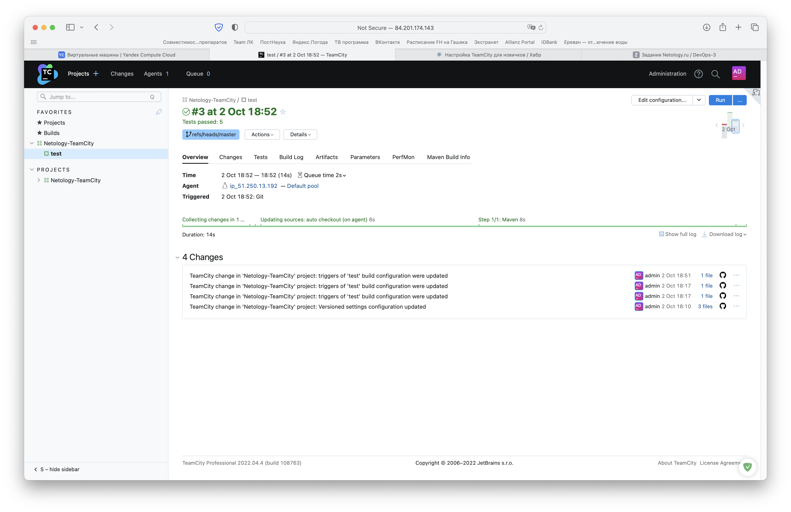

# Домашнее задание к занятию "09.04 Teamcity"

## Подготовка к выполнению

1. _Поднимите инфраструктуру [teamcity](./teamcity/docker-compose.yml)_

При использовании указанной инфраструктуры система не функционировала, поэтому мной была использована инфраструктура, показанная в лекции:

```dockerfile
version: "3"
services:
  teamcity-agent:
    image: jetbrains/teamcity-agent 
    volumes:
      - /var/run/docker.sock:/var/run/docker.sock
      - /opt/buildagent/work:/opt/buildagent/work
    environment:
      SERVER_URL: "http://84.201.174.143:8111"
```

Только с такой инфраструктурой агент появлялся в консоли TeamCity.

2. _Если хочется, можете создать свою собственную инфраструктуру на основе той технологии, которая нравится. Инструкция по установке из [документации](https://www.jetbrains.com/help/teamcity/installing-and-configuring-the-teamcity-server.html)_

Развернём 2 ВМ (`jetbrains/teamcity-server`, `jetbrains/teamcity-agent`) в Yandex Cloud:


3. _Дождитесь запуска teamcity, выполните первоначальную настройку_


4. _Авторизуйте агент_


5. _Сделайте fork [репозитория](https://github.com/aragastmatb/example-teamcity)_

Fork [здесь](https://github.com/Opalennyi/example-teamcity).

## Основная часть

1. _Создайте новый проект в teamcity на основе fork_


2. _Сделайте autodetect конфигурации_


3. _Сохраните необходимые шаги, запустите первую сборку master'a_


4. _Поменяйте условия сборки: если сборка по ветке `master`, то должен происходит `mvn clean package`, иначе `mvn clean test`_

Активируем синхронизацию:


Проверим условия сборки в созданном `example-teamcity/.teamcity/settings.kts`:


5. _Мигрируйте `build configuration` в репозиторий_

Мигрируем [сюда](https://github.com/Opalennyi/example-teamcity/blob/master/.teamcity/settings.kts).

6. _Создайте отдельную ветку `feature/add_reply` в репозитории_

Добавили ветку [feature/add_reply](https://github.com/Opalennyi/example-teamcity/tree/feature/add_reply).

7. _Напишите новый метод для класса Welcomer: метод должен возвращать произвольную реплику, содержащую слово `hunter`_

```java
public String askHunter() {
    return "Are you a hunter?";
}
```

8. _Дополните тест для нового метода на поиск слова `hunter` в новой реплике_

```java
public void welcomerSaysHunter() {
	assertThat(welcomer.sayWelcome(), containsString("hunter"));
	assertThat(welcomer.sayFarewell(), containsString("hunter"));
    assertThat(welcomer.askHunter(), containsString("hunter"));
}
```

9. _Сделайте push всех изменений в новую ветку в репозиторий_
10. _Убедитесь что сборка самостоятельно запустилась, тесты прошли успешно_

Сборка запустилась самостоятельно, тесты прошлы успешно.




11. _Внесите изменения из произвольной ветки `feature/add_reply` в `master` через `Merge`_


12. _Убедитесь, что нет собранного артефакта в сборке по ветке `master`_


13. _Настройте конфигурацию так, чтобы она собирала `.jar` в артефакты сборки_

Регулярное выражение для сборки должно выглядеть как `+:target/*.jar => target`:


Однако если мы раскроем дерево, мы увидим, что `.jar`-файлы не создаются, поэтому при любом регулярном выражении они не появляются при сборке.


14. _Проведите повторную сборку мастера, убедитесь, что сбора прошла успешно и артефакты собраны_

Соответственно, на этой стадии появляется `target`, но не появляются `.jar`-файлы.


15. _Проверьте, что конфигурация в репозитории содержит все настройки конфигурации из teamcity_
16. _В ответ предоставьте ссылку на репозиторий_

Репозиторий [находится здесь](https://github.com/Opalennyi/example-teamcity/tree/master).