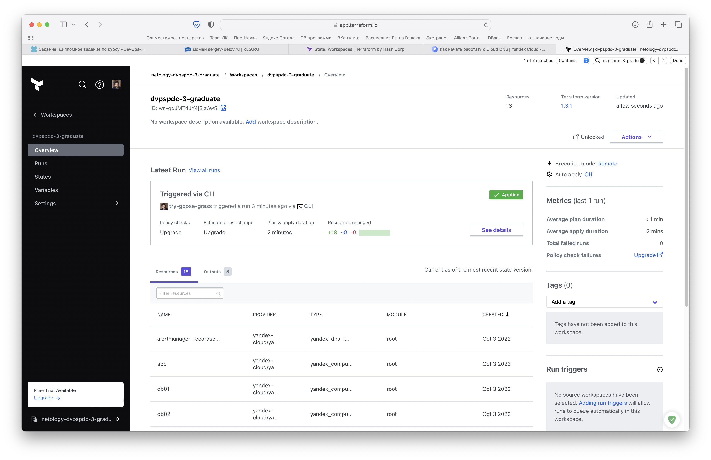
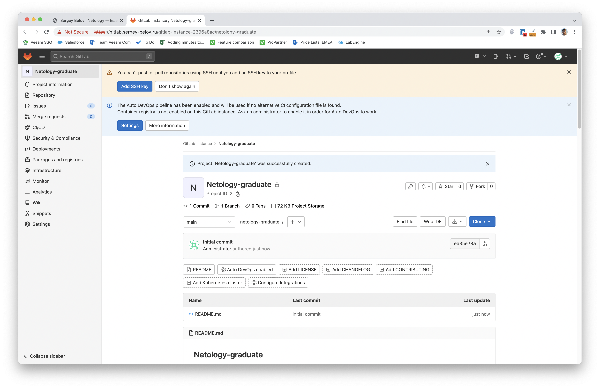

# Дипломное задание по курсу «DevOps-инженер»

## Дипломный практикум в YandexCloud

---
### UPD. от 19 ноября 2022 года специально для Олега Букатчука, который не верит, что мои сертификаты были выпущены для работающих сервисов


---

### 1. Регистрация доменного имени

Зарегистрируем домен `sergey-belov.ru` на reg.ru. При покупке добавим дополнительную бесплатную услугу DomainSSL.

Изменим дефолтные DNS-серверы на серверы Яндекса `ns1.yandexcloud.net` и `ns2.yandexcloud.net`.


### 2. Создание инфраструктуры

Создадим сервисный аккаунт в Yandex Cloud с ролью `editor`.


Создадим CLI-driven workspace в Terraform Cloud, который будем в дальнейшем использовать в качестве backend'а. Создать workspace с именем `stage` невозможно — оно уже занято.


Всего нам понадобится 8 виртуальных машин. Для сборки будем использовать один из стандартных образов Yandex Cloud, список которых мы можем получить с помощью этой команды:
```bash
sergey.belov@Try-Goose-Grass-MacBook-Pro ~ % yc compute image list --folder-id standard-images >> /Users/sergey.belov/Downloads/yс-images.txt
```

Инфраструктура доступна в директории [terraform](terraform/).

Запустим `terraform init`:
```shell
sergey.belov@Try-Goose-Grass-MacBook-Pro terraform % terraform init

Initializing Terraform Cloud...

Initializing provider plugins...
- Finding yandex-cloud/yandex versions matching "0.80.0"...
- Installing yandex-cloud/yandex v0.80.0...
- Installed yandex-cloud/yandex v0.80.0 (self-signed, key ID E40F590B50BB8E40)

Partner and community providers are signed by their developers.
If you'd like to know more about provider signing, you can read about it here:
https://www.terraform.io/docs/cli/plugins/signing.html

Terraform has created a lock file .terraform.lock.hcl to record the provider
selections it made above. Include this file in your version control repository
so that Terraform can guarantee to make the same selections by default when
you run "terraform init" in the future.

Terraform Cloud has been successfully initialized!

You may now begin working with Terraform Cloud. Try running "terraform plan" to
see any changes that are required for your infrastructure.

If you ever set or change modules or Terraform Settings, run "terraform init"
again to reinitialize your working directory.
```

Проверим конфигурацию при помощи `terraform validate`:
```shell
sergey.belov@Try-Goose-Grass-MacBook-Pro terraform % terraform validate
Success! The configuration is valid.
```

При первом запуске `terraform plan` получим сообщение о том, что переменные не настроены:
```shell
sergey.belov@Try-Goose-Grass-MacBook-Pro terraform % terraform plan
Running plan in Terraform Cloud. Output will stream here. Pressing Ctrl-C
will stop streaming the logs, but will not stop the plan running remotely.

Preparing the remote plan...

To view this run in a browser, visit:
https://app.terraform.io/app/netology-dvpspdc-3-graduate/dvpspdc-3-graduate/runs/run-RoGBwDBWyTXbHcmC

Waiting for the plan to start...

Terraform v1.3.1
on linux_amd64
Initializing plugins and modules...
╷
│ Error: No value for required variable
│
│   on variables.tf line 1:
│    1: variable "yc_token" {}
│
│ The root module input variable "yc_token" is not set, and has no default
│ value. Use a -var or -var-file command line argument to provide a value for
│ this variable.
╵
╷
│ Error: No value for required variable
│
│   on variables.tf line 11:
│   11: variable "SSH_ID_RSA_PUB" {}
│
│ The root module input variable "SSH_ID_RSA_PUB" is not set, and has no
│ default value. Use a -var or -var-file command line argument to provide a
│ value for this variable.
╵
Operation failed: failed running terraform plan (exit 1)
```

Добавим в Terraform Cloud две переменные окружения, отметив, что их значения — Sensitive:


Запустим `terraform plan` еще раз:
```shell
sergey.belov@Try-Goose-Grass-MacBook-Pro terraform % terraform plan
Running plan in Terraform Cloud. Output will stream here. Pressing Ctrl-C
will stop streaming the logs, but will not stop the plan running remotely.

Preparing the remote plan...

To view this run in a browser, visit:
https://app.terraform.io/app/netology-dvpspdc-3-graduate/dvpspdc-3-graduate/runs/run-TgQGWZ5Yj8o55j4W

Waiting for the plan to start...

Terraform v1.3.1
on linux_amd64
Initializing plugins and modules...

Terraform used the selected providers to generate the following execution
plan. Resource actions are indicated with the following symbols:
  + create

Terraform will perform the following actions:

  # yandex_compute_instance.app will be created
  + resource "yandex_compute_instance" "app" {
    
<...>

Plan: 18 to add, 0 to change, 0 to destroy.

Changes to Outputs:
  + app_internal_ip_address           = (known after apply)
  + db01_internal_ip_address          = (known after apply)
  + db02_internal_ip_address          = (known after apply)
  + gitlab_internal_ip_address        = (known after apply)
  + main_instance_external_ip_address = (known after apply)
  + monitoring_internal_ip_address    = (known after apply)
  + runner_internal_ip_address        = (known after apply)
  + ssh_config                        = (known after apply)
```

Выполним `terraform apply --auto-approve`:
```shell
sergey.belov@Try-Goose-Grass-MacBook-Pro terraform % terraform apply --auto-approve
Running apply in Terraform Cloud. Output will stream here. Pressing Ctrl-C
will cancel the remote apply if it's still pending. If the apply started it
will stop streaming the logs, but will not stop the apply running remotely.

<...>

Terraform will perform the following actions:

Apply complete! Resources: 18 added, 0 changed, 0 destroyed.

Outputs:

app_internal_ip_address = "192.168.2.15"
db01_internal_ip_address = "192.168.2.17"
db02_internal_ip_address = "192.168.2.30"
gitlab_internal_ip_address = "192.168.2.21"
main_instance_external_ip_address = "178.154.223.24"
monitoring_internal_ip_address = "192.168.2.39"
runner_internal_ip_address = "192.168.2.19"
ssh_config = <<EOT

<...>
```

Проверим Terraform Cloud:




Также проверим в интерфейсе Yandex.Cloud что все корректно работает.


**Виртуальные машины:**


**Виртуальные сети:**


**DNS-записи:**


Вся инфраструктура успешно развернута.

Попробуем применить `terraform destroy`:
```shell
<...>

Do you really want to destroy all resources in workspace "dvpspdc-3-graduate"?
  Terraform will destroy all your managed infrastructure, as shown above.
  There is no undo. Only 'yes' will be accepted to confirm.

  Enter a value: yes
  
<...>

Apply complete! Resources: 0 added, 0 changed, 18 destroyed.
```

Снова проверим Terraform Cloud и интерфейс Yandex.Cloud:


Инфраструктура успешно уничтожена.

### 3. Установка Nginx и LetsEncrypt

Файлы конфигурации доступны [здесь](ansible/roles/main).

Чтобы Nginx мог корректно перенаправлять запросы, ему необходимы сформированные при конфигурации виртуальных машин IP-адреса. Их мы вручную добавляем в `variables.yml` перед запуском Ansible после отработки Terraform'а.

При каждом запуске Ansible'а будем очищать файл `known_hosts` командой `echo "" > ~/.ssh/known_hosts`, в противном случае получим следующую ошибку:
```shell
fatal: [www.sergey-belov.ru]: UNREACHABLE! => {"changed": false, "msg": "Failed to connect to the host via ssh: @@@@@@@@@@@@@@@@@@@@@@@@@@@@@@@@@@@@@@@@@@@@@@@@@@@@@@@@@@@\r\n@    WARNING: REMOTE HOST IDENTIFICATION HAS CHANGED!     @\r\n@@@@@@@@@@@@@@@@@@@@@@@@@@@@@@@@@@@@@@@@@@@@@@@@@@@@@@@@@@@\r\nIT IS POSSIBLE THAT SOMEONE IS DOING SOMETHING NASTY!\r\nSomeone could be eavesdropping on you right now (man-in-the-middle attack)!\r\nIt is also possible that a host key has just been changed.\r\nThe fingerprint for the ED25519 key sent by the remote host is\nSHA256:LAjAwmTdlk63/DwiZgwir7V9yKGv77pT07jxRTtG0G8.\r\nPlease contact your system administrator.\r\nAdd correct host key in /Users/sergey.belov/.ssh/known_hosts to get rid of this message.\r\nOffending ECDSA key in /Users/sergey.belov/.ssh/known_hosts:15\r\nHost key for www.sergey-belov.ru has changed and you have requested strict checking.\r\nHost key verification failed.", "unreachable": true}
```

Запустим роль для установки Nginx:
```shell
sergey.belov@Try-Goose-Grass-MacBook-Pro ansible % ansible-playbook -i inventory roles/main/main.yml

PLAY [main] ***************************************************************************************************************************************************************************************************************************************

TASK [Gathering Facts] ****************************************************************************************************************************************************************************************************************************
The authenticity of host 'www.sergey-belov.ru (51.250.64.91)' can't be established.
ED25519 key fingerprint is SHA256:d0/EVgzVZnDqGpj1MzgmDBiegLS2OsHiMfVuIlLpBhA.
This key is not known by any other names
Are you sure you want to continue connecting (yes/no/[fingerprint])? yes
Enter passphrase for key '/Users/sergey.belov/.ssh/id_rsa':
ok: [www.sergey-belov.ru]

TASK [include_vars] *******************************************************************************************************************************************************************************************************************************
ok: [www.sergey-belov.ru]

TASK [Updating installed apt packages] ************************************************************************************************************************************************************************************************************
changed: [www.sergey-belov.ru]

<...>

PLAY RECAP ****************************************************************************************************************************************************************************************************************************************
www.sergey-belov.ru        : ok=18   changed=16   unreachable=0    failed=0    skipped=0    rescued=0    ignored=0
```

Проверим доступ на www.sergey-belov.ru:


Соединение небезопасно — это нормально, поскольку мы выпускали тестовый сертификат.


Проверим доступ на другие разделы сайта.

**gitlab.sergey-belov.ru:**


**grafana.sergey-belov.ru:**


**prometheus.sergey-belov.ru:**


**alertmanager.sergey-belov.ru:**


### 4. Установка кластера MySQL

Файлы конфигурации доступны [здесь](ansible/roles/mysql).

Поскольку у main-ноды есть внешний IP-адрес, Ansible для provisioning обращается к ней по нему. Однако db01 и db02 — машины только с внутренними адресами, поэтому для того, чтобы наш NAT резолвил эти адреса правильно, работая как прокси, после запуска Terraform'а мы вручную передадим вывод Terraform'а в `~/.ssh/config`:

```shell
Host sergey-belov.ru
  HostName 178.154.222.111
  User ubuntu
  IdentityFile ~/.ssh/id_rsa

Host db01.sergey-belov.ru
  HostName 192.168.2.21
  User ubuntu
  IdentityFile ~/.ssh/id_rsa
    ProxyJump ubuntu@130.193.48.206
    ProxyCommand ssh -W %h:%p -i .ssh/id_rsa

Host db02.sergey-belov.ru
  HostName 192.168.2.8
  User ubuntu
  IdentityFile ~/.ssh/id_rsa
    ProxyJump ubuntu@130.193.48.206
    ProxyCommand ssh -W %h:%p -i .ssh/id_rsa

Host app.sergey-belov.ru
  HostName 192.168.2.31
  User ubuntu
  IdentityFile ~/.ssh/id_rsa
    ProxyJump ubuntu@130.193.48.206
    ProxyCommand ssh -W %h:%p -i .ssh/id_rsa

Host monitoring.sergey-belov.ru
  HostName 192.168.2.26
  User ubuntu
  IdentityFile ~/.ssh/id_rsa
    ProxyJump ubuntu@130.193.48.206
    ProxyCommand ssh -W %h:%p -i .ssh/id_rsa

Host gitlab.sergey-belov.ru
  HostName 192.168.2.10
  User ubuntu
  IdentityFile ~/.ssh/id_rsa
    ProxyJump ubuntu@130.193.48.206
    ProxyCommand ssh -W %h:%p -i .ssh/id_rsa

Host runner.sergey-belov.ru
  HostName 192.168.2.18
  User ubuntu
  IdentityFile ~/.ssh/id_rsa
    ProxyJump ubuntu@130.193.48.206
    ProxyCommand ssh -W %h:%p -i .ssh/id_rsa
```

Запустим роль для установки MySQL:
```shell
sergey.belov@Try-Goose-Grass-MacBook-Pro ansible % ansible-playbook -i inventory roles/mysql/main.yml

PLAY [mysql_master] *******************************************************************************************************************************************************************************************************************************

TASK [Gathering Facts] ****************************************************************************************************************************************************************************************************************************
The authenticity of host '130.193.48.206 (130.193.48.206)' can't be established.
ED25519 key fingerprint is SHA256:KG7WcDqRpUuECn8O4oha2NHMkMY5P6snWFE/sMD6bf8.
This key is not known by any other names
Are you sure you want to continue connecting (yes/no/[fingerprint])? yes
Enter passphrase for key '/Users/sergey.belov/.ssh/id_rsa':
ok: [db01.sergey-belov.ru]

TASK [include_vars] *******************************************************************************************************************************************************************************************************************************
ok: [db01.sergey-belov.ru]

<...>

PLAY RECAP ****************************************************************************************************************************************************************************************************************************************
db01.sergey-belov.ru       : ok=16   changed=7    unreachable=0    failed=0    skipped=0    rescued=0    ignored=0
db02.sergey-belov.ru       : ok=11   changed=9    unreachable=0    failed=0    skipped=0    rescued=0    ignored=0
```

### 5. Установка WordPress

Файлы конфигурации доступны [здесь](ansible/roles/wordpress).

Запустим роль для установки Wordpress:
```shell
sergey.belov@Try-Goose-Grass-MacBook-Pro ansible % ansible-playbook -i inventory roles/wordpress/main.yml

PLAY [wordpress] **********************************************************************************************************************************************************************************************************************************

TASK [Gathering Facts] ****************************************************************************************************************************************************************************************************************************
Enter passphrase for key '/Users/sergey.belov/.ssh/id_rsa':
The authenticity of host '192.168.2.15 (<no hostip for proxy command>)' can't be established.
ED25519 key fingerprint is SHA256:otyMIkhz07q/QBVsGsHMnmXCLDE/hmJE9Raj86mgYS8.
This key is not known by any other names
Are you sure you want to continue connecting (yes/no/[fingerprint])? yes
Enter passphrase for key '/Users/sergey.belov/.ssh/id_rsa':
ok: [app.sergey-belov.ru]

TASK [include_vars] *******************************************************************************************************************************************************************************************************************************
ok: [app.sergey-belov.ru]

<...>

TASK [Adding `WP_SITEURL` to WordPress configuration] *********************************************************************************************************************************************************************************************
changed: [app.sergey-belov.ru]

PLAY RECAP ****************************************************************************************************************************************************************************************************************************************
app.sergey-belov.ru        : ok=18   changed=12   unreachable=0    failed=0    skipped=0    rescued=0    ignored=0
```

Проверим в браузере его работу:


### 6. Установка Gitlab CE и Gitlab Runner

Файлы конфигурации доступны [здесь](ansible/roles/gitlab).

Запустим роль для установки Gitlab и Runner:
```shell
sergey.belov@Try-Goose-Grass-MacBook-Pro ansible % ansible-playbook -i inventory roles/gitlab/main.yml

PLAY [gitlab] *************************************************************************************************************************************************************************************************************************************

TASK [Gathering Facts] ****************************************************************************************************************************************************************************************************************************
Enter passphrase for key '/Users/sergey.belov/.ssh/id_rsa':

<...>

TASK [Downloading gitlab-runner] ******************************************************************************************************************************************************************************************************************
changed: [runner.sergey-belov.ru]

TASK [Installing gitlab-runner] *******************************************************************************************************************************************************************************************************************
changed: [runner.sergey-belov.ru]

PLAY RECAP ****************************************************************************************************************************************************************************************************************************************
gitlab.sergey-belov.ru     : ok=11   changed=6    unreachable=0    failed=0    skipped=0    rescued=0    ignored=0
runner.sergey-belov.ru     : ok=11   changed=6    unreachable=0    failed=0    skipped=0    rescued=0    ignored=0
```

Проверим, что Gitlab и Runner установились:


Чтобы проверить, что CI/CD система успешно настроена, закончим установку Wordpress'а и поменяем пароль администратора в Gitlab'е.


В Gitlab'е создадим новый проект и, соответственно, новый репозиторий.



Прежде всего, в Ansible-файле `main/mail.yml` уберем флаги `--test-cert` и выпустим реальные сертификаты. Залогинимся на машину `runner` и создадим новый `gitlab-runner`.


```shell
sergey.belov@Try-Goose-Grass-MacBook-Pro ~ % ssh runner.sergey-belov.ru
Enter passphrase for key '/Users/sergey.belov/.ssh/id_rsa':
Enter passphrase for key '/Users/sergey.belov/.ssh/id_rsa':
Welcome to Ubuntu 18.04.1 LTS (GNU/Linux 4.15.0-29-generic x86_64)

<...>

ubuntu@fhm6gre92ohvmmhukedc:~$ gitlab-runner register
Runtime platform                                    arch=amd64 os=linux pid=16670 revision=43b2dc3d version=15.4.0
WARNING: Running in user-mode.
WARNING: The user-mode requires you to manually start builds processing:
WARNING: $ gitlab-runner run
WARNING: Use sudo for system-mode:
WARNING: $ sudo gitlab-runner...

Enter the GitLab instance URL (for example, https://gitlab.com/):
https://gitlab.sergey-belov.ru/
Enter the registration token:
[<***>]:
Enter a description for the runner:
[fhm6gre92ohvmmhukedc]:
Enter tags for the runner (comma-separated):
netology
Enter optional maintenance note for the runner:

Registering runner... succeeded                     runner=<***>
Enter an executor: kubernetes, custom, docker-ssh, shell, ssh, docker+machine, docker, parallels, virtualbox, docker-ssh+machine:
shell
Runner registered successfully. Feel free to start it, but if it's running already the config should be automatically reloaded!

Configuration (with the authentication token) was saved in "/home/ubuntu/.gitlab-runner/config.toml"
```

Залогинимся на машину с Wordpress и создадим pipeline-файл `.gitlab-ci.yml`:
```shell
sergey.belov@Try-Goose-Grass-MacBook-Pro ~ % ssh app.sergey-belov.ru
Enter passphrase for key '/Users/sergey.belov/.ssh/id_rsa':
Enter passphrase for key '/Users/sergey.belov/.ssh/id_rsa':
Welcome to Ubuntu 18.04.1 LTS (GNU/Linux 4.15.0-29-generic x86_64)

<...>
```

Содержание файла:
```yaml
before_script:
  - eval $(ssh-agent -s)
  - echo "$ssh_key" | tr -d '\r' | ssh-add -
  - mkdir -p ~/.ssh
  - chmod 700 ~/.ssh

deploy-job:
  stage: deploy
  script:
    - echo "Deploy" 
    # Upload to server
    - rsync -vz -e "ssh -o StrictHostKeyChecking=no" ./* /var/www/wordpress/
    - ssh -o StrictHostKeyChecking=no rm -rf /var/www/wordpress/.git
    # Provide file permissions
    - ssh -o StrictHostKeyChecking=no sudo chown -R www-data /var/www/wordpress/
```

Добавим .git-репозиторий для Wordpress-проекта на машине с Wordpress'ом:
```shell
ubuntu@fhms2a0alialq0ahp8qd:~$ git init
Initialized empty Git repository in /home/ubuntu/.git/
ubuntu@fhms2a0alialq0ahp8qd:~$ git remote add origin http://gitlab.sergey-belov.ru/gitlab-instance-342192aa/netology-graduate.git
ubuntu@fhms2a0alialq0ahp8qd:~$ git add .
ubuntu@fhms2a0alialq0ahp8qd:~$ git commit -m "Initial commit 2"
[master (root-commit) 1aa089e] Initial commit 2
 Committer: Ubuntu <ubuntu@fhms2a0alialq0ahp8qd.auto.internal>
Your name and email address were configured automatically based
on your username and hostname. Please check that they are accurate.
You can suppress this message by setting them explicitly. Run the
following command and follow the instructions in your editor to edit
your configuration file:

    git config --global --edit

After doing this, you may fix the identity used for this commit with:

    git commit --amend --reset-author

 8 files changed, 167 insertions(+)
 create mode 100644 .bash_logout
 create mode 100644 .bashrc
 create mode 100644 .cache/motd.legal-displayed
 create mode 100644 .cloud-locale-test.skip
 create mode 100644 .gitlab-ci.yml
 create mode 100644 .profile
 create mode 100644 .ssh/authorized_keys
 create mode 100644 .sudo_as_admin_successful
ubuntu@fhms2a0alialq0ahp8qd:~$ git push -u origin master
Username for 'https://gitlab.sergey-belov.ru': root
Password for 'https://root@gitlab.sergey-belov.ru':
warning: redirecting to https://gitlab.sergey-belov.ru/gitlab-instance-342192aa/netology-graduate.git/
Counting objects: 10, done.
Delta compression using up to 4 threads.
Compressing objects: 100% (7/7), done.
Writing objects: 100% (10/10), 3.56 KiB | 3.56 MiB/s, done.
Total 10 (delta 0), reused 0 (delta 0)
remote:
remote: To create a merge request for master, visit:
remote:   http://localhost:10080/gitlab-instance-342192aa/netology-graduate/-/merge_requests/new?merge_request%5Bsource_branch%5D=master
remote:
To http://gitlab.sergey-belov.ru/gitlab-instance-342192aa/netology-graduate.git
 * [new branch]      master -> master
Branch 'master' set up to track remote branch 'master' from 'origin'.
```

Проверим gitlab.sergey-belov.ru:


### 7. Установка Prometheus, Alert Manager, Node Exporter и Grafana

Для того чтобы мы смогли мониторить наши сервера, на каждый из серверов (кроме Gitlab'а) нам нужно установить Docker и Node exporter, то есть в каждый из Ansible-файлов серверов добавляем вставку:
```yaml
- name: Including a shared Docker task
  include_role:
    name: '/Users/sergey.belov/PycharmProjects/Netology_DevOps/dvpspdc-3-graduate/ansible/roles/shared'
    tasks_from: docker

- name: Including a shared 'Node exporter' task
  include_role:
    name: '/Users/sergey.belov/PycharmProjects/Netology_DevOps/dvpspdc-3-graduate/ansible/roles/shared'
    tasks_from: node-exporter
```

Проверим prometheus.sergey-belov.ru:


Проверим alertmanager.sergey-belov.ru:


Проверим grafana.sergey-belov.ru:

