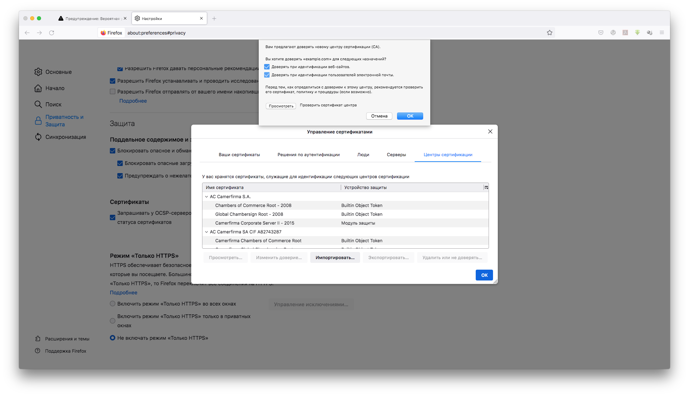
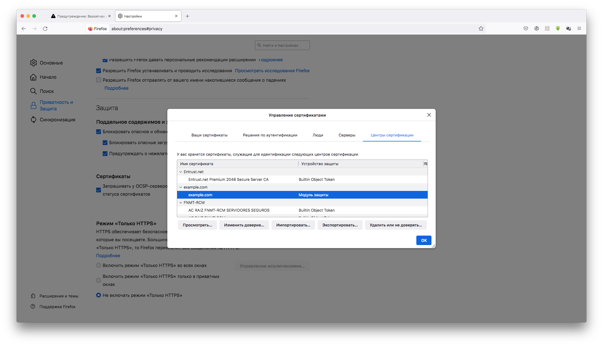
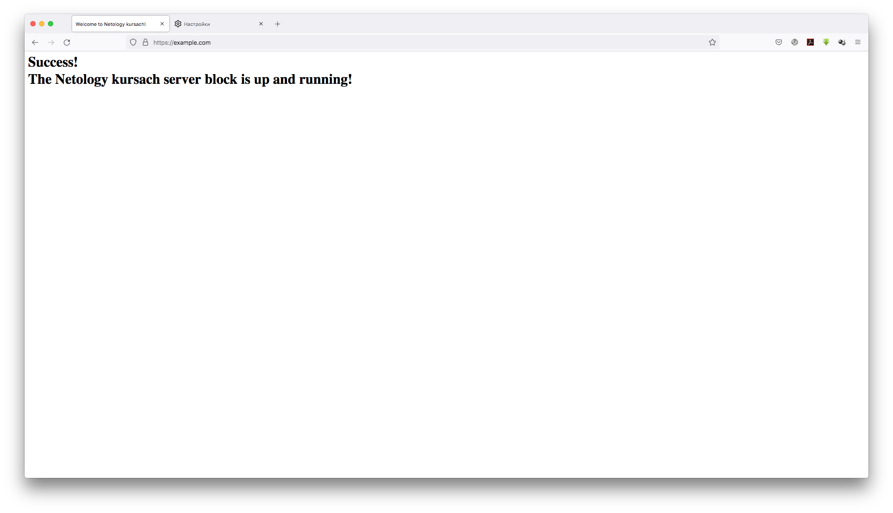
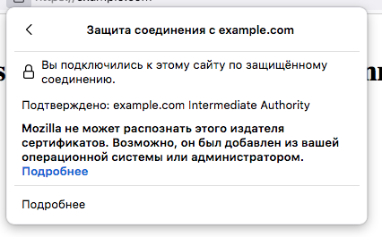
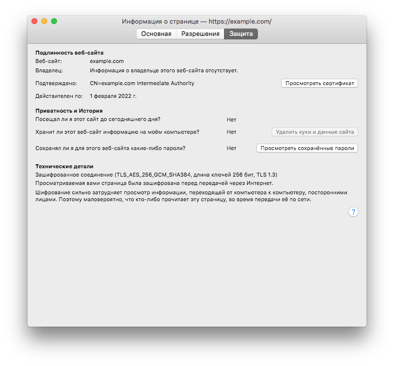
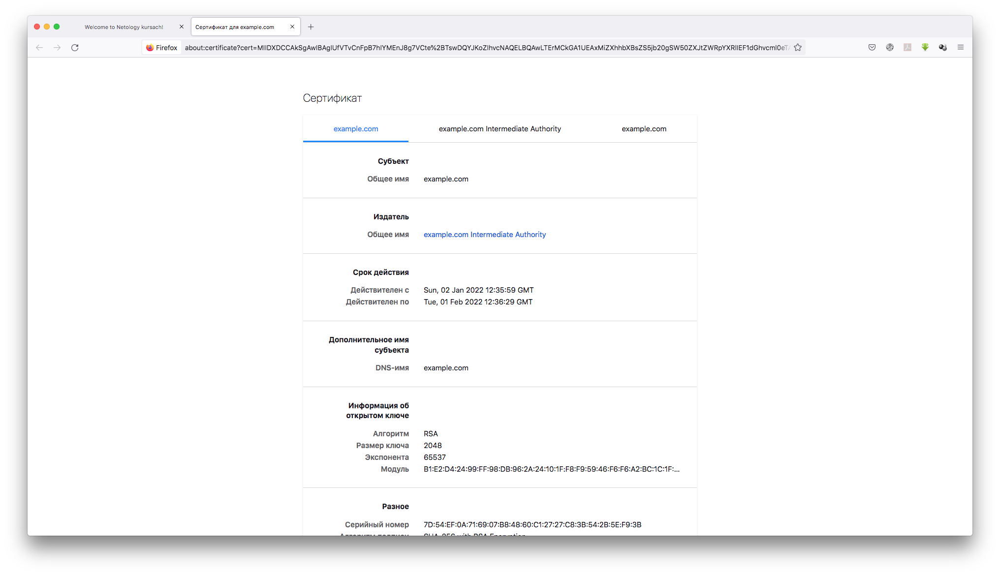

## Курсовая работа по итогам модуля "DevOps и системное администрирование"

### 1. Создайте виртуальную машину Linux.

```bash
Opalennyi-iMac-2:03-sysadmin-01-terminal opalennyi$ cat vagrantfile
Vagrant.configure("2") do |config|
  config.vm.network "private_network", type: "dhcp"
  config.vm.box = "bento/ubuntu-20.04"
  config.vm.provider "virtualbox" do |v|
	v.memory = 4096
  config.vm.synced_folder "/Users/opalennyi/Desktop/vagrant-Mac", "/home/vagrant/vagrant-Mac", create: true
  end
end

Opalennyi-iMac-2:03-sysadmin-01-terminal opalennyi$ vagrant up
Bringing machine 'default' up with 'virtualbox' provider...
==> default: Importing base box 'bento/ubuntu-20.04'...
==> default: Matching MAC address for NAT networking...
==> default: Checking if box 'bento/ubuntu-20.04' version '202107.28.0' is up to date...
==> default: A newer version of the box 'bento/ubuntu-20.04' for provider 'virtualbox' is
==> default: available! You currently have version '202107.28.0'. The latest is version
==> default: '202112.19.0'. Run `vagrant box update` to update.
==> default: Setting the name of the VM: 03-sysadmin-01-terminal_default_1640694271936_36662
==> default: Clearing any previously set network interfaces...
==> default: Preparing network interfaces based on configuration...
    default: Adapter 1: nat
    default: Adapter 2: intnet
==> default: Forwarding ports...
    default: 22 (guest) => 2222 (host) (adapter 1)
==> default: Running 'pre-boot' VM customizations...
==> default: Booting VM...
==> default: Waiting for machine to boot. This may take a few minutes...
    default: SSH address: 127.0.0.1:2222
    default: SSH username: vagrant
    default: SSH auth method: private key
    default: Warning: Connection reset. Retrying...
    default: Warning: Remote connection disconnect. Retrying...
    default: Warning: Connection reset. Retrying...
    default:
    default: Vagrant insecure key detected. Vagrant will automatically replace
    default: this with a newly generated keypair for better security.
    default:
    default: Inserting generated public key within guest...
    default: Removing insecure key from the guest if it's present...
    default: Key inserted! Disconnecting and reconnecting using new SSH key...
==> default: Machine booted and ready!
==> default: Checking for guest additions in VM...
==> default: Configuring and enabling network interfaces...
==> default: Mounting shared folders...
    default: /vagrant => /Users/opalennyi/netology-devops/03-sysadmin-01-terminal
Opalennyi-iMac-2:03-sysadmin-01-terminal opalennyi$ vagrant ssh
```

### 2. Установите ufw и разрешите к этой машине сессии на порты 22 и 443, при этом трафик на интерфейсе localhost (lo) должен ходить свободно на все порты.

Пакет `ufw` уже был установлен:
```bash
vagrant@vagrant:~$ dpkg -s ufw
Package: ufw
Status: install ok installed
Priority: optional
Section: admin
<...>
```

Активируем порт 22 (SSH):
```bash
vagrant@vagrant:~$ sudo ufw allow ssh
Rules updated
Rules updated (v6)
```

Активируем порт 443 (HTTPS):
```bash
vagrant@vagrant:~$ sudo ufw allow 'Nginx HTTPS'
Rules updated
Rules updated (v6)
vagrant@vagrant:~$ sudo ufw allow https
Rule added
Rule added (v6)
```

Запустим `ufw` и проверим его статус:
```bash
vagrant@vagrant:~$ sudo ufw enable
Command may disrupt existing ssh connections. Proceed with operation (y|n)? y
Firewall is active and enabled on system startup
vagrant@vagrant:~$ sudo ufw status
Status: active

To                         Action      From
--                         ------      ----
22/tcp                     ALLOW       Anywhere
Nginx HTTPS                ALLOW       Anywhere
443/tcp                    ALLOW       Anywhere
22/tcp (v6)                ALLOW       Anywhere (v6)
Nginx HTTPS (v6)           ALLOW       Anywhere (v6)
443/tcp (v6)               ALLOW       Anywhere (v6)
```

Добавим свободный трафик на localhost:
```bash
vagrant@vagrant:~$ sudo ufw allow from 127.0.0.1
Rule added
vagrant@vagrant:~$ sudo ufw allow to 127.0.0.1
Rule added
vagrant@vagrant:~$ sudo ufw status
Status: active

To                         Action      From
--                         ------      ----
22/tcp                     ALLOW       Anywhere
Nginx HTTPS                ALLOW       Anywhere
Anywhere                   ALLOW       127.0.0.1
127.0.0.1                  ALLOW       Anywhere
443/tcp                    ALLOW       Anywhere
22/tcp (v6)                ALLOW       Anywhere (v6)
Nginx HTTPS (v6)           ALLOW       Anywhere (v6)
443/tcp (v6)               ALLOW       Anywhere (v6)
```

### 3. Установите hashicorp vault ([инструкция по ссылке](https://learn.hashicorp.com/tutorials/vault/getting-started-install?in=vault/getting-started#install-vault)).

```bash
vagrant@vagrant:~$ curl -fsSL https://apt.releases.hashicorp.com/gpg | sudo apt-key add -
OK
vagrant@vagrant:~$ sudo apt-add-repository "deb [arch=amd64] https://apt.releases.hashicorp.com $(lsb_release -cs) main"
Hit:1 http://security.ubuntu.com/ubuntu focal-security InRelease
Hit:2 http://archive.ubuntu.com/ubuntu focal InRelease
Hit:3 http://archive.ubuntu.com/ubuntu focal-updates InRelease
Hit:4 http://archive.ubuntu.com/ubuntu focal-backports InRelease
Get:5 https://apt.releases.hashicorp.com focal InRelease [9495 B]
Get:6 https://apt.releases.hashicorp.com focal/main amd64 Packages [41.1 kB]
Fetched 50.6 kB in 1s (58.0 kB/s)
Reading package lists... Done
vagrant@vagrant:~$ sudo apt-get update && sudo apt-get install vault
Hit:1 http://archive.ubuntu.com/ubuntu focal InRelease
Hit:2 http://archive.ubuntu.com/ubuntu focal-updates InRelease
Hit:3 http://archive.ubuntu.com/ubuntu focal-backports InRelease
Hit:4 http://security.ubuntu.com/ubuntu focal-security InRelease
Hit:5 https://apt.releases.hashicorp.com focal InRelease
Reading package lists... Done
Reading package lists... Done
Building dependency tree
Reading state information... Done
The following NEW packages will be installed:
  vault
0 upgraded, 1 newly installed, 0 to remove and 108 not upgraded.
Need to get 69.4 MB of archives.
After this operation, 188 MB of additional disk space will be used.
Get:1 https://apt.releases.hashicorp.com focal/main amd64 vault amd64 1.9.2 [69.4 MB]
Fetched 69.4 MB in 9s (7770 kB/s)
Selecting previously unselected package vault.
(Reading database ... 42987 files and directories currently installed.)
Preparing to unpack .../archives/vault_1.9.2_amd64.deb ...
Unpacking vault (1.9.2) ...
Setting up vault (1.9.2) ...
Generating Vault TLS key and self-signed certificate...
Generating a RSA private key
.......++++
......................................................................................................................................................................................................................................++++
writing new private key to 'tls.key'
-----
Vault TLS key and self-signed certificate have been generated in '/opt/vault/tls'.
```

Проверим установку:
```bash
vagrant@vagrant:~$ vault
Usage: vault <command> [args]

Common commands:
    read        Read data and retrieves secrets
    write       Write data, configuration, and secrets
    delete      Delete secrets and configuration
    list        List data or secrets
    login       Authenticate locally
    agent       Start a Vault agent
    server      Start a Vault server
    status      Print seal and HA status
    unwrap      Unwrap a wrapped secret

Other commands:
    audit          Interact with audit devices
    auth           Interact with auth methods
    debug          Runs the debug command
    kv             Interact with Vault's Key-Value storage
    lease          Interact with leases
    monitor        Stream log messages from a Vault server
    namespace      Interact with namespaces
    operator       Perform operator-specific tasks
    path-help      Retrieve API help for paths
    plugin         Interact with Vault plugins and catalog
    policy         Interact with policies
    print          Prints runtime configurations
    secrets        Interact with secrets engines
    ssh            Initiate an SSH session
    token          Interact with tokens
```

### 4. Cоздайте центр сертификации по инструкции ([ссылка](https://learn.hashicorp.com/tutorials/vault/pki-engine?in=vault/secrets-management)) и выпустите сертификат для использования его в настройке веб-сервера nginx (срок жизни сертификата - месяц).

Запустим сервер Vault в отдельном терминале:
```bash
vagrant@vagrant:~$ vault server -dev -dev-root-token-id root
==> Vault server configuration:

             Api Address: http://127.0.0.1:8200
                     Cgo: disabled
         Cluster Address: https://127.0.0.1:8201
              Go Version: go1.17.5
              Listener 1: tcp (addr: "127.0.0.1:8200", cluster address: "127.0.0.1:8201", max_request_duration: "1m30s", max_request_size: "33554432", tls: "disabled")
               Log Level: info
                   Mlock: supported: true, enabled: false
           Recovery Mode: false
                 Storage: inmem
                 Version: Vault v1.9.2
             Version Sha: f4c6d873e2767c0d6853b5d9ffc77b0d297bfbdf

==> Vault server started! Log data will stream in below:

<...>

WARNING! dev mode is enabled! In this mode, Vault runs entirely in-memory
and starts unsealed with a single unseal key. The root token is already
authenticated to the CLI, so you can immediately begin using Vault.

You may need to set the following environment variable:

    $ export VAULT_ADDR='http://127.0.0.1:8200'

The unseal key and root token are displayed below in case you want to
seal/unseal the Vault or re-authenticate.

Unseal Key: S8gfPoJ/dc4QiMWjeAnlPLokFgleafwOVEE8asaeh4k=
Root Token: root

Development mode should NOT be used in production installations!
```

В первом окне терминала выпустим сертификат.

Для начала создадим свой корневой центр верификации (Certification Authority, CA):
```bash
vagrant@vagrant:~$ export VAULT_ADDR=http://127.0.0.1:8200
vagrant@vagrant:~$ export VAULT_TOKEN=root
vagrant@vagrant:~$ vault secrets enable pki
Success! Enabled the pki secrets engine at: pki/
vagrant@vagrant:~$ vault secrets tune -max-lease-ttl=87600h pki
Success! Tuned the secrets engine at: pki/
vagrant@vagrant:~$ vault write -field=certificate pki/root/generate/internal common_name="example.com" ttl=87600h > CA_cert.crt
vagrant@vagrant:~$ cat CA_cert.crt
-----BEGIN CERTIFICATE-----
MIIDNTCCAh2gAwIBAgIUQDehHLBL/nYMmPS3IGTe0Kzs/BMwDQYJKoZIhvcNAQEL
BQAwFjEUMBIGA1UEAxMLZXhhbXBsZS5jb20wHhcNMjIwMTAyMTIzMzQyWhcNMzEx
MjMxMTIzNDExWjAWMRQwEgYDVQQDEwtleGFtcGxlLmNvbTCCASIwDQYJKoZIhvcN
AQEBBQADggEPADCCAQoCggEBALtZL6BBu2rf2ujP7Aj7s6Vd0IFLjt3PPU1kwMp5
sc6hrQpeVdHH0NwwlS1266t2f569zPyVDvVAyxRxvFfKga0CrXoMaAt2Y6PYKyWk
fhRMQWIhJEYzWEoiLLychXGRWMcc2HN43VZkGwpKe4EDWUI4kr4EypdcX0PMl6pd
1ZIbWivCYsfkAS8C2Vle8KTdhz+PvbeKcAIXsi29pnR7PAJJyeoYg4IweuQ85xk6
H6zzuSO9BIloxpXYAe1qTuujceLRfvbgRZa3murQ4qHQx3+pvEAnJWh5B9e6dERd
tIDXC3GbxJ4uLqp3nH+c5JTVSZkXkjccm8vBorvUIsnOgb0CAwEAAaN7MHkwDgYD
VR0PAQH/BAQDAgEGMA8GA1UdEwEB/wQFMAMBAf8wHQYDVR0OBBYEFM/A+ZA8lDEU
3yp4wpE7sDveNPwOMB8GA1UdIwQYMBaAFM/A+ZA8lDEU3yp4wpE7sDveNPwOMBYG
A1UdEQQPMA2CC2V4YW1wbGUuY29tMA0GCSqGSIb3DQEBCwUAA4IBAQAVAob45Wh9
UWkN6+HuWp4apskEir9hEetJVsvzob0IHLltaldddC3lw/SFaUSjTQcBkwcFfP+h
DJHsyJHXblRzkXPH9TQrFR/WALRledJOKNzjIj1qVrhw7Lb2aHWI6RykAT9/eKBb
hqCyVt3RVN2SPRizBfT96d+BbZKPPzgkIbqV1JMlNamhM6LxFmzAzeLG/l4zhVOW
tXT5L/QD65v+ek8iQuSUdCXJcp1tQl6GgjPrAQ18x/RayMQVkRmKKbIsyg8coyNt
WLBAJXXDwioax7rj1TTfz9gBUGUf23axzdNUGyp573crO37Z+xzULuFdjVt0AQag
yue9Xpq+BBmh
-----END CERTIFICATE-----
vagrant@vagrant:~$ vault write pki/config/urls issuing_certificates="$VAULT_ADDR/v1/pki/ca" crl_distribution_points="$VAULT_ADDR/v1/pki/crl"
Success! Data written to: pki/config/urls
```

Создадим промежуточный центр верификации и импортируем его в Vault:
```bash
vagrant@vagrant:~$ vault secrets enable -path=pki_int pki
Success! Enabled the pki secrets engine at: pki_int/
vagrant@vagrant:~$ vault secrets tune -max-lease-ttl=43800h pki_int
Success! Tuned the secrets engine at: pki_int/
vagrant@vagrant:~$ vault write -format=json pki_int/intermediate/generate/internal \
> common_name="example.com Intermediate Authority" \
> | jq -r '.data.csr' > pki_intermediate.csr
vagrant@vagrant:~$ cat pki_intermediate.csr
-----BEGIN CERTIFICATE REQUEST-----
MIICcjCCAVoCAQAwLTErMCkGA1UEAxMiZXhhbXBsZS5jb20gSW50ZXJtZWRpYXRl
IEF1dGhvcml0eTCCASIwDQYJKoZIhvcNAQEBBQADggEPADCCAQoCggEBANFdjAWg
G7k4JndNPzCvtJAXZfWNgEnIMLRuCJN3jYZFrRbwT6W+0RpQZ3N5yKR/fkggVsJj
kZ7QYsvGdtJSna0RgijKBPlpMvQqW++/fFaheaoF/YbWdIOGj0SCSgRtXn8xP5I+
xA0kRs5XpGF95kuGADG7Cvrd/sbf+Ipwp3ZuVV1VmDun+voVXj06nBmv8xK2mcaT
Q9+P9mVgFJWHBHaUXFyeJPt4A8/4snkrM49S5Gh+KvulGzwOsv+JmzomaAZ7HfOj
r6oIwY+fWmuu6WMooOmCV6lSMayrgsh4QD2Wwvx+2ltlMfDh/ebw00WgwYVVY+yY
CHkWFt3SlFkh67kCAwEAAaAAMA0GCSqGSIb3DQEBCwUAA4IBAQBQMrsUaMbBU72T
ZtjX/bF1o8ElCstmKcmZenN4oQQyjaG1qWb+a2nGMZIFTVZVRC30GH0EwdPOgqJd
dGgYDwdlIktkfwlH+EtrCVJ9Ort8g0Gj9oqcbkvCIDcllD3fJmzHdaq1CbrifCBI
3ujgd1K9IGYdy8GLkxeyGI2+6yst+eYfas4zWPNSxfS/njON0D/eDGJCsp51mVx4
3Jaskz61aM6P6Yz3kfJAlEUrmKKFrJUnnYRhlI8pa9tyaHTaCEl2jkmRcG66/Jye
JVlkybdJl8rRCLye0hyqJDcXO6/smFmDblOU/BWnb17IwzLAe8aFR6Zi1IONqQBh
+TTMK2wu
-----END CERTIFICATE REQUEST-----

vagrant@vagrant:~$ vault write -format=json pki/root/sign-intermediate csr=@pki_intermediate.csr \
> format=pem_bundle ttl="43800h" \
> | jq -r '.data.certificate' > intermediate.cert.pem
vagrant@vagrant:~$ cat intermediate.cert.pem
-----BEGIN CERTIFICATE-----
MIIDpjCCAo6gAwIBAgIUD2xdeqXeidRjnLfP1XjSQeqKP2owDQYJKoZIhvcNAQEL
BQAwFjEUMBIGA1UEAxMLZXhhbXBsZS5jb20wHhcNMjIwMTAyMTIzNDQ5WhcNMjcw
MTAxMTIzNTE5WjAtMSswKQYDVQQDEyJleGFtcGxlLmNvbSBJbnRlcm1lZGlhdGUg
QXV0aG9yaXR5MIIBIjANBgkqhkiG9w0BAQEFAAOCAQ8AMIIBCgKCAQEA0V2MBaAb
uTgmd00/MK+0kBdl9Y2AScgwtG4Ik3eNhkWtFvBPpb7RGlBnc3nIpH9+SCBWwmOR
ntBiy8Z20lKdrRGCKMoE+Wky9Cpb7798VqF5qgX9htZ0g4aPRIJKBG1efzE/kj7E
DSRGzlekYX3mS4YAMbsK+t3+xt/4inCndm5VXVWYO6f6+hVePTqcGa/zEraZxpND
34/2ZWAUlYcEdpRcXJ4k+3gDz/iyeSszj1LkaH4q+6UbPA6y/4mbOiZoBnsd86Ov
qgjBj59aa67pYyig6YJXqVIxrKuCyHhAPZbC/H7aW2Ux8OH95vDTRaDBhVVj7JgI
eRYW3dKUWSHruQIDAQABo4HUMIHRMA4GA1UdDwEB/wQEAwIBBjAPBgNVHRMBAf8E
BTADAQH/MB0GA1UdDgQWBBTPDB01dMsyBm0QeYpi7L3KUGMoijAfBgNVHSMEGDAW
gBTPwPmQPJQxFN8qeMKRO7A73jT8DjA7BggrBgEFBQcBAQQvMC0wKwYIKwYBBQUH
MAKGH2h0dHA6Ly8xMjcuMC4wLjE6ODIwMC92MS9wa2kvY2EwMQYDVR0fBCowKDAm
oCSgIoYgaHR0cDovLzEyNy4wLjAuMTo4MjAwL3YxL3BraS9jcmwwDQYJKoZIhvcN
AQELBQADggEBADpP/HzEmkTyyB2bVkxIPBxwAUvyKltUm4crT0LzkyCYon7xSDAP
uPIMvAMiCJJC7teVTJgZ2rskKknj+w4+5rvimCPcJadPYRTT9Zq3c/Gcswg01O5J
2joLn5lIVIKBM2i/cFb0GzyxewzDNibTV0wfT33rdBLVylC0hg3/uo9yCc5bNQO+
GPEnfhkwFlKagZMyqSLn3xRgAT81j8MfyKErOFZFiEIBmPv0SfMHGd4i7gORxBUB
uAhWp7olG6AjFLll9yTEwNAFV3X+XH2nJtkVrf/29Wqv9/S8+qqdPEe554MbgCfr
+FfwG02kDzOi6yQexUJQRBLrqqq11mAg7bE=
-----END CERTIFICATE-----

vagrant@vagrant:~$ vault write pki_int/intermediate/set-signed certificate=@intermediate.cert.pem
Success! Data written to: pki_int/intermediate/set-signed
```

Создадим роль `example-dot-com`:
```bash
vagrant@vagrant:~$ vault write pki_int/roles/example-dot-com \
> allowed_domains="example.com" \
> allow_subdomains=true \
> allow_bare_domains=true \
> max_ttl="720h"
Success! Data written to: pki_int/roles/example-dot-com
```

Выпустим сертификат: 
```bash
vagrant@vagrant:~$ vault write -format=json pki_int/issue/example-dot-com common_name="example.com" ttl="720h" > example.com.crt
```

Разберем файл вывода на сертификат и ключ для конечного узла:
```bash
vagrant@vagrant:~$ jq -r .data.certificate < example.com.crt > example.com.crt.pem
vagrant@vagrant:~$ jq -r .data.issuing_ca < example.com.crt >> example.com.crt.pem
vagrant@vagrant:~$ jq -r .data.private_key < example.com.crt > example.com.crt.key
```
### 5. Установите корневой сертификат созданного центра сертификации в доверенные в хостовой системе.

Скопируем сертификат на гостевой машине в общую с хостом папку:
```bash
vagrant@vagrant:~$ cp CA_cert.crt vagrant-Mac
```

Установим сертификат и сделаем его доверенным через GUI Mac'а в хранилище Firefox, поскольку у него отдельное хранилище сертификатов:





### 6. Установите nginx.

```bash
vagrant@vagrant:~$ sudo apt update && sudo apt upgrade && sudo apt install nginx
Hit:1 http://security.ubuntu.com/ubuntu focal-security InRelease
Hit:2 http://archive.ubuntu.com/ubuntu focal InRelease
Hit:3 http://archive.ubuntu.com/ubuntu focal-updates InRelease
Hit:4 http://archive.ubuntu.com/ubuntu focal-backports InRelease
Hit:5 https://apt.releases.hashicorp.com focal InRelease
Reading package lists... Done
Building dependency tree
Reading state information... Done
108 packages can be upgraded. Run 'apt list --upgradable' to see them.
Reading package lists... Done
Building dependency tree
Reading state information... Done
Calculating upgrade... Done
<...>
Need to get 0 B/3620 B of archives.
After this operation, 45.1 kB of additional disk space will be used.
Selecting previously unselected package nginx.
(Reading database ... 49779 files and directories currently installed.)
Preparing to unpack .../nginx_1.18.0-0ubuntu1.2_all.deb ...
Unpacking nginx (1.18.0-0ubuntu1.2) ...
Setting up nginx (1.18.0-0ubuntu1.2) ...
```

### 7. По инструкции ([ссылка](https://nginx.org/en/docs/http/configuring_https_servers.html)) настройте nginx на https, используя ранее подготовленный сертификат

```bash
vagrant@vagrant:~$ sudo mkdir -p /var/www/example.com/html
vagrant@vagrant:~$ sudo chown -R $USER:$USER /var/www/example.com/html
vagrant@vagrant:~$ sudo chmod -R 755 /var/www/example.com
vagrant@vagrant:~$ nano /var/www/example.com/html/index.html
vagrant@vagrant:~$ cat /var/www/example.com/html/index.html
<html>
    <head>
        <title>Welcome to Netology kursach!</title>
    </head>
    <body>
        <h1>Success!<br />The Netology kursach server block is up and running!</h1>
    </body>
</html>
vagrant@vagrant:~$ sudo nano /etc/nginx/sites-available/example.com
vagrant@vagrant:~$ cat /etc/nginx/sites-available/example.com
server {
        listen 80;
        listen [::]:80;
        listen 443 ssl;
        ssl_certificate /home/vagrant/example.com.crt.pem;
        ssl_certificate_key /home/vagrant/example.com.crt.key;

        root /var/www/example.com/html;
        index index.html index.htm index.nginx-debian.html;

        server_name example.com www.example.com;

        location / {
                try_files $uri $uri/ =404;
        }
}
vagrant@vagrant:~$ nano /var/www/example.com/html/index.html
vagrant@vagrant:~$ sudo nano /etc/nginx/sites-available/example.com
vagrant@vagrant:~$ sudo ln -s /etc/nginx/sites-available/example.com /etc/nginx/sites-enabled/
vagrant@vagrant:~$ sudo nginx -t
nginx: the configuration file /etc/nginx/nginx.conf syntax is ok
nginx: configuration file /etc/nginx/nginx.conf test is successful
vagrant@vagrant:~$ sudo systemctl restart nginx
vagrant@vagrant:~$ sudo systemctl status nginx
● nginx.service - A high performance web server and a reverse proxy server
     Loaded: loaded (/lib/systemd/system/nginx.service; enabled; vendor preset: enabled)
     Active: active (running) since Sun 2022-01-02 15:41:29 MSK; 2s ago
       Docs: man:nginx(8)
    Process: 2119 ExecStartPre=/usr/sbin/nginx -t -q -g daemon on; master_process on; (code=exited, status=0/SUCCESS)
    Process: 2133 ExecStart=/usr/sbin/nginx -g daemon on; master_process on; (code=exited, status=0/SUCCESS)
   Main PID: 2142 (nginx)
      Tasks: 3 (limit: 4658)
     Memory: 3.5M
     CGroup: /system.slice/nginx.service
             ├─2142 nginx: master process /usr/sbin/nginx -g daemon on; master_process on;
             ├─2144 nginx: worker process
             └─2145 nginx: worker process

Jan 02 15:41:29 vagrant systemd[1]: Starting A high performance web server and a reverse proxy server...
Jan 02 15:41:29 vagrant systemd[1]: Started A high performance web server and a reverse proxy server.
```

### 8. Откройте в браузере на хосте https адрес страницы, которую обслуживает сервер nginx.

Для того, чтобы на хостовой машине можно было получить доступ к узлу `netology-diplom1.com`, на который у нас выпущен сертификат, добавим этот адрес с перенаправлением на ip гостевой машины в `/private/etc/hosts`:
```bash
Opalennyi-iMac-2:~ opalennyi$ sudo nano /private/etc/hosts
Opalennyi-iMac-2:~ opalennyi$ cat /private/etc/hosts
##
# Host Database
#
# localhost is used to configure the loopback interface
# when the system is booting.  Do not change this entry.
##
127.0.0.1	localhost
255.255.255.255	broadcasthost
::1             localhost
192.168.56.3	example.com
# Adobe Blocker
127.0.0.1 lmlicenses.wip4.adobe.com
127.0.0.1 lm.licenses.adobe.com
127.0.0.1 na1r.services.adobe.com
127.0.0.1 hlrcv.stage.adobe.com
127.0.0.1 practivate.adobe.com
127.0.0.1 activate.adobe.com
```

Доступ к серверу удалось получить через HTTPS:









### 9. Создайте скрипт, который будет генерировать новый сертификат в vault:<br />- генерируем новый сертификат так, чтобы не переписывать конфиг nginx;<br />- перезапускаем nginx для применения нового сертификата.

Поскольку в тексте задания не оговорена необходимость отзыва предыдущих сертификатов, в скрипте я не отзываю сертификаты по серийным номерам, но только чищу истекшие по сроку.

Скрипт (файл `renew-certs.sh`)
```bash
vagrant@vagrant:~$ nano renew-certs.sh
vagrant@vagrant:~$ chmod +x renew-certs.sh
vagrant@vagrant:~$ cat renew-certs.sh
#!/usr/bin/env bash

date
echo -e "\033[1mStarting renew-certs.sh...\033[0m"

export VAULT_ADDR=http://127.0.0.1:8200
export VAULT_TOKEN=root

# Removing expired certificates
if vault write pki_int/tidy tidy_cert_store=true tidy_revoked_certs=true
then
  echo -e "\033[1mSuccessfully revoked expired certificates!\033[0m"
else
  echo -e "\033[1mSomething's wrong. Didn't manage to revoke expired certificates.\033[0m"
fi

# Generating a new certificate and writing it into the same files
if vault write -format=json pki_int/issue/example-dot-com common_name="example.com" ttl="720h" > example.com.crt
then
  echo -e "\033[1mSuccessfully generated a new certificate!\033[0m"
else
  echo -e "\033[1mSomething's wrong. Didn't manage to generate a new certificate. Interrupting the script...\033[0m"
  exit
fi
jq -r .data.certificate < example.com.crt > /home/vagrant/example.com.crt.pem
jq -r .data.issuing_ca < example.com.crt >> /home/vagrant/example.com.crt.pem
jq -r .data.private_key < example.com.crt > /home/vagrant/example.com.crt.key

# Checking if there are any errors; if no, then reboot our nginx server
if nginx -t
then
    echo -e "\033[1mRestarting nginx...\033[0m"
    if systemctl restart nginx
    then
      echo -e "\033[1mRestarted nginx successfully.\033[0m"
    else
      echo -e "\033[1m[!!!] Something's wrong. Please check it manually.\033[0m"
    fi
else
    echo -e "\033[1m[!!!] Something's wrong. Please check it manually.\033[0m"
fi
```

Проверим его работу:
```bash
vagrant@vagrant:~$ sudo systemctl status nginx
● nginx.service - A high performance web server and a reverse proxy server
     Loaded: loaded (/lib/systemd/system/nginx.service; enabled; vendor preset: enabled)
     Active: active (running) since Sun 2022-01-02 17:54:19 MSK; 42s ago
       Docs: man:nginx(8)
    Process: 4422 ExecStartPre=/usr/sbin/nginx -t -q -g daemon on; master_process on; (code=exited, status=0/SUCCESS)
    Process: 4433 ExecStart=/usr/sbin/nginx -g daemon on; master_process on; (code=exited, status=0/SUCCESS)
   Main PID: 4444 (nginx)
      Tasks: 3 (limit: 4658)
     Memory: 3.4M
     CGroup: /system.slice/nginx.service
             ├─4444 nginx: master process /usr/sbin/nginx -g daemon on; master_process on;
             ├─4445 nginx: worker process
             └─4446 nginx: worker process

Jan 02 17:54:19 vagrant systemd[1]: Starting A high performance web server and a reverse proxy server...
Jan 02 17:54:19 vagrant systemd[1]: Started A high performance web server and a reverse proxy server.
vagrant@vagrant:~$ sudo ./renew-certs.sh
Sun Jan  2 17:55:04 MSK 2022
Starting renew-certs.sh...
WARNING! The following warnings were returned from Vault:

  * Tidy operation successfully started. Any information from the operation
  will be printed to Vault's server logs.

Successfully revoked expired certificates!
Successfully generated a new certificate!
nginx: the configuration file /etc/nginx/nginx.conf syntax is ok
nginx: configuration file /etc/nginx/nginx.conf test is successful
Restarting nginx...
Restarted nginx successfully.
vagrant@vagrant:~$ sudo systemctl status nginx
● nginx.service - A high performance web server and a reverse proxy server
     Loaded: loaded (/lib/systemd/system/nginx.service; enabled; vendor preset: enabled)
     Active: active (running) since Sun 2022-01-02 17:55:04 MSK; 981ms ago
       Docs: man:nginx(8)
    Process: 4474 ExecStartPre=/usr/sbin/nginx -t -q -g daemon on; master_process on; (code=exited, status=0/SUCCESS)
    Process: 4486 ExecStart=/usr/sbin/nginx -g daemon on; master_process on; (code=exited, status=0/SUCCESS)
   Main PID: 4493 (nginx)
      Tasks: 3 (limit: 4658)
     Memory: 3.5M
     CGroup: /system.slice/nginx.service
             ├─4493 nginx: master process /usr/sbin/nginx -g daemon on; master_process on;
             ├─4495 nginx: worker process
             └─4496 nginx: worker process

Jan 02 17:55:04 vagrant systemd[1]: Starting A high performance web server and a reverse proxy server...
Jan 02 17:55:04 vagrant systemd[1]: Started A high performance web server and a reverse proxy server.
```

Проверим сертификат в Firefox:


Видим, что конечный сертификат новый, выпущен в 17:54:34 по московскому времени.

### 10. Поместите скрипт в crontab, чтобы сертификат обновлялся какого-то числа каждого месяца в удобное для вас время.

```bash
vagrant@vagrant:~$ sudo crontab -e
crontab: installing new crontab

vagrant@vagrant:~$ sudo crontab -l
# Edit this file to introduce tasks to be run by cron.
#
# Each task to run has to be defined through a single line
# indicating with different fields when the task will be run
# and what command to run for the task
#
# To define the time you can provide concrete values for
# minute (m), hour (h), day of month (dom), month (mon),
# and day of week (dow) or use '*' in these fields (for 'any').
#
# Notice that tasks will be started based on the cron's system
# daemon's notion of time and timezones.
#
# Output of the crontab jobs (including errors) is sent through
# email to the user the crontab file belongs to (unless redirected).
#
# For example, you can run a backup of all your user accounts
# at 5 a.m every week with:
# 0 5 * * 1 tar -zcf /var/backups/home.tgz /home/
#
# For more information see the manual pages of crontab(5) and cron(8)
#
# m h  dom mon dow   command

33 17 2 * * /home/vagrant/renew-certs.sh > /home/vagrant/renew-certs.log 2>&1
```

Читаем log-файл, проверяем запуск:
```bash
vagrant@vagrant:~$ cat renew-certs.log
Sun 02 Jan 2022 05:33:01 PM MSK
Starting renew-certs.sh...
WARNING! The following warnings were returned from Vault:

  * Tidy operation successfully started. Any information from the operation
  will be printed to Vault's server logs.

/home/vagrant/renew-certs.sh: line 19: nginx: command not found
[!!!] Something's wrong. Please check it manually.
```

Проверяем, где установлен `nginx`. Оказывается, он установлен в `/usr/sbin/` и ничего нет в `/usr/bin/`. Создадим символьную ссылку в `/usr/bin/`:
```bash
vagrant@vagrant:~$ sudo ln -s /usr/sbin/nginx /usr/bin
```

Запланируем запуск еще раз:
```bash
vagrant@vagrant:~$ sudo crontab -e
crontab: installing new crontab
vagrant@vagrant:~$ sudo crontab -l
# Edit this file to introduce tasks to be run by cron.
#
# Each task to run has to be defined through a single line
# indicating with different fields when the task will be run
# and what command to run for the task
#
# To define the time you can provide concrete values for
# minute (m), hour (h), day of month (dom), month (mon),
# and day of week (dow) or use '*' in these fields (for 'any').
#
# Notice that tasks will be started based on the cron's system
# daemon's notion of time and timezones.
#
# Output of the crontab jobs (including errors) is sent through
# email to the user the crontab file belongs to (unless redirected).
#
# For example, you can run a backup of all your user accounts
# at 5 a.m every week with:
# 0 5 * * 1 tar -zcf /var/backups/home.tgz /home/
#
# For more information see the manual pages of crontab(5) and cron(8)
#
# m h  dom mon dow   command

55 19 2 * * /home/vagrant/renew-certs.sh > /home/vagrant/renew-certs.log 2>&1

vagrant@vagrant:~$ cat renew-certs.log
Sun 02 Jan 2022 07:55:01 PM MSK
Starting renew-certs.sh...
WARNING! The following warnings were returned from Vault:

  * Tidy operation successfully started. Any information from the operation
  will be printed to Vault's server logs.

Successfully revoked expired certificates!
Successfully generated a new certificate!
nginx: the configuration file /etc/nginx/nginx.conf syntax is ok
nginx: configuration file /etc/nginx/nginx.conf test is successful
Restarting nginx...
Restarted nginx successfully.
```

Проверим сертификат:


Как мы видим, сертификат выпущен в 19:54:31 по московскому времени. Время гостевой системы и хоста могут немного отличаться, этим может объясняться разница в 30 секунд, как будто сертификат был выпущен за полминуты до запуска скрипта.